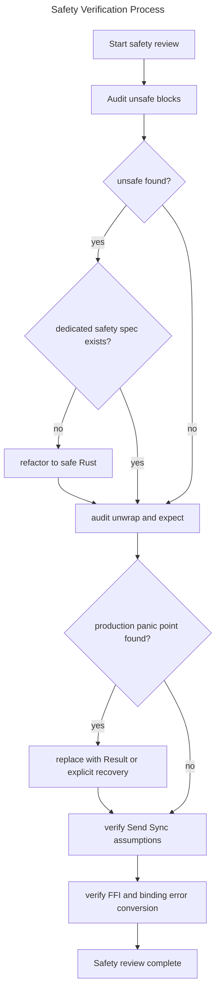

# Core Safety Standards

## Overview
<!-- type: overview lang: markdown -->

This specification establishes cclab-core safety standards for shared
infrastructure crates: avoid unsafe code unless explicitly justified, preserve
thread-safety guarantees for public cross-thread types, and replace production
panic points with structured error propagation.

## Requirements
<!-- type: requirements lang: mermaid -->

```mermaid
---
id: cclab-core-safety-requirements
title: Core Safety Requirements
requirements:
  R1:
    text: "Core crates SHOULD forbid or avoid unsafe code unless a dedicated safety spec justifies it."
    type: safety
    priority: high
    risk: high
    verification: review
  R2:
    text: "Public cross-thread types SHOULD have Send and Sync guarantees verified at compile time when relied on by APIs."
    type: safety
    priority: high
    risk: medium
    verification: test
  R3:
    text: "Production code SHOULD avoid manual unwrap and expect in favor of Result propagation or explicit recovery."
    type: reliability
    priority: high
    risk: high
    verification: audit
  R4:
    text: "FFI and language-binding boundaries MUST convert internal failures into structured sanitized errors."
    type: security
    priority: high
    risk: high
    verification: test
---
requirementDiagram

requirement R1 {
  id: R1
  text: "Core crates SHOULD forbid or avoid unsafe code unless a dedicated safety spec justifies it."
  risk: High
  verifymethod: Review
}

requirement R2 {
  id: R2
  text: "Public cross-thread types SHOULD have Send and Sync guarantees verified at compile time when relied on by APIs."
  risk: Medium
  verifymethod: Test
}

requirement R3 {
  id: R3
  text: "Production code SHOULD avoid manual unwrap and expect in favor of Result propagation or explicit recovery."
  risk: High
  verifymethod: Inspection
}

requirement R4 {
  id: R4
  text: "FFI and language-binding boundaries MUST convert internal failures into structured sanitized errors."
  risk: High
  verifymethod: Test
}
```

## Scenarios
<!-- type: scenarios lang: yaml -->

```yaml
scenarios:
  - id: unsafe_code_review
    given:
      - "A core crate introduces an unsafe block."
    when: "Safety review runs."
    then:
      - "The unsafe block is either removed or linked to a dedicated safety spec."

  - id: thread_safety_assertion
    given:
      - "A public type is used across threads."
    when: "The crate compiles."
    then:
      - "Compile-time assertions verify the expected Send and Sync bounds."

  - id: panic_audit
    given:
      - "Production code contains unwrap or expect."
    when: "The code is audited."
    then:
      - "The call is justified as unreachable/test-only or replaced with structured error propagation."

  - id: binding_error_boundary
    given:
      - "A Rust error crosses a language-binding boundary."
    when: "The host-runtime error is built."
    then:
      - "The error message is categorized and sanitized unless debug mode is enabled."
```

## Logic
<!-- type: logic lang: mermaid -->



## Changes
<!-- type: changes lang: yaml -->

```yaml
changes:
  - path: .aw/tech-design/crates/cclab-core/logic/safety/core-safety-standards.md
    action: modify
    section: requirements
    impl_mode: hand-written
    description: "Maintain cclab-core safety requirements, scenarios, and verification flow."
  - path: crates/cclab-core/src/error.rs
    action: modify
    section: logic
    impl_mode: hand-written
    description: "Provide structured errors for core operations."
  - path: crates/cclab-core/src/error_utils.rs
    action: modify
    section: logic
    impl_mode: hand-written
    description: "Sanitize and categorize errors crossing language-binding boundaries."
  - path: .aw/tech-design/crates/cclab-core/README.md
    action: modify
    section: overview
    impl_mode: hand-written
    description: "Link the normalized core safety standards spec."
```
