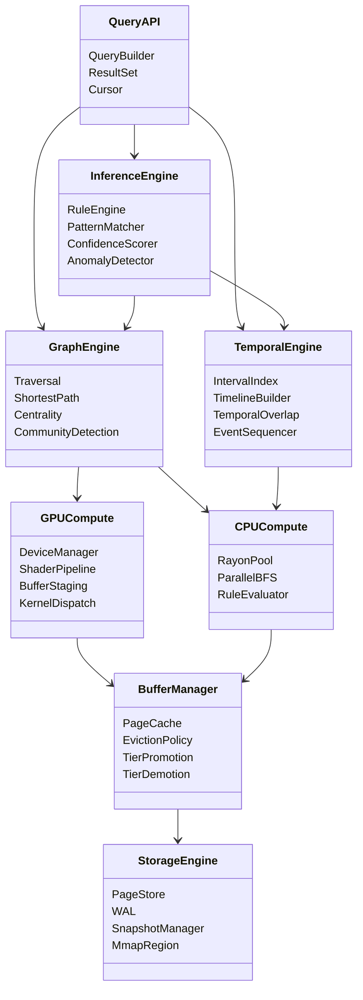
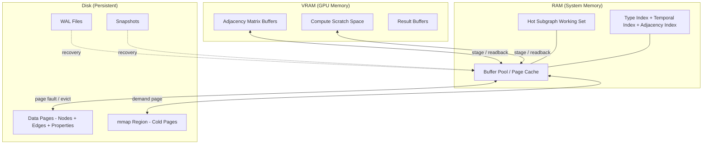

# Architecture

## System Overview
<!-- type: overview lang: markdown -->

CtxInfDB is a temporal knowledge graph database built for intelligence analysis workloads. It combines four resource tiers (GPU, CPU, RAM, Disk) into a unified engine that supports entity/relation CRUD, graph analytics, timeline construction, and inference.

## System Layers
<!-- type: dependency lang: mermaid -->



## Storage Tier Architecture
<!-- type: logic lang: mermaid -->



## Module Dependency Graph
<!-- type: dependency lang: mermaid -->

Reflects current Phase 1 + Phase 2 module layout (under `crates/cclab-ctx-inf-db/src/`). Aspirational modules (Phase 2.5–5) are tagged explicitly; they are placeholders for future work and do **not** exist in the codebase yet. The WAL (`WalWriter` / `WalReader` / `WalEntry`) lives in the external `cclab-wal` crate, not as a top-level module of this crate. Indices (type-index, adjacency) are inline `DashMap` fields on `CtxInfEngine::new`, not a separate module.

```mermaid
classDiagram
    direction LR

    class lib {
        re-exports
    }
    class types {
        Entity
        Relation
        PropertyValue
        EntityType
        RelationType
    }
    class error {
        CtxInfError
    }
    class engine {
        CtxInfEngine
        create/update/delete_entity
        create/update/delete_relation
        flush / shutdown / create_snapshot
    }
    class graph {
        bfs / dfs / shortest_path
        degree / neighbors
    }
    class temporal {
        active_at / overlap
        TemporalRange semantics
    }
    class storage {
        GraphOp (wal_ops)
        PersistenceHandle (handle)
        RecoveryManager (recovery)
        SnapshotWriter/Loader (snapshot)
        Page format (page)
    }
    class cclab_wal["cclab-wal (external)"] {
        WalWriter
        WalReader
        WalEntry
    }

    class buffer["buffer (aspirational — Phase 2.5)"]
    class query["query (aspirational — Phase 3)"]
    class gpu["gpu (aspirational — Phase 4)"]
    class inference["inference (aspirational — Phase 5)"]

    lib --> engine
    lib --> types
    lib --> error
    engine --> types
    engine --> error
    engine --> graph
    engine --> temporal
    engine --> storage
    storage --> cclab_wal
    storage --> types
    storage --> error
    graph --> types
    temporal --> types
    types --> error

    query -.-> engine
    query -.-> graph
    query -.-> temporal
    inference -.-> graph
    inference -.-> temporal
    graph -.-> gpu
    engine -.-> buffer
    buffer -.-> storage
```
