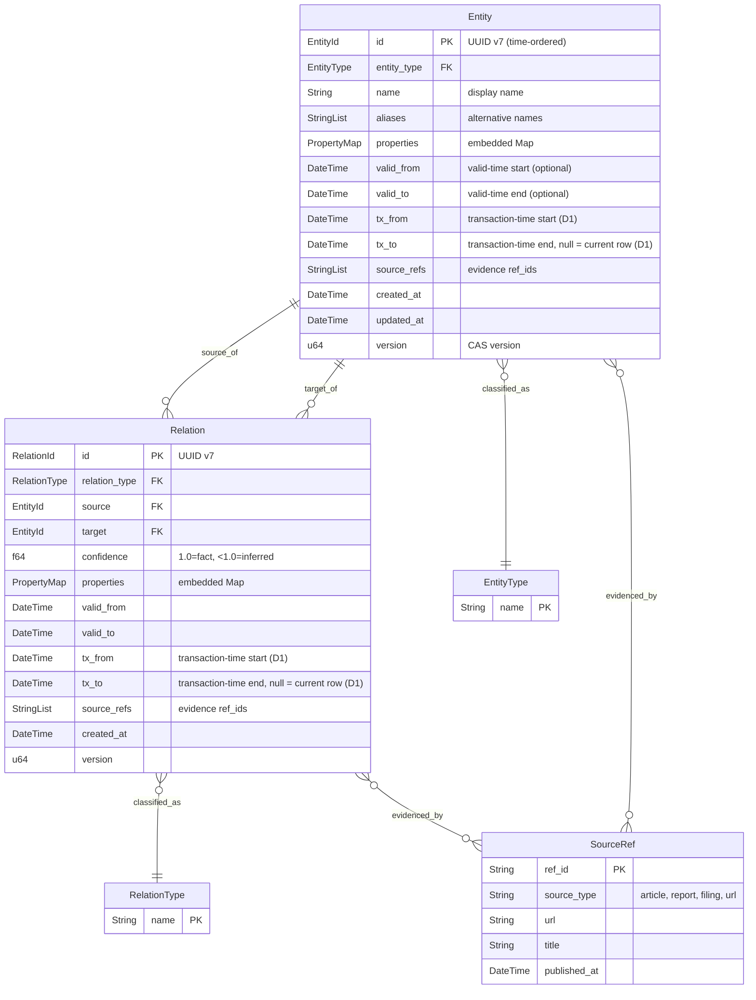

# Data Model

## Overview
<!-- type: overview lang: markdown -->

The data model consists of entities (nodes) and relations (edges) in a temporal knowledge graph. Every node and edge is **bitemporal** (see [design-decisions.md#D1](design-decisions.md)): it carries both a *valid-time* range (`valid_from` / `valid_to`, i.e. when the fact is true in the world) and a *transaction-time* range (`tx_from` / `tx_to`, i.e. when the system knew of the fact). Updates and deletes are non-destructive — the previous row is frozen with `tx_to = <freeze time>` and preserved for "as of" queries. Property values are strongly typed to support efficient indexing and GPU-compatible layout.

Properties are stored inline on entities and relations as a `Map<String, PropertyValue>` field — there is no separate `EntityProperty` / `RelationProperty` table. Temporal validity is carried on a nested `temporal` object (matching the Rust field name), not as flat `valid_from` / `valid_to` columns.

## Entity-Relation Model
<!-- type: db-model lang: mermaid -->



## Error Types
<!-- type: schema lang: json -->

```json
{
  "$id": "ctx-inf-error",
  "title": "CtxInfError",
  "oneOf": [
    {
      "type": "object",
      "required": ["code", "kind"],
      "properties": {
        "code": { "const": "entity_not_found" },
        "kind": { "const": "not_found" },
        "entity_id": { "type": "string", "format": "uuid" }
      }
    },
    {
      "type": "object",
      "required": ["code", "kind"],
      "properties": {
        "code": { "const": "relation_not_found" },
        "kind": { "const": "not_found" },
        "relation_id": { "type": "string", "format": "uuid" }
      }
    },
    {
      "type": "object",
      "required": ["code", "kind"],
      "properties": {
        "code": { "const": "version_conflict" },
        "kind": { "const": "conflict" },
        "expected": { "type": "integer" },
        "actual": { "type": "integer" }
      }
    },
    {
      "type": "object",
      "required": ["code", "kind"],
      "properties": {
        "code": { "const": "invalid_entity_type" },
        "kind": { "const": "validation" },
        "value": { "type": "string" }
      }
    },
    {
      "type": "object",
      "required": ["code", "kind"],
      "properties": {
        "code": { "const": "invalid_relation_type" },
        "kind": { "const": "validation" },
        "value": { "type": "string" }
      }
    },
    {
      "type": "object",
      "required": ["code", "kind"],
      "properties": {
        "code": { "const": "dangling_reference" },
        "kind": { "const": "validation" },
        "description": "Source or target entity does not exist",
        "missing_id": { "type": "string", "format": "uuid" }
      }
    },
    {
      "type": "object",
      "required": ["code", "kind"],
      "properties": {
        "code": { "const": "storage_error" },
        "kind": { "const": "internal" },
        "message": { "type": "string" }
      }
    },
    {
      "type": "object",
      "required": ["code", "kind"],
      "properties": {
        "code": { "const": "wal_error" },
        "kind": { "const": "internal" },
        "message": { "type": "string" }
      }
    },
    {
      "type": "object",
      "required": ["code", "kind"],
      "properties": {
        "code": { "const": "snapshot_error" },
        "kind": { "const": "internal" },
        "message": { "type": "string" }
      }
    },
    {
      "type": "object",
      "required": ["code", "kind"],
      "properties": {
        "code": { "const": "recovery_error" },
        "kind": { "const": "internal" },
        "message": { "type": "string" }
      }
    },
    {
      "type": "object",
      "required": ["code", "kind"],
      "properties": {
        "code": { "const": "gpu_unavailable" },
        "kind": { "const": "resource" },
        "message": { "type": "string" }
      }
    },
    {
      "type": "object",
      "required": ["code", "kind"],
      "properties": {
        "code": { "const": "out_of_memory" },
        "kind": { "const": "resource" },
        "tier": { "type": "string", "enum": ["vram", "ram", "disk"] },
        "requested": { "type": "integer", "description": "bytes requested" },
        "available": { "type": "integer", "description": "bytes available" }
      }
    }
  ]
}
```

## Entity Type Enum
<!-- type: schema lang: json -->

```json
{
  "$id": "entity-type",
  "title": "EntityType",
  "oneOf": [
    {
      "type": "string",
      "enum": [
        "person",
        "organization",
        "political_party",
        "government_agency",
        "company",
        "media_outlet",
        "event",
        "location",
        "document",
        "policy",
        "financial_flow"
      ],
      "description": "Built-in entity classifications."
    },
    {
      "type": "object",
      "required": ["custom"],
      "properties": {
        "custom": { "type": "string" }
      },
      "additionalProperties": false,
      "description": "Custom(String) escape hatch — serializes as {\"custom\": \"<value>\"}."
    }
  ],
  "description": "Classification of graph entities. Built-in variants serialize as lowercase snake_case strings; the Custom(String) variant serializes as a tagged object {\"custom\": \"<value>\"}."
}
```

## Relation Type Enum
<!-- type: schema lang: json -->

```json
{
  "$id": "relation-type",
  "title": "RelationType",
  "oneOf": [
    {
      "type": "string",
      "enum": [
        "member_of",
        "leader_of",
        "affiliated_with",
        "met_with",
        "funded_by",
        "funded",
        "employed_by",
        "attended",
        "participated_in",
        "located_at",
        "occurred_at",
        "preceded_by",
        "succeeded_by",
        "influenced_by",
        "controlled_by",
        "reported_by",
        "mentioned_in",
        "co_occurred_with",
        "opposed_to",
        "allied_with",
        "sanctioned_by",
        "investigated_by",
        "related_to"
      ],
      "description": "Built-in directed-edge classifications."
    },
    {
      "type": "object",
      "required": ["custom"],
      "properties": {
        "custom": { "type": "string" }
      },
      "additionalProperties": false,
      "description": "Custom(String) escape hatch — serializes as {\"custom\": \"<value>\"}."
    }
  ],
  "description": "Classification of directed edges. Built-in variants serialize as lowercase snake_case strings; the Custom(String) variant serializes as a tagged object {\"custom\": \"<value>\"}."
}
```

## PropertyValue Schema
<!-- type: schema lang: json -->

```json
{
  "$id": "property-value",
  "title": "PropertyValue",
  "oneOf": [
    { "type": "null" },
    { "type": "boolean" },
    { "type": "integer", "format": "int64" },
    { "type": "number", "format": "double" },
    { "type": "string" },
    { "type": "string", "format": "date-time" },
    { "type": "array", "items": { "$ref": "#" } },
    { "type": "object", "additionalProperties": { "$ref": "#" } }
  ],
  "description": "Typed property value stored on entities and relations. Serialized with serde(untagged) — each variant picks the first matching JSON shape. Maps to Rust enum with fixed discriminant for page layout."
}
```

## TemporalRange Schema
<!-- type: schema lang: json -->

```json
{
  "$id": "temporal-range",
  "title": "TemporalRange",
  "type": "object",
  "required": ["valid_from", "valid_to"],
  "properties": {
    "valid_from": {
      "type": ["string", "null"],
      "format": "date-time",
      "description": "Temporal validity start (null = since beginning of time)"
    },
    "valid_to": {
      "type": ["string", "null"],
      "format": "date-time",
      "description": "Temporal validity end (null = still valid)"
    }
  },
  "description": "Embedded temporal validity range carried on Entity and Relation via the `temporal` field."
}
```

## Entity Schema
<!-- type: schema lang: json -->

```json
{
  "$id": "entity",
  "title": "Entity",
  "type": "object",
  "required": [
    "id",
    "entity_type",
    "name",
    "aliases",
    "properties",
    "temporal",
    "source_refs",
    "created_at",
    "updated_at",
    "version"
  ],
  "properties": {
    "id": {
      "type": "string",
      "format": "uuid",
      "description": "UUID v7 (time-ordered) for natural chronological sort"
    },
    "entity_type": { "$ref": "entity-type" },
    "name": {
      "type": "string",
      "maxLength": 512,
      "description": "Primary display name"
    },
    "aliases": {
      "type": "array",
      "items": { "type": "string" },
      "description": "Alternative names, transliterations"
    },
    "properties": {
      "type": "object",
      "additionalProperties": { "$ref": "property-value" },
      "description": "Embedded Map<String, PropertyValue> — no separate EntityProperty table"
    },
    "temporal": {
      "$ref": "temporal-range",
      "description": "Embedded temporal validity range; matches the Rust field name `temporal`"
    },
    "source_refs": {
      "type": "array",
      "items": { "type": "string" },
      "description": "Evidence ref_ids"
    },
    "tx_from": {
      "type": "string",
      "format": "date-time",
      "description": "Transaction-time start — when the system learned of this row (D1). Set on create and on every update (new current row)."
    },
    "tx_to": {
      "type": ["string", "null"],
      "format": "date-time",
      "description": "Transaction-time end. `null` on the current row; a concrete timestamp on frozen history rows (D1)."
    },
    "created_at": { "type": "string", "format": "date-time" },
    "updated_at": { "type": "string", "format": "date-time" },
    "version": { "type": "integer", "minimum": 0 }
  }
}
```

## Relation Schema
<!-- type: schema lang: json -->

```json
{
  "$id": "relation",
  "title": "Relation",
  "type": "object",
  "required": [
    "id",
    "relation_type",
    "source",
    "target",
    "confidence",
    "properties",
    "temporal",
    "source_refs",
    "created_at",
    "version"
  ],
  "properties": {
    "id": { "type": "string", "format": "uuid" },
    "relation_type": { "$ref": "relation-type" },
    "source": {
      "type": "string",
      "format": "uuid",
      "description": "Source entity ID (edge direction: source → target)"
    },
    "target": {
      "type": "string",
      "format": "uuid",
      "description": "Target entity ID"
    },
    "confidence": {
      "type": "number",
      "minimum": 0.0,
      "maximum": 1.0,
      "default": 1.0,
      "description": "1.0 = verified fact, <1.0 = inferred with confidence"
    },
    "properties": {
      "type": "object",
      "additionalProperties": { "$ref": "property-value" },
      "description": "Embedded Map<String, PropertyValue> — no separate RelationProperty table"
    },
    "temporal": {
      "$ref": "temporal-range",
      "description": "Embedded temporal validity range; matches the Rust field name `temporal`"
    },
    "source_refs": {
      "type": "array",
      "items": { "type": "string" }
    },
    "tx_from": {
      "type": "string",
      "format": "date-time",
      "description": "Transaction-time start (D1) — see Entity schema."
    },
    "tx_to": {
      "type": ["string", "null"],
      "format": "date-time",
      "description": "Transaction-time end (D1). `null` on the current row."
    },
    "created_at": { "type": "string", "format": "date-time" },
    "version": { "type": "integer", "minimum": 0 }
  }
}
```

## Bitemporal Semantics (D1)
<!-- type: overview lang: markdown -->

Every Entity and Relation participates in two orthogonal time dimensions:

- **Valid-time** — `valid_from` / `valid_to` (inside `TemporalRange`). Tracks when a fact is true in the real world. `valid_to = null` means "indefinite / still valid."
- **Transaction-time** — `tx_from` / `tx_to`. Tracks when the system learned of the fact. `tx_to = null` marks the **current row**; any non-null value marks a **frozen history row**.

**Freeze-on-mutate.** Updates and deletes never destroy data:

| Operation | Effect |
|-----------|--------|
| `create_entity` / `create_relation` | New row with `tx_from = now`, `tx_to = None`, `version = 0`. |
| `update_entity` / `update_relation` | Freeze the previous current row: `tx_to = now`, park in `entities_history` / `relations_history` keyed by `(id, old_version)`. Replace the current row with `tx_from = now`, `tx_to = None`, `version = old_version + 1`. |
| `delete_entity` / `delete_relation` | Move the current row to history with `tx_to = now`. Current-state queries no longer see it. Cascade delete applies the same freeze to adjacent relations. |

**Current-state queries** (the default) return only rows with `tx_to = None`. Affected surfaces: `get_entity`, `get_relation`, `find_entities`, `find_relations`, `neighbors`, `active_at`.

**"As-of" queries** answer "what did we believe at transaction time `tx`?"

- `get_entity_as_of_tx(id, tx)` / `get_relation_as_of_tx(id, tx)` — return the row where `tx_from ≤ tx AND (tx_to IS NULL OR tx < tx_to)`, scanning both the current-state map and `*_history`.

**Out of scope for Phase 2.5** (tracked in follow-up issues — see [design-decisions.md#D1 Impact](design-decisions.md)):

- Bitemporal indexing for efficient "as of" scans — current impl is linear over history.
- Datalog `as_of_tx` operator.
- Joint valid-time × transaction-time rectangular queries beyond the current point-in-time API.

**WAL + recovery.** `GraphOp::UpdateEntity` / `UpdateRelation` carry a `frozen_tx_to`; `DeleteEntity` / `DeleteRelation` carry a `tx_to`. Recovery replays these ops and reconstructs history maps so durability preserves the bitemporal view exactly. Pre-bitemporal WAL entries and snapshots are supported through `#[serde(default)]` fallbacks (unix-epoch sentinel for WAL, `snapshot.created_at` rewrite for snapshots).
