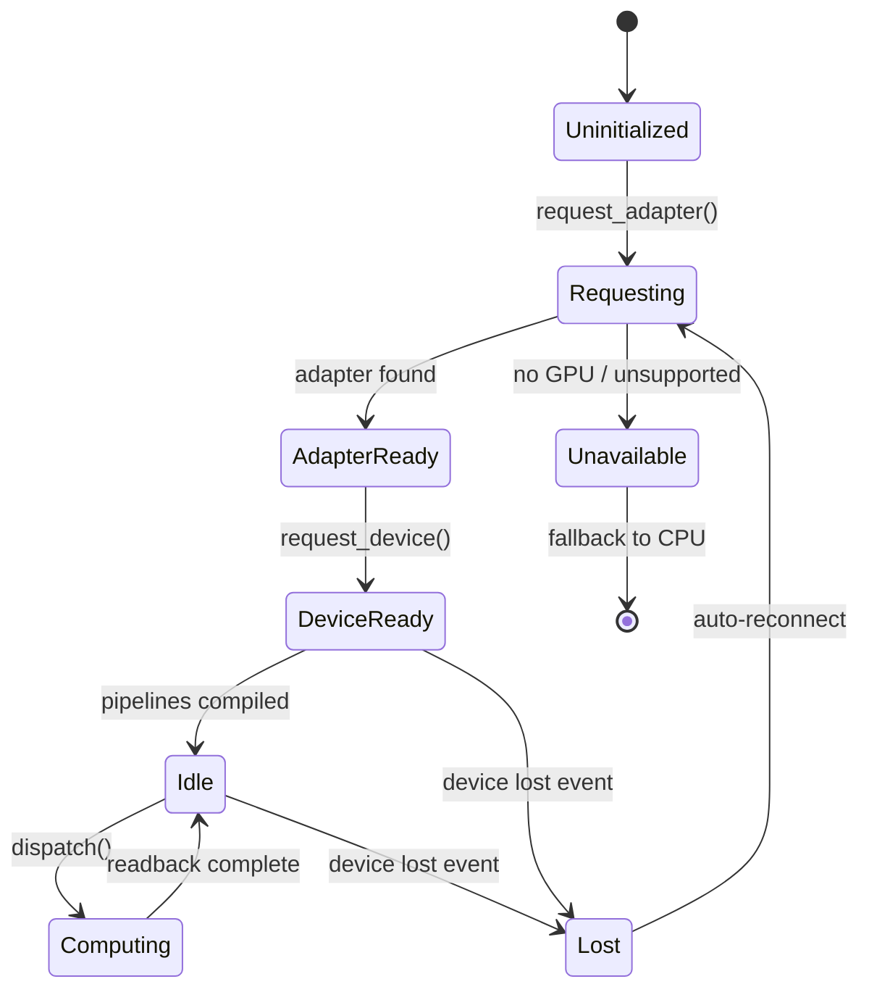
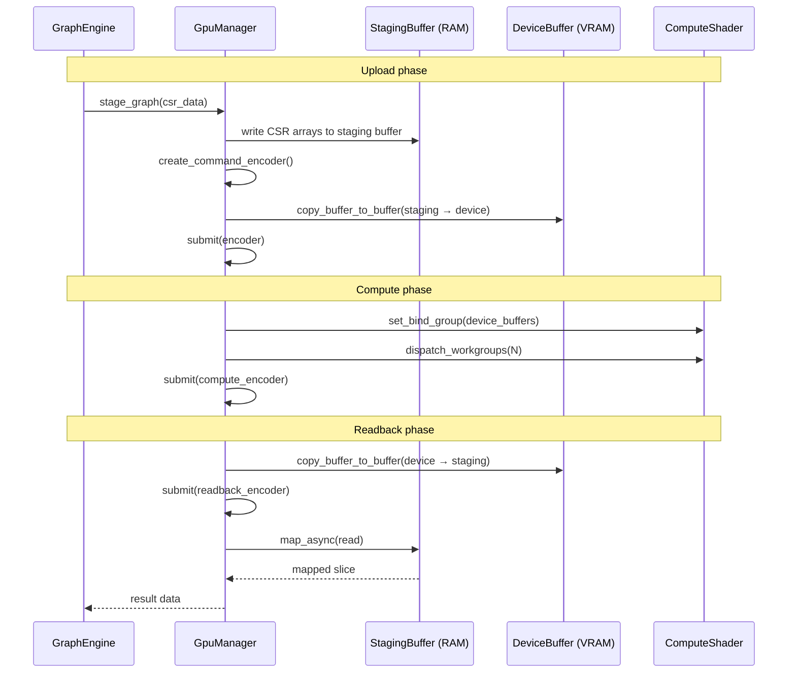
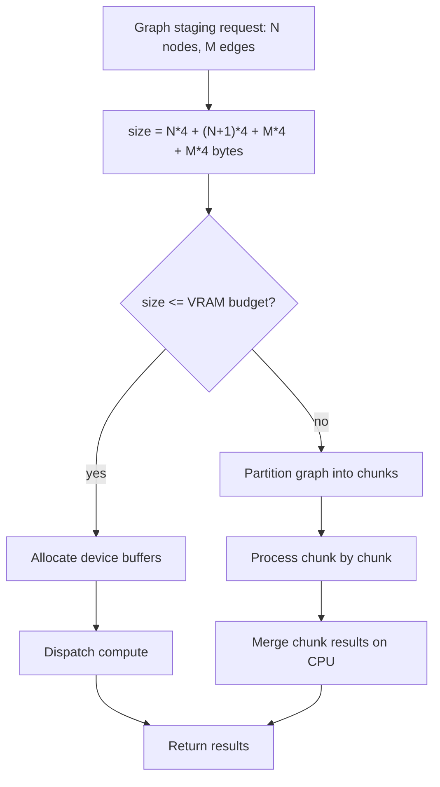

# GPU Compute

## Overview
<!-- type: overview lang: markdown -->

GPU acceleration layer via `wgpu` (WebGPU API). Provides cross-platform compute shader execution (Metal on macOS, Vulkan on Linux/Windows). Handles device lifecycle, buffer staging (RAM ↔ VRAM), shader pipeline management, and workgroup dispatch for graph algorithms.

## Device Lifecycle
<!-- type: state-machine lang: mermaid -->



## Buffer Staging Pipeline
<!-- type: interaction lang: mermaid -->



## CSR Graph Representation
<!-- type: schema lang: json -->

```json
{
  "$id": "csr-graph",
  "title": "CSRGraph",
  "description": "Compressed Sparse Row format for GPU-friendly adjacency representation",
  "type": "object",
  "properties": {
    "num_nodes": { "type": "integer" },
    "num_edges": { "type": "integer" },
    "row_offsets": {
      "type": "array",
      "items": { "type": "integer", "format": "uint32" },
      "description": "Length = num_nodes + 1. row_offsets[i]..row_offsets[i+1] gives edge range for node i"
    },
    "col_indices": {
      "type": "array",
      "items": { "type": "integer", "format": "uint32" },
      "description": "Length = num_edges. Target node indices"
    },
    "edge_weights": {
      "type": "array",
      "items": { "type": "number", "format": "float32" },
      "description": "Length = num_edges. Edge weights (confidence values)"
    }
  }
}
```

## Compute Shader Catalog
<!-- type: schema lang: json -->

```json
{
  "$id": "shader-catalog",
  "title": "ShaderCatalog",
  "type": "object",
  "additionalProperties": {
    "type": "object",
    "required": ["description", "workgroup_size", "inputs", "outputs"],
    "properties": {
      "description": { "type": "string" },
      "workgroup_size": {
        "type": "array",
        "items": { "type": "integer" },
        "minItems": 3,
        "maxItems": 3
      },
      "inputs": {
        "type": "array",
        "items": { "type": "string" },
        "description": "Named GPU buffer bindings (input)"
      },
      "outputs": {
        "type": "array",
        "items": { "type": "string" },
        "description": "Named GPU buffer bindings (output)"
      },
      "iterations": { "type": "string", "description": "Iteration semantics (if applicable)" }
    }
  },
  "examples": [
    {
      "pagerank": {
        "description": "Iterative PageRank on CSR graph",
        "workgroup_size": [256, 1, 1],
        "inputs": ["row_offsets", "col_indices", "edge_weights", "rank_in"],
        "outputs": ["rank_out"],
        "iterations": "configurable (default 100)"
      },
      "bfs_level": {
        "description": "Level-synchronous BFS (one level per dispatch)",
        "workgroup_size": [256, 1, 1],
        "inputs": ["row_offsets", "col_indices", "frontier", "visited"],
        "outputs": ["next_frontier", "distances"]
      },
      "spmv": {
        "description": "Sparse matrix-vector multiply (building block for eigenvector centrality)",
        "workgroup_size": [256, 1, 1],
        "inputs": ["row_offsets", "col_indices", "values", "vec_in"],
        "outputs": ["vec_out"]
      },
      "community_label_prop": {
        "description": "Label propagation for community detection",
        "workgroup_size": [256, 1, 1],
        "inputs": ["row_offsets", "col_indices", "labels_in"],
        "outputs": ["labels_out", "changed_count"]
      }
    }
  ]
}
```

## GPU Memory Budget
<!-- type: logic lang: mermaid -->


