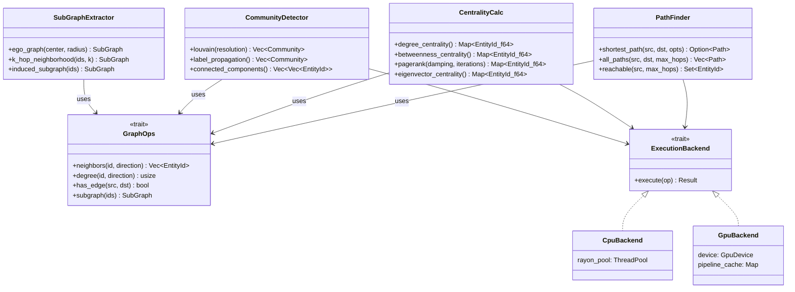
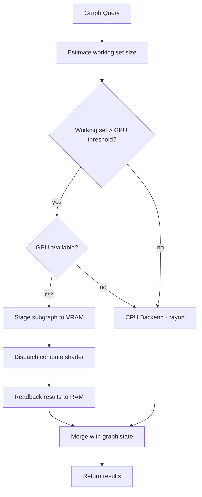
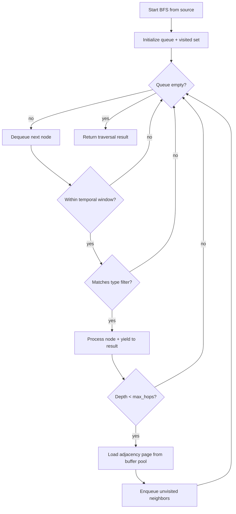
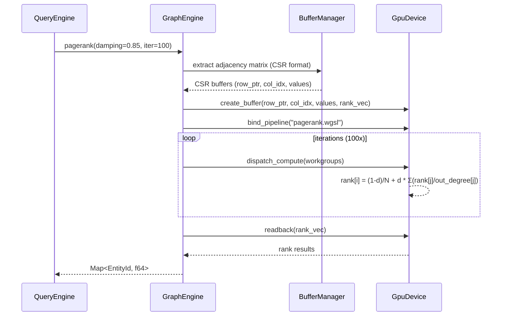

# Graph Engine

## Overview
<!-- type: overview lang: markdown -->

Graph computation engine with dual execution paths: CPU (rayon threadpool) for small/medium graphs and interactive queries, GPU (wgpu compute shaders) for large-scale analytics. Provides traversal, shortest path, centrality metrics, and community detection.

## Graph Operations Class Hierarchy
<!-- type: dependency lang: mermaid -->



## Execution Routing
<!-- type: logic lang: mermaid -->



## BFS/DFS Traversal
<!-- type: logic lang: mermaid -->



## PageRank GPU Pipeline
<!-- type: interaction lang: mermaid -->



## Path Result Schema
<!-- type: schema lang: json -->

Phase 1 `src/graph.rs::Path` currently ships `{nodes, edges, hop_count, min_confidence}`. The `total_weight` field below is reserved for Phase 3+ weighted-traversal algorithms (Dijkstra / A*); BFS in Phase 1 is unweighted and does not populate it.

```json
{
  "$id": "path-result",
  "title": "Path",
  "type": "object",
  "properties": {
    "nodes": {
      "type": "array",
      "items": { "type": "string", "format": "uuid" },
      "description": "Ordered entity IDs from source to destination"
    },
    "edges": {
      "type": "array",
      "items": { "type": "string", "format": "uuid" },
      "description": "Relation IDs connecting consecutive nodes"
    },
    "total_weight": {
      "type": "number",
      "description": "Sum of edge weights (1/confidence by default). Phase 3+ weighted traversal; absent from Phase 1 BFS output."
    },
    "hop_count": { "type": "integer" },
    "min_confidence": {
      "type": "number",
      "description": "Lowest confidence edge in path — bottleneck indicator"
    }
  }
}
```

## Community Result Schema
<!-- type: schema lang: json -->

```json
{
  "$id": "community-result",
  "title": "Community",
  "type": "object",
  "properties": {
    "community_id": { "type": "integer" },
    "members": {
      "type": "array",
      "items": { "type": "string", "format": "uuid" }
    },
    "size": { "type": "integer" },
    "density": {
      "type": "number",
      "description": "Internal edge density (0..1)"
    },
    "modularity_contribution": {
      "type": "number",
      "description": "This community's contribution to overall modularity score"
    }
  }
}
```
