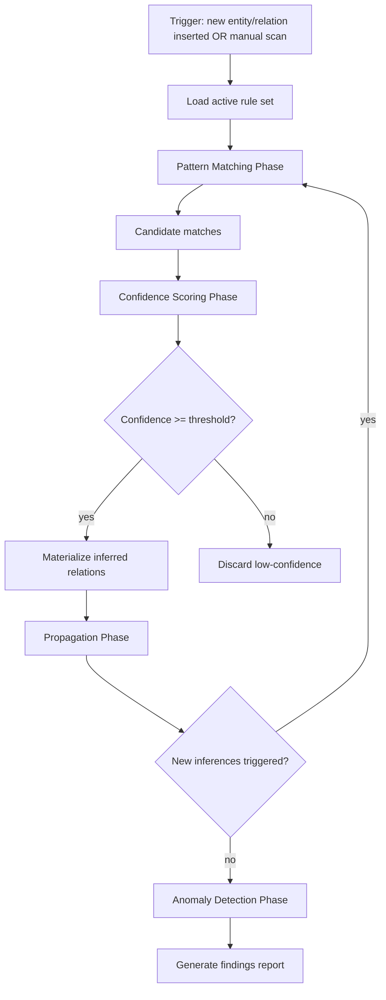
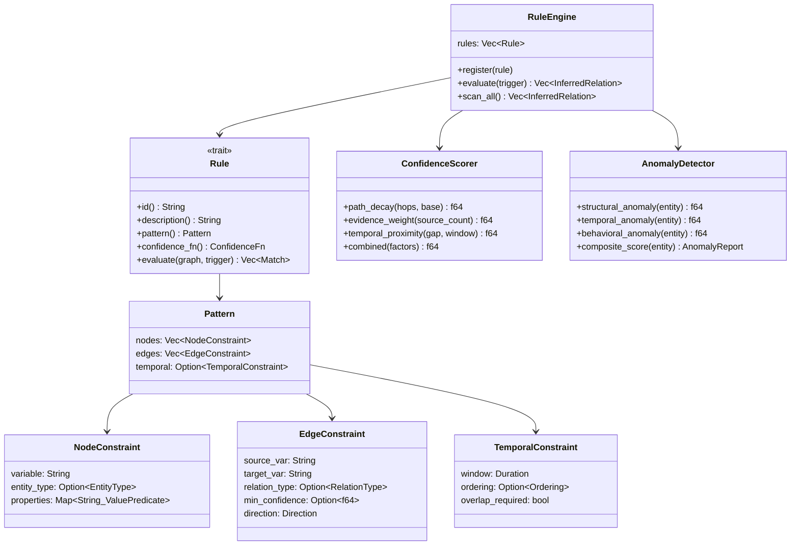
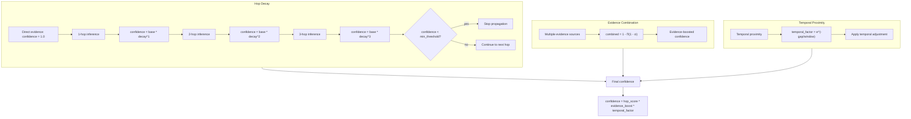
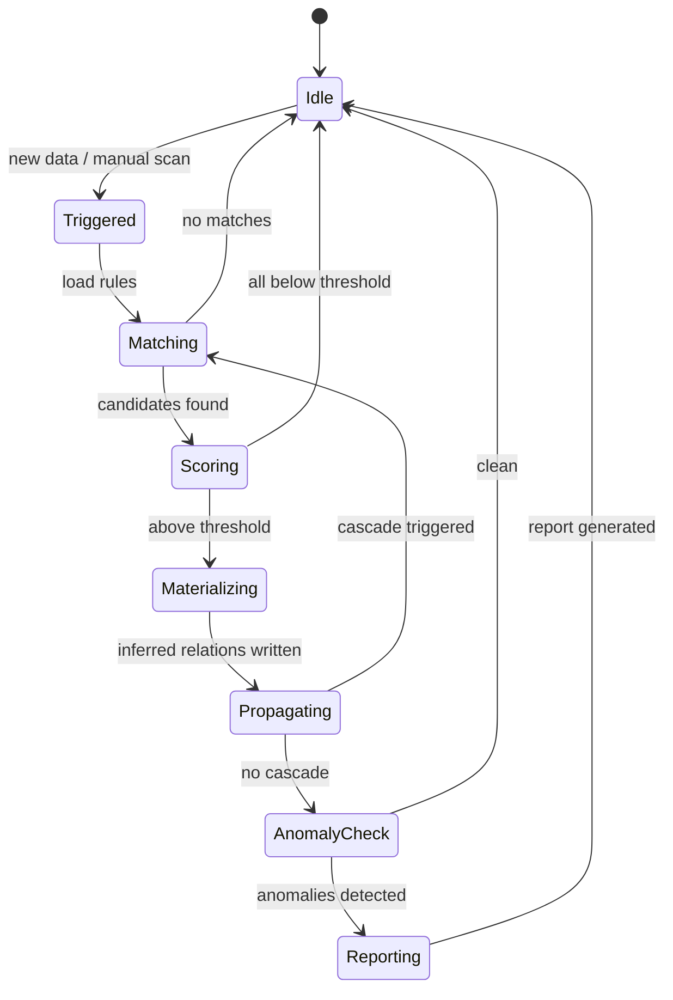

# Inference Engine

## Overview
<!-- type: overview lang: markdown -->

Rule-based inference engine for detecting patterns, propagating confidence, and scoring anomalies in the temporal knowledge graph. Designed for intelligence analysis: identifying indirect connections, suspicious temporal clusters, and hidden influence networks.

## Inference Pipeline
<!-- type: logic lang: mermaid -->



## Rule Engine Architecture
<!-- type: dependency lang: mermaid -->



## Confidence Propagation
<!-- type: logic lang: mermaid -->



## Rule Definition Schema
<!-- type: schema lang: json -->

```json
{
  "$id": "inference-rule",
  "title": "InferenceRule",
  "type": "object",
  "required": ["id", "description", "pattern", "infers"],
  "properties": {
    "id": { "type": "string", "pattern": "^R-[A-Z]+-\\d+$" },
    "description": { "type": "string" },
    "enabled": { "type": "boolean", "default": true },
    "priority": { "type": "integer", "minimum": 0, "maximum": 100 },
    "pattern": {
      "type": "object",
      "properties": {
        "nodes": {
          "type": "array",
          "items": {
            "type": "object",
            "properties": {
              "var": { "type": "string" },
              "entity_type": { "$ref": "data-model#entity-type" },
              "properties": { "type": "object" }
            }
          }
        },
        "edges": {
          "type": "array",
          "items": {
            "type": "object",
            "properties": {
              "from": { "type": "string" },
              "to": { "type": "string" },
              "relation_type": { "$ref": "data-model#relation-type" },
              "min_confidence": { "type": "number" }
            }
          }
        },
        "temporal": {
          "type": "object",
          "properties": {
            "window_days": { "type": "integer" },
            "ordering": { "type": "string", "enum": ["before", "after", "concurrent", "any"] },
            "overlap_required": { "type": "boolean" }
          }
        }
      }
    },
    "infers": {
      "type": "object",
      "description": "The relation to create when pattern matches",
      "properties": {
        "relation_type": { "$ref": "data-model#relation-type" },
        "source_var": { "type": "string" },
        "target_var": { "type": "string" },
        "base_confidence": { "type": "number", "minimum": 0, "maximum": 1 },
        "decay_per_hop": { "type": "number", "default": 0.15 }
      }
    }
  }
}
```

## Example Rules
<!-- type: overview lang: markdown -->

**R-AFF-001: Transitive Affiliation**
If A is `member_of` Org1, and Org1 is `affiliated_with` Org2, infer A is `affiliated_with` Org2 (confidence decayed by hop).

**R-MTG-001: Meeting Network**
If A `met_with` B, and B `met_with` C within 30 days, and A never directly met C, flag as potential indirect coordination.

**R-FND-001: Follow the Money**
If Org1 `funded` Org2, and Person is `member_of` Org2, infer Person is `influenced_by` Org1 (base confidence 0.6, decays).

**R-TMP-001: Suspicious Temporal Clustering**
If Person has 3+ `met_with` relations within 7 days preceding a `policy` entity's `valid_from`, flag as anomaly.

**R-ANO-001: Bridge Node Detection**
If a Person has high betweenness centrality AND connects two otherwise disconnected communities, flag as potential intermediary.

## Anomaly Report Schema
<!-- type: schema lang: json -->

```json
{
  "$id": "anomaly-report",
  "title": "AnomalyReport",
  "type": "object",
  "properties": {
    "entity_id": { "type": "string", "format": "uuid" },
    "entity_name": { "type": "string" },
    "composite_score": {
      "type": "number",
      "minimum": 0.0,
      "maximum": 1.0,
      "description": "Weighted combination of all anomaly dimensions"
    },
    "dimensions": {
      "type": "object",
      "properties": {
        "structural": {
          "type": "number",
          "description": "Unusual graph position (high betweenness, bridge node)"
        },
        "temporal": {
          "type": "number",
          "description": "Unusual temporal patterns (clustered activity)"
        },
        "behavioral": {
          "type": "number",
          "description": "Deviation from peer group behavior"
        }
      }
    },
    "triggered_rules": {
      "type": "array",
      "items": { "type": "string", "description": "Rule IDs that flagged this entity" }
    },
    "evidence": {
      "type": "array",
      "items": {
        "type": "object",
        "properties": {
          "rule_id": { "type": "string" },
          "description": { "type": "string" },
          "related_entities": {
            "type": "array",
            "items": { "type": "string", "format": "uuid" }
          },
          "confidence": { "type": "number" }
        }
      }
    }
  }
}
```

## Inference State Machine
<!-- type: state-machine lang: mermaid -->


