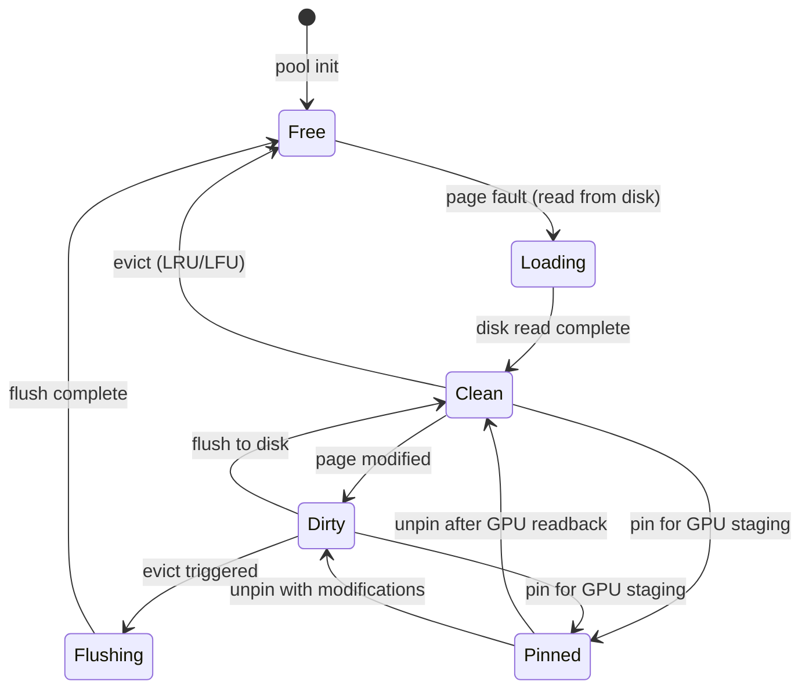
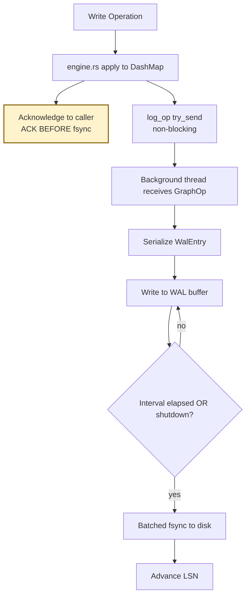
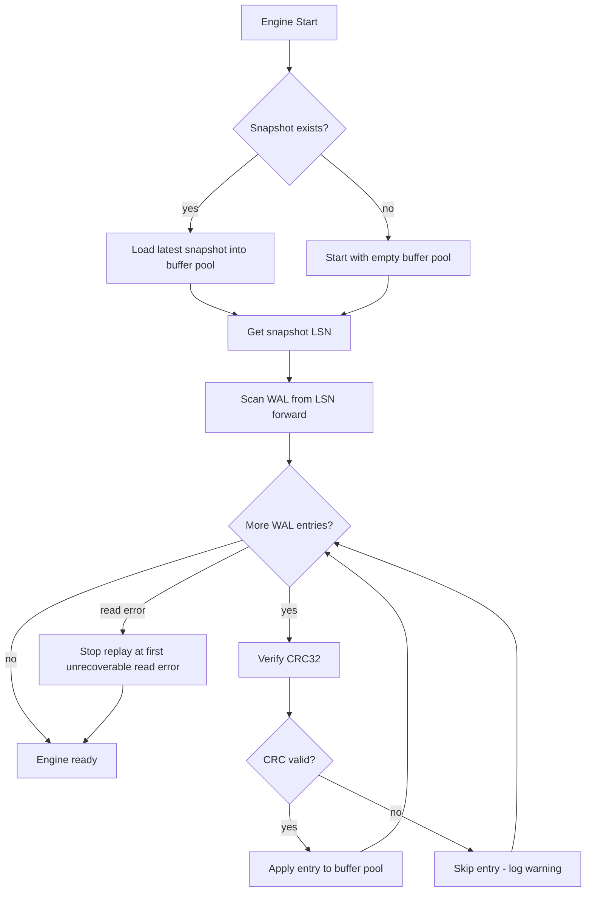
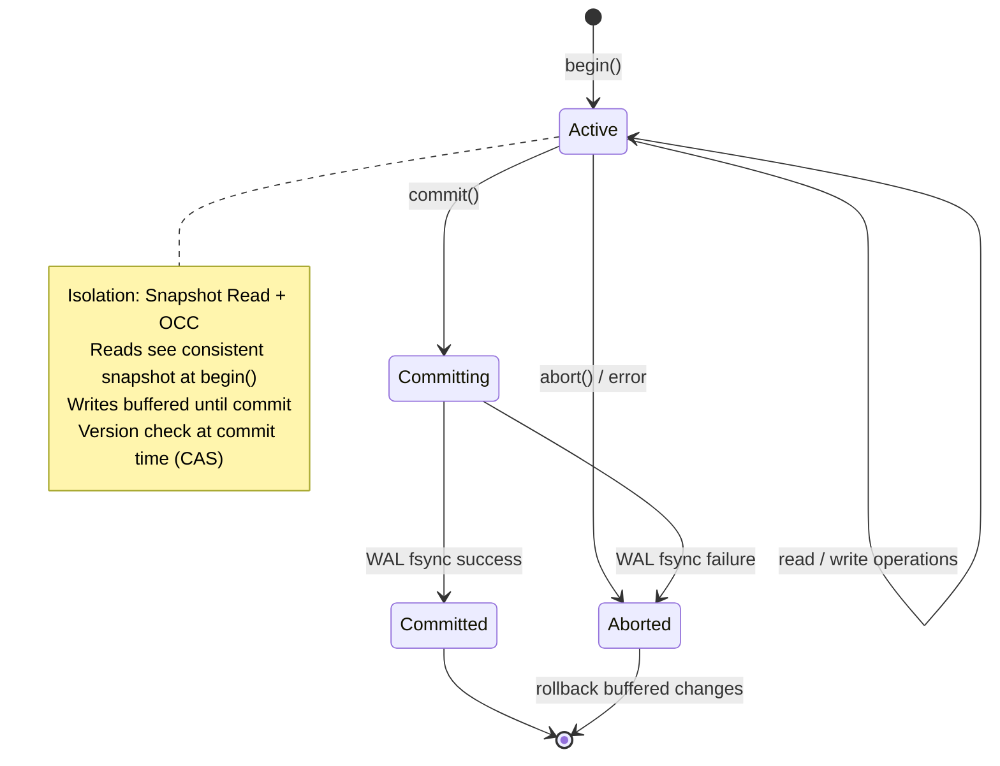

# Storage Engine

## Overview
<!-- type: overview lang: markdown -->

Page-based storage engine with tiered memory management. Data lives in fixed-size pages on disk, cached in a RAM buffer pool, and selectively staged to VRAM for GPU computation. WAL ensures durability; snapshots enable fast recovery.

## Page Layout
<!-- type: schema lang: json -->

```json
{
  "$id": "page-layout",
  "title": "PageLayout",
  "description": "Fixed 16KB pages. Each page has a header (64 bytes) + slots.",
  "type": "object",
  "properties": {
    "page_size": { "const": 16384, "description": "16KB per page" },
    "header": {
      "type": "object",
      "properties": {
        "magic": { "const": "CIDB", "description": "4 bytes" },
        "page_type": {
          "type": "string",
          "enum": ["node", "edge", "property", "index", "overflow"],
          "description": "1 byte discriminant"
        },
        "page_id": { "type": "integer", "description": "8 bytes, monotonic" },
        "slot_count": { "type": "integer", "description": "2 bytes, entries in page" },
        "free_offset": { "type": "integer", "description": "2 bytes, start of free space" },
        "next_page": { "type": "integer", "description": "8 bytes, overflow chain" },
        "checksum": { "type": "integer", "description": "4 bytes, CRC32" },
        "lsn": { "type": "integer", "description": "8 bytes, log sequence number for WAL" },
        "reserved": { "description": "27 bytes padding to 64" }
      }
    },
    "body_size": { "const": 16320, "description": "16384 - 64 = usable slot space" }
  }
}
```

## Node Page Slot Layout
<!-- type: schema lang: json -->

```json
{
  "$id": "node-slot",
  "title": "NodeSlot",
  "description": "Fixed 128-byte slot for entity core data. Properties overflow to PropertyPage.",
  "type": "object",
  "properties": {
    "entity_id": { "description": "16 bytes (UUID)" },
    "entity_type_id": { "description": "2 bytes (type registry index)" },
    "name_offset": { "description": "4 bytes (offset into property page for name string)" },
    "name_length": { "description": "2 bytes" },
    "valid_from": { "description": "8 bytes (epoch millis, 0 = unbounded)" },
    "valid_to": { "description": "8 bytes (epoch millis, i64::MAX = unbounded)" },
    "created_at": { "description": "8 bytes" },
    "updated_at": { "description": "8 bytes" },
    "version": { "description": "8 bytes" },
    "property_page_id": { "description": "8 bytes (first property page)" },
    "adjacency_page_id": { "description": "8 bytes (first adjacency list page)" },
    "flags": { "description": "2 bytes (deleted, pinned, inferred)" },
    "reserved": { "description": "46 bytes" }
  },
  "x-sdd": {
    "id": "node-slot",
    "total_bytes": 128,
    "slots_per_page": 127
  }
}
```

## Edge Page Slot Layout
<!-- type: schema lang: json -->

```json
{
  "$id": "edge-slot",
  "title": "EdgeSlot",
  "description": "Fixed 100-byte slot for relation core data (see x-sdd.total_bytes; field widths sum to 100: 16+2+16+16+8+8+8+8+8+8+2).",
  "type": "object",
  "properties": {
    "relation_id": { "description": "16 bytes (UUID)" },
    "relation_type_id": { "description": "2 bytes (type registry index)" },
    "source_id": { "description": "16 bytes (UUID)" },
    "target_id": { "description": "16 bytes (UUID)" },
    "confidence": { "description": "8 bytes (f64, matches data-model precision)" },
    "valid_from": { "description": "8 bytes" },
    "valid_to": { "description": "8 bytes" },
    "created_at": { "description": "8 bytes" },
    "version": { "description": "8 bytes" },
    "property_page_id": { "description": "8 bytes" },
    "flags": { "description": "2 bytes" }
  },
  "x-sdd": {
    "id": "edge-slot",
    "total_bytes": 100,
    "slots_per_page": 163
  }
}
```

## Buffer Pool State Machine
<!-- type: state-machine lang: mermaid -->



## WAL Write Flow
<!-- type: logic lang: mermaid -->



> Apply-first lazy-log: caller-ack happens after the in-memory DashMap apply,
> BEFORE the WAL fsync. The trade is throughput (no per-op fsync barrier) vs
> strict durability (a crash between ack and the next batched fsync loses the
> tail of acked ops). Callers needing a hard durability barrier must invoke
> `flush()`, which drains the WAL channel and forces an fsync before returning.
> Aspirational — a future Phase-2.5+ uplift may introduce ARIES-style
> durable-first ordering for durability-critical workloads; see
> `design-decisions.md`.

## Recovery Flow
<!-- type: logic lang: mermaid -->



> Non-destructive recovery: a CRC-mismatched entry is logged and skipped, and
> replay halts at the first unrecoverable read error without rewriting the WAL.
> The post-corruption WAL tail is preserved on disk for forensic inspection
> (operators can diff the file or re-attempt recovery against a hardened
> reader). Aspirational — destructive truncation at the corruption point is an
> alternative that could be adopted if forensic preservation is not needed.

## Transaction State Machine
<!-- type: state-machine lang: mermaid -->



## Disk File Layout
<!-- type: schema lang: json -->

```json
{
  "$id": "disk-layout",
  "title": "DiskLayout",
  "type": "object",
  "properties": {
    "data_dir": {
      "type": "string",
      "description": "Root directory for all DB files"
    },
    "files": {
      "type": "object",
      "properties": {
        "nodes.cidb": { "description": "Node pages (mmap'd)" },
        "edges.cidb": { "description": "Edge pages (mmap'd)" },
        "props.cidb": { "description": "Property pages (mmap'd)" },
        "idx_type.cidb": { "description": "Type index pages" },
        "idx_temporal.cidb": { "description": "Temporal interval index (B-tree)" },
        "idx_adjacency.cidb": { "description": "Adjacency list index" },
        "idx_text.cidb": { "description": "Text search index (trigram)" },
        "wal/": { "description": "WAL segment files (wal-{seq}.log)" },
        "snap/": { "description": "Snapshot files (snap-{lsn}.cidb)" },
        "meta.json": { "description": "DB metadata (version, config, stats)" }
      }
    }
  }
}
```
