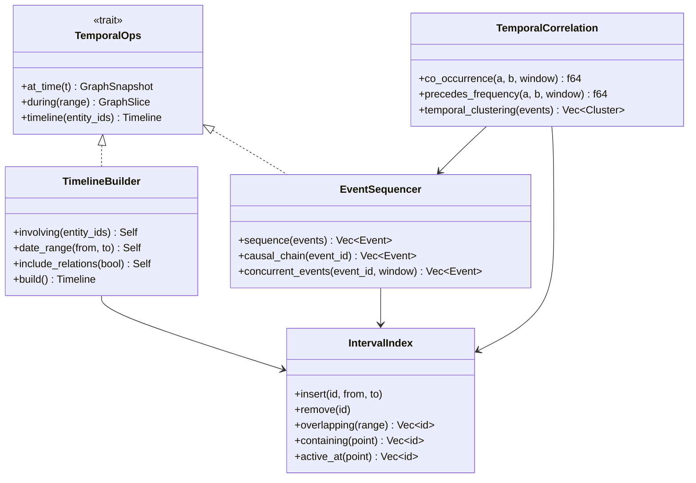
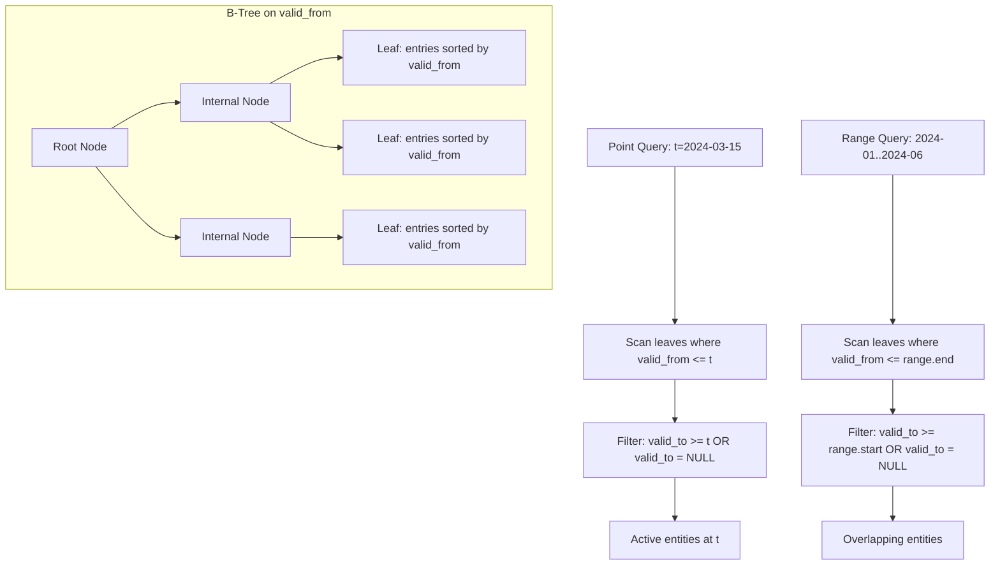
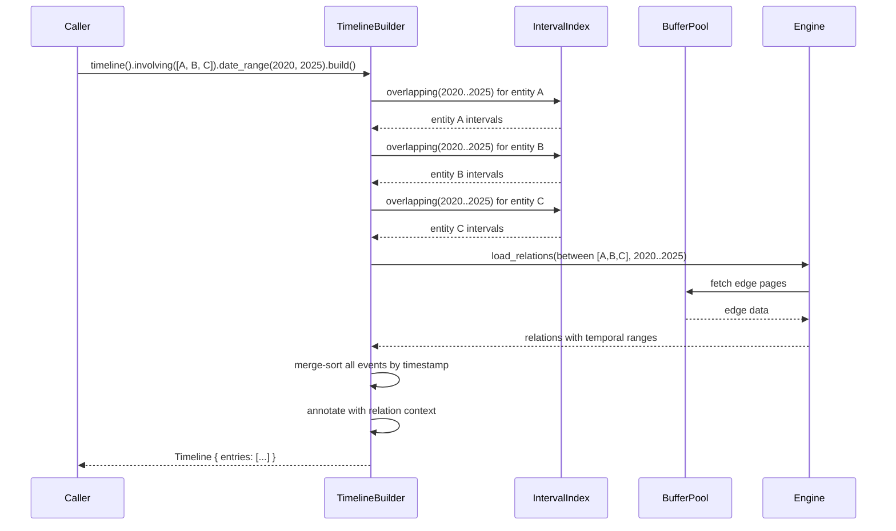

# Temporal Engine

> **Phase 1 scope marker.** `src/temporal.rs` (Phase 1) currently provides `active_during`, `active_at`, `relations_at`, and `timeline` as direct methods on `impl CtxInfEngine`, backed by linear DashMap iteration + `TemporalRange::{contains, overlaps}`. The `TemporalOps` trait, `IntervalIndex` B-tree, `TimelineBuilder`, `EventSequencer`, `TemporalCorrelation`, and interval-index flow below are **Phase 3+ aspirational** — they describe the target indexed architecture, not today's code. The "Timeline Entry Schema" IS implemented in Phase 1 (minus the `description` field, which is reserved for Phase 3).

## Overview
<!-- type: overview lang: markdown -->

Temporal engine for time-aware graph queries. Every entity and relation carries `(valid_from, valid_to)` interval bounds. The engine provides interval indexing (B-tree on intervals), point-in-time graph snapshots, timeline construction, and temporal correlation detection across entities.

## Temporal Query Types
<!-- type: dependency lang: mermaid -->



## Interval Index Structure
<!-- type: logic lang: mermaid -->



## Timeline Construction
<!-- type: interaction lang: mermaid -->



## Timeline Entry Schema
<!-- type: schema lang: json -->

```json
{
  "$id": "timeline-entry",
  "title": "TimelineEntry",
  "type": "object",
  "required": ["timestamp", "entry_type"],
  "properties": {
    "timestamp": { "type": "string", "format": "date-time" },
    "entry_type": {
      "type": "string",
      "enum": ["entity_start", "entity_end", "relation_start", "relation_end", "event_occurred"]
    },
    "entity_id": { "type": "string", "format": "uuid" },
    "entity_name": { "type": "string" },
    "entity_type": { "$ref": "data-model#entity-type" },
    "relation_id": { "type": "string", "format": "uuid" },
    "relation_type": { "$ref": "data-model#relation-type" },
    "counterpart_id": { "type": "string", "format": "uuid" },
    "counterpart_name": { "type": "string" },
    "description": { "type": "string", "description": "Reserved for Phase 3+ enrichment; absent from Phase 1 src/temporal.rs::TimelineEntry." }
  }
}
```

## Temporal Correlation Schema
<!-- type: schema lang: json -->

```json
{
  "$id": "temporal-correlation",
  "title": "TemporalCorrelation",
  "type": "object",
  "properties": {
    "entity_a": { "type": "string", "format": "uuid" },
    "entity_b": { "type": "string", "format": "uuid" },
    "co_occurrence_score": {
      "type": "number",
      "minimum": 0.0,
      "maximum": 1.0,
      "description": "How often A and B are active in the same time window"
    },
    "precedes_score": {
      "type": "number",
      "description": "How often A's events precede B's within a window"
    },
    "window_days": {
      "type": "integer",
      "description": "Temporal window used for correlation"
    },
    "sample_count": {
      "type": "integer",
      "description": "Number of event pairs examined"
    }
  }
}
```
