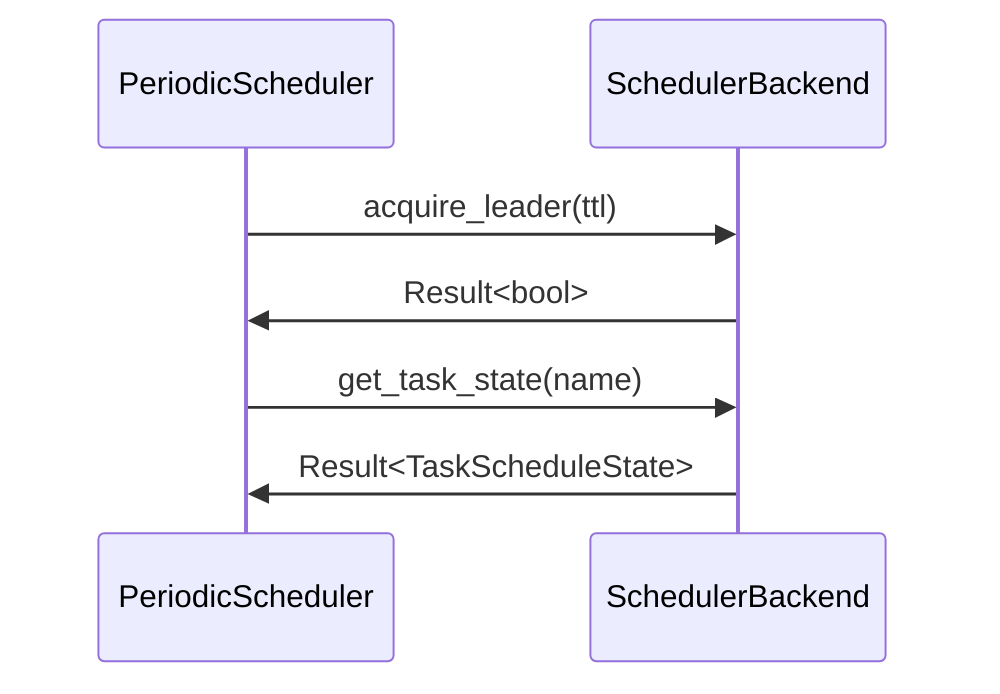

<spec>

# Meteor Scheduler Backends

## Overview

This specification defines the interfaces for the Meteor scheduler backends and the implementation for the Ion backend. It allows for different storage and locking mechanisms while maintaining a consistent interface for the periodic scheduler.

## Requirements

### R1 - SchedulerBackend Trait

```yaml
id: R1
priority: medium
status: draft
```

Define a trait to abstract away the leader election and state persistence.

### R2 - Ion Backend Implementation

```yaml
id: R2
priority: medium
status: draft
```

Provide a production-ready implementation using cclab-ion for distributed locking.

### R3 - InMemory Backend for Testing

```yaml
id: R3
priority: medium
status: draft
```

Include an in-memory backend for unit testing without external dependencies.

## Acceptance Criteria

### Scenario: Ion Leader Acquisition

- **GIVEN** An IonSchedulerBackend.
- **WHEN** acquire_leader() is called.
- **THEN** The backend uses the Ion lock command to attempt acquisition.

### Scenario: Task State Persistence

- **GIVEN** A scheduler instance using Ion backend.
- **WHEN** set_task_state() is called for a specific task.
- **THEN** The state is stored in Ion and survives instance restarts.

## Diagrams

### Scheduler and Backend Interaction



<semantic-data>

```json
{
  "messages": [
    {
      "from": "Scheduler",
      "text": "acquire_leader(ttl)",
      "to": "Backend"
    },
    {
      "from": "Backend",
      "text": "Result<bool>",
      "to": "Scheduler"
    },
    {
      "from": "Scheduler",
      "text": "get_task_state(name)",
      "to": "Backend"
    },
    {
      "from": "Backend",
      "text": "Result<TaskScheduleState>",
      "to": "Scheduler"
    }
  ],
  "participants": [
    {
      "id": "Scheduler",
      "label": "PeriodicScheduler",
      "type": "participant"
    },
    {
      "id": "Backend",
      "label": "SchedulerBackend",
      "type": "participant"
    }
  ]
}
```

</semantic-data>

</spec>
