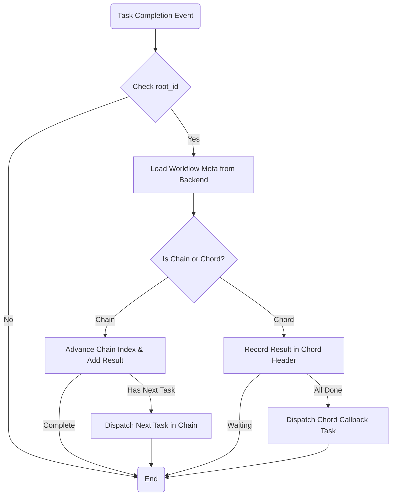

<spec>

# Workflow Orchestration

## Overview

This specification defines the task composition primitives (Chain, Group, Chord) and their high-level orchestration model. It describes how complex task graphs are constructed using signatures and executed across a distributed system. The orchestration logic is decoupled from execution to enable cross-executor continuation, particularly supporting Kubernetes Job hand-offs.

## Requirements

### R1 - Chain Workflows

Support sequential execution of tasks where results are passed forward.

### R2 - Group Workflows

Support parallel execution of multiple tasks.

### R3 - Chord Workflows

Support a header group of parallel tasks followed by a single callback task once all are complete.

### R4 - Workflow Signatures

Construct workflows using TaskSignature objects encapsulating name, args, and options.

### R5 - State Persistence via Metadata API

Manage workflow state (progress, results) using persistent ChainMeta and ChordMeta in the ResultBackend.

### R6 - Decoupled Orchestration Logic

Ensure orchestration logic (continuation) can be triggered by any executor, including external ones like K8s Jobs.

## Acceptance Criteria

### Scenario: Chain Continuation

- **GIVEN** A chain: TaskA -> TaskB.
- **WHEN** TaskA completes successfully.
- **THEN** TaskB is published to NATS with TaskA's result.

### Scenario: Chord Completion

- **GIVEN** A chord with header [T1, T2] and callback C.
- **WHEN** T1 and T2 complete.
- **THEN** Callback task C is published with results [R1, R2].

### Scenario: K8s Job Continuation

- **GIVEN** A chain where the first task is a K8s Job.
- **WHEN** The K8s Job reports success to the backend.
- **THEN** The next task in the chain is triggered after the K8s Job finishes.

### Scenario: Group Monitoring

- **GIVEN** A group of tasks.
- **WHEN** Individual tasks in the group finish.
- **THEN** The system reflects the combined state of all tasks in the group.

## Diagrams

### Workflow Orchestration Logic



<semantic-data>

```json
{
  "edges": [
    {
      "from": "CheckRootId",
      "semantic": {
        "condition": "root_id.is_some()"
      },
      "to": "LoadMeta"
    },
    {
      "from": "CheckRootId",
      "semantic": {
        "condition": "root_id.is_none()"
      },
      "to": "End"
    },
    {
      "from": "IsChainOrChord",
      "semantic": {
        "condition": "meta.is_chain()"
      },
      "to": "AdvanceChain"
    },
    {
      "from": "IsChainOrChord",
      "semantic": {
        "condition": "meta.is_chord()"
      },
      "to": "RecordChordResult"
    },
    {
      "from": "AdvanceChain",
      "semantic": {
        "condition": "next_task.is_some()"
      },
      "to": "DispatchNext"
    },
    {
      "from": "AdvanceChain",
      "semantic": {
        "condition": "next_task.is_none()"
      },
      "to": "End"
    },
    {
      "from": "RecordChordResult",
      "semantic": {
        "condition": "all_header_tasks_complete == true"
      },
      "to": "DispatchCallback"
    },
    {
      "from": "RecordChordResult",
      "semantic": {
        "condition": "all_header_tasks_complete == false"
      },
      "to": "End"
    }
  ],
  "metadata": null,
  "nodes": [
    {
      "id": "TaskComplete",
      "semantic": {
        "type": "start"
      }
    },
    {
      "id": "CheckRootId",
      "semantic": {
        "type": "condition"
      }
    },
    {
      "id": "LoadMeta",
      "semantic": {
        "operation": "SELECT",
        "table": "metadata",
        "type": "db_query"
      }
    },
    {
      "id": "IsChainOrChord",
      "semantic": {
        "type": "condition"
      }
    },
    {
      "id": "AdvanceChain",
      "semantic": {
        "type": "transform"
      }
    },
    {
      "id": "DispatchNext",
      "semantic": {
        "type": "api_call",
        "url": "nats://publish"
      }
    },
    {
      "id": "RecordChordResult",
      "semantic": {
        "operation": "UPDATE",
        "table": "metadata",
        "type": "db_mutation"
      }
    },
    {
      "id": "DispatchCallback",
      "semantic": {
        "type": "api_call",
        "url": "nats://publish"
      }
    },
    {
      "id": "End",
      "semantic": {
        "type": "end"
      }
    }
  ]
}
```

</semantic-data>

</spec>
