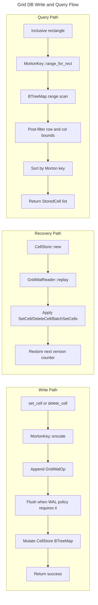

# Grid DB Architecture

## Overview
<!-- type: overview lang: markdown -->

The grid database layer lives in `crates/cclab-grid/src/db`. It provides
cell storage, rectangular range queries, and Yrs update/snapshot persistence
for workbooks served by `crates/cclab-grid/src/server/db`.

The storage path uses `CellStore` per workbook. `CellStore` maps `(row, col)`
coordinates to a `MortonKey`, appends a grid WAL operation before mutating the
in-memory `BTreeMap`, and replays `wal-current.log` on startup to reconstruct
the durable cell state.

## Requirements
<!-- type: schema lang: yaml -->

```yaml
requirements:
  - id: R1
    title: Morton coordinate key
    priority: must
    statement: "The storage layer must encode every `(row, col)` coordinate as a deterministic `u64` Morton key and decode the key back to the original `u32` coordinates."
    implementation:
      - "Use `MortonKey::encode(row, col)` before accessing the cell map."
      - "Expose `MortonKey::decode()` for round-trip validation and diagnostics."

  - id: R2
    title: WAL-first mutation
    priority: must
    statement: "Cell set/delete operations must append the matching WAL operation before updating the in-memory store."
    implementation:
      - "Set writes emit `GridWalOp::SetCell` with row, col, value, and version."
      - "Delete writes emit `GridWalOp::DeleteCell` with row and col."
      - "Recovery replays WAL operations idempotently into the `BTreeMap`."

  - id: R3
    title: Rectangular range query
    priority: must
    statement: "The query path must accept inclusive rectangular bounds and return only cells inside the rectangle."
    implementation:
      - "Map the rectangle through `MortonKey::range_for_rect`."
      - "Scan `BTreeMap` key ranges in Morton order."
      - "Post-filter by original row and column bounds."
      - "Sort results by Morton key before returning."

  - id: R4
    title: Workbook-scoped stores
    priority: should
    statement: "The server database wrapper should isolate cell and Yrs persistence by workbook id."
    implementation:
      - "Cache one `CellStore` per workbook id."
      - "Use `YrsStore` for update and snapshot persistence."
      - "Delete workbook cell/Yrs data before removing workbook metadata."
```

## Scenarios
<!-- type: scenarios lang: yaml -->

```yaml
scenarios:
  - name: Morton round trip
    given:
      - "A valid `(row, col)` pair within `u32` bounds."
    when:
      - "`MortonKey::encode(row, col)` is decoded with `decode()`."
    then:
      - "The decoded coordinates equal the original row and column."

  - name: Durable cell upsert
    given:
      - "A workbook-scoped `CellStore` and a cell value."
    when:
      - "`set_cell(row, col, value)` is called."
    then:
      - "`GridWalOp::SetCell` is appended before the `BTreeMap` entry changes."
      - "A restarted store recovers the same latest cell value from WAL replay."

  - name: Range query over rectangle
    given:
      - "Stored cells inside and outside an inclusive rectangle."
    when:
      - "`query_range(start_row, start_col, end_row, end_col)` is called."
    then:
      - "The scan uses the Morton range coverage."
      - "Cells outside the original rectangle are filtered out."
      - "The returned cells are ordered by Morton key."
```

## Logic
<!-- type: logic lang: mermaid -->



## Schema
<!-- type: schema lang: yaml -->

```yaml
types:
  MortonKey:
    module: crates/cclab-grid/src/db/storage/morton.rs
    representation: u64
    methods:
      - "encode(row: u32, col: u32) -> MortonKey"
      - "decode(&self) -> (u32, u32)"
      - "as_u64(&self) -> u64"
      - "range_for_rect(start_row, start_col, end_row, end_col) -> Vec<(MortonKey, MortonKey)>"

  StoredCell:
    module: crates/cclab-grid/src/db/storage/cell_store.rs
    fields:
      row: u32
      col: u32
      value: CellValue
      version: u64
      timestamp: u64

  GridWalOp:
    module: crates/cclab-grid/src/db/storage/wal.rs
    variants:
      - "SetCell { row, col, value, version }"
      - "DeleteCell { row, col }"
      - "BatchSetCells { cells }"
      - "Checkpoint { sequence }"

  Database:
    module: crates/cclab-grid/src/server/db/mod.rs
    responsibilities:
      - "Persist workbook metadata."
      - "Create and cache workbook-scoped CellStore instances."
      - "Forward Yrs updates and snapshots to YrsStore."
```

## Changes
<!-- type: changes lang: yaml -->

```yaml
changes:
  - path: .aw/tech-design/crates/cclab-grid-db/logic/architecture/grid-db-architecture.md
    action: move
    section: overview
    impl_mode: hand-written
    description: "Move the Grid DB architecture spec out of the crate spec root and normalize section annotations."
  - path: .aw/tech-design/crates/cclab-grid-db/README.md
    action: add
    section: overview
    impl_mode: hand-written
    description: "Add the crate spec index required by the normalized TD layout."
  - path: crates/cclab-grid/src/db/storage/morton.rs
    action: reference
    section: schema
    impl_mode: hand-written
    description: "Defines Morton key encoding, decoding, and rectangle range coverage."
  - path: crates/cclab-grid/src/db/storage/cell_store.rs
    action: reference
    section: logic
    impl_mode: hand-written
    description: "Defines WAL-first cell persistence and rectangular range scans."
```
