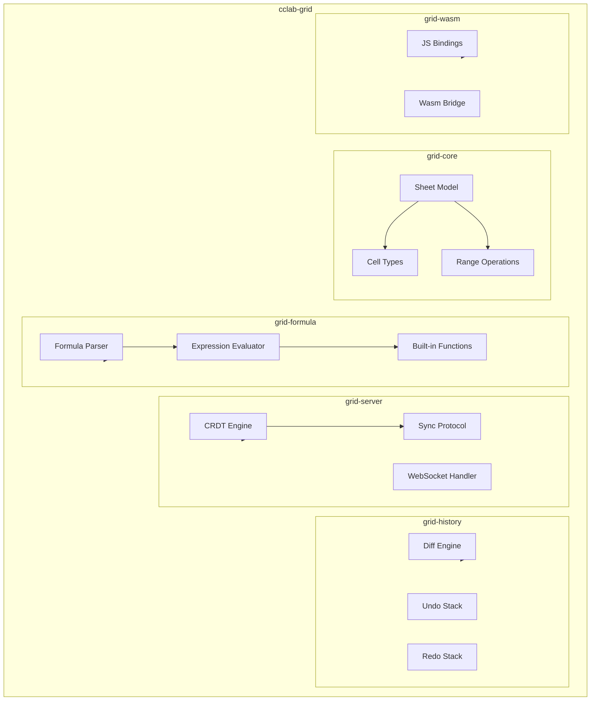

# cclab-grid Specs

High-performance spreadsheet engine (RuSheet) - replaces SheetJS, Handsontable.

## Crates

| Crate | Description |
|-------|-------------|
| **cclab-grid-core** | Core data structures |
| **cclab-grid-db** | Database persistence layer |
| **cclab-grid-formula** | Formula parsing and evaluation |
| **cclab-grid-history** | Undo/redo with efficient diffing |
| **cclab-grid-server** | Real-time collaboration (CRDT) |
| **cclab-grid-wasm** | WebAssembly bindings |

## Architecture



## Data Model (ERD)

```mermaid
erDiagram
    WORKBOOK ||--o{ SHEET : contains
    SHEET ||--o{ CELL : contains
    SHEET ||--o{ COLUMN : has
    SHEET ||--o{ ROW : has
    CELL ||--o| FORMULA : may_have
    CELL ||--o| STYLE : may_have
    FORMULA ||--o{ DEPENDENCY : references

    WORKBOOK {
        uuid id PK
        string name
        timestamp created_at
        timestamp updated_at
    }
    SHEET {
        uuid id PK
        uuid workbook_id FK
        string name
        int index
    }
    CELL {
        uuid id PK
        uuid sheet_id FK
        int row
        int col
        string value
        string type
    }
    FORMULA {
        uuid id PK
        uuid cell_id FK
        string expression
        string parsed_ast
    }
```

## Specs

| File | Type | Description |
|------|------|-------------|
| grid-formula-array-spec.md | algorithm | Array formula support |
| grid-formula-functions-spec.md | algorithm | Built-in functions |
| grid-io-spec.md | integration | Import/export formats |
| grid-performance-spec.md | algorithm | Performance optimizations |
| grid-styling-spec.md | data-model | Cell styling system |
