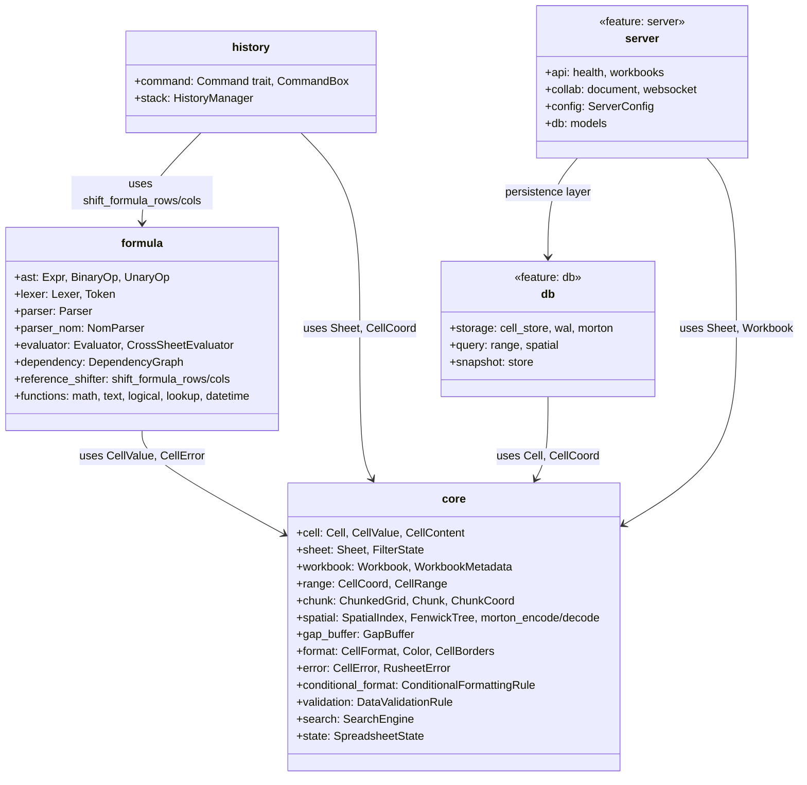
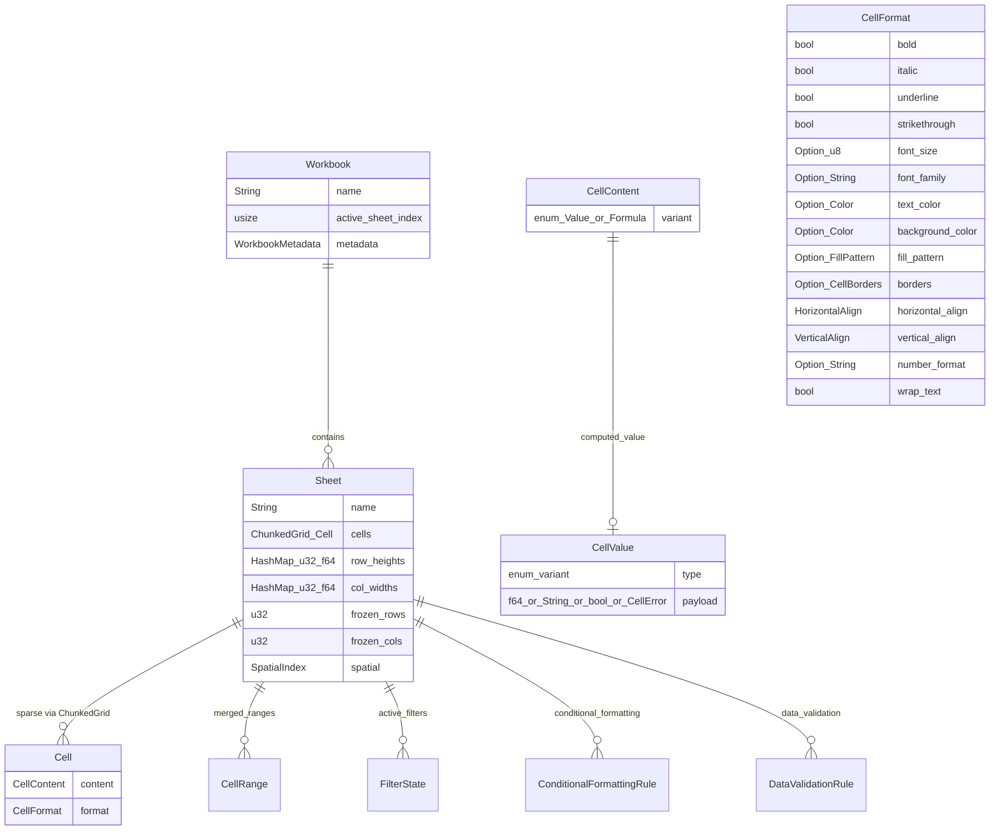

# cclab-grid Architecture

## Overview
<!-- type: overview lang: markdown -->

Unified spreadsheet engine crate (post-consolidation). Combines core data structures, formula evaluation, undo/redo history, database persistence, and collaboration server into a single crate with feature-gated modules.

## Module Structure
<!-- type: dependency lang: mermaid -->



## Data Model
<!-- type: db-model lang: mermaid -->



## Feature Gates
<!-- type: config lang: json -->

```json
{
  "$id": "grid-feature-gates",
  "type": "object",
  "properties": {
    "default": {
      "description": "core + formula + history (always included)",
      "const": ["core", "formula", "history"]
    },
    "db": {
      "description": "Morton-encoded persistence, WAL, range queries, spatial queries"
    },
    "server": {
      "description": "Axum web server, CRDT collaboration, WebSocket handlers"
    }
  }
}
```

## Key Design Decisions
<!-- type: overview lang: markdown -->

| Decision | Choice | Rationale |
|----------|--------|-----------|
| Sparse storage | ChunkedGrid (HashMap of 64x64 Chunks) | Only non-empty cells stored; cache-friendly via Morton encoding |
| Cell indexing | Morton/Z-order curve within chunks | Improved cache locality for range queries |
| Position lookup | Fenwick Tree (SpatialIndex) | O(log N) row/col position lookups with variable heights/widths |
| Row/col insertion | GapBuffer (logical-to-physical BTreeMap) | Avoids expensive data movement on insert/delete |
| Formula parser | Dual: hand-rolled Lexer + NomParser | NomParser is primary; Lexer used for tokenization |
| Undo/redo | Command pattern with HistoryManager | Mergeable commands, bounded stack size |
| Serialization | serde JSON (Workbook, Sheet, Cell) | Full round-trip via `to_json()`/`from_json()` |
