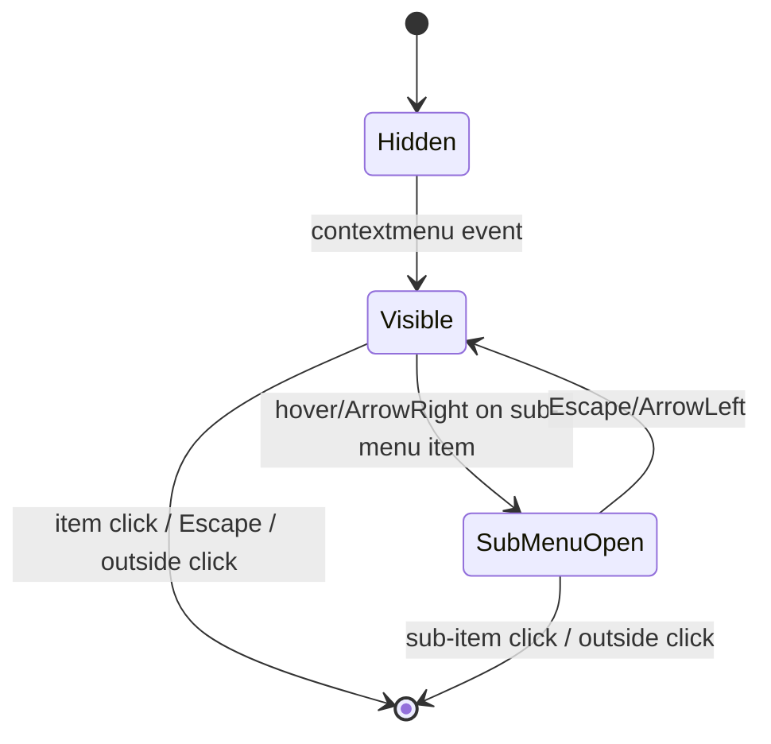

<spec>

# Context Menu UI Component

## Overview

Define the ContextMenu UI component: a DOM overlay that appears on right-click over the grid canvas. Covers menu rendering, positioning algorithm (boundary-aware), keyboard navigation (Arrow keys, Enter, Escape), sub-menu support, dynamic item generation based on selection context (single cell, range, row header, column header), separator rendering, disabled item states, and outside-click dismissal. Follows the FilterDropdown.ts DOM overlay pattern.

## Requirements

### R1 - Right-click triggers context menu

```yaml
id: R1
priority: high
status: draft
```

InputController captures the 'contextmenu' DOM event on the canvas element. It calls preventDefault() to suppress the browser default menu, determines the click context (cell body, row header, column header) using screenToGrid(), and dispatches to ContextMenu.show(x, y, context). If the right-clicked cell is outside the current selection, the selection moves to the right-clicked cell first.

### R2 - Menu item generation by context

```yaml
id: R2
priority: high
status: draft
```

ContextMenu generates menu items dynamically based on the click context. Cell context: Cut, Copy, Paste, Paste special, separator, Insert row above, Insert row below, Insert column left, Insert column right, Delete row, Delete column, separator, Create filter, Sort A→Z, Sort Z→A, separator, Conditional formatting, Data validation, separator, Comment. Row header context: Insert row above/below, Delete row, Row height. Column header context: Insert column left/right, Delete column, Column width, Sort A→Z/Z→A.

### R3 - Positioning with boundary detection

```yaml
id: R3
priority: high
status: draft
```

Menu is positioned at the mouse cursor (x, y) coordinates. If the menu would extend beyond the right edge of the viewport, it opens to the left. If it would extend below the viewport bottom, it opens upward. Sub-menus follow the same boundary logic. Menu is appended to document.body with position:fixed.

### R4 - Keyboard navigation

```yaml
id: R4
priority: medium
status: draft
```

When menu is open: ArrowDown/ArrowUp move focus between items (skipping separators and disabled items), Enter activates the focused item, Escape closes the menu (or closes sub-menu and returns to parent), ArrowRight opens sub-menu on focused item if it has one, ArrowLeft closes sub-menu and returns to parent.

### R5 - Dismissal behavior

```yaml
id: R5
priority: high
status: draft
```

Menu closes on: clicking outside the menu, pressing Escape, activating a menu item, scrolling the grid, or resizing the window. A mousedown listener on document handles outside-click detection. Cleanup removes all event listeners.

### R6 - Visual styling

```yaml
id: R6
priority: medium
status: draft
```

Menu has white background (#ffffff), 1px solid border (#d0d0d0), border-radius 4px, box-shadow for depth. Items have 32px height, 12px horizontal padding, hover state (#f0f0f0), disabled state (opacity 0.4, pointer-events none). Separators are 1px solid #e0e0e0 with 4px vertical margin. Sub-menu arrows use CSS ::after with chevron character. Keyboard shortcut hints right-aligned in gray (#999).

## Acceptance Criteria

### Scenario: Right-click on cell shows context menu

- **GIVEN** Grid is loaded, cell B2 is selected
- **WHEN** User right-clicks on cell C3
- **THEN** Selection moves to C3, context menu appears at cursor position with full cell menu items

### Scenario: Right-click on row header

- **GIVEN** Grid is loaded
- **WHEN** User right-clicks on row header for row 5
- **THEN** Row 5 is selected, context menu shows row-specific items (Insert row above/below, Delete row)

### Scenario: Right-click on column header

- **GIVEN** Grid is loaded
- **WHEN** User right-clicks on column header for column C
- **THEN** Column C is selected, context menu shows column-specific items (Insert column left/right, Delete column, Sort)

### Scenario: Menu boundary detection

- **GIVEN** Grid is loaded, viewport is 1200x800
- **WHEN** User right-clicks near bottom-right corner at (1150, 750)
- **THEN** Menu opens to the left and upward to stay within viewport

### Scenario: Keyboard navigation

- **GIVEN** Context menu is open with 10 items, first item focused
- **WHEN** User presses ArrowDown 3 times then Enter
- **THEN** Focus moves to 4th item (skipping separators), 4th item action executes, menu closes

### Scenario: Escape closes menu

- **GIVEN** Context menu is open
- **WHEN** User presses Escape
- **THEN** Menu closes, focus returns to grid canvas

### Scenario: Outside click dismissal

- **GIVEN** Context menu is open
- **WHEN** User clicks anywhere outside the menu
- **THEN** Menu closes immediately

### Scenario: Right-click inside selection keeps selection

- **GIVEN** Range A1:D4 is selected
- **WHEN** User right-clicks on cell B2 (inside selection)
- **THEN** Selection stays A1:D4, context menu appears at cursor

## Flow Diagram



</spec>