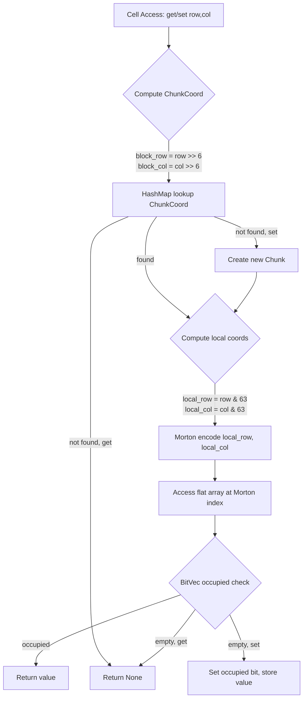
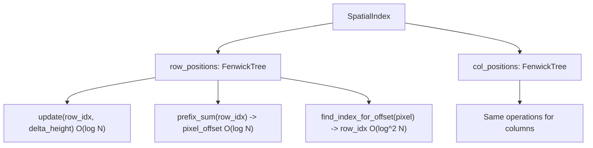
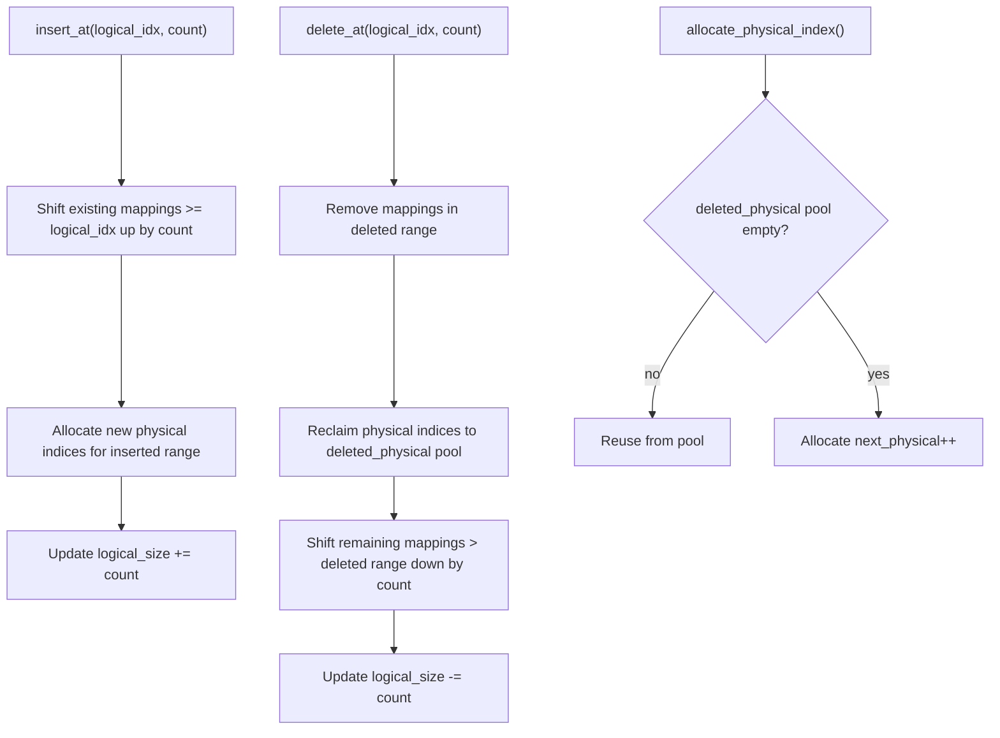

# cclab-grid Core Module

## Overview
<!-- type: overview lang: markdown -->

Sparse matrix storage, cell types, coordinate system, range operations, sheet management, spatial indexing, and row/column gap buffer for efficient insertion/deletion.

## Cell Type Hierarchy
<!-- type: schema lang: json -->

```json
{
  "$id": "grid-cell-types",
  "definitions": {
    "CellValue": {
      "description": "Raw value stored in a cell. Tagged enum.",
      "oneOf": [
        { "const": "Empty" },
        { "type": "object", "properties": { "type": { "const": "Number" }, "value": { "type": "number", "format": "f64" } }, "required": ["type", "value"] },
        { "type": "object", "properties": { "type": { "const": "Text" }, "value": { "type": "string" } }, "required": ["type", "value"] },
        { "type": "object", "properties": { "type": { "const": "Boolean" }, "value": { "type": "boolean" } }, "required": ["type", "value"] },
        { "type": "object", "properties": { "type": { "const": "Error" }, "value": { "$ref": "#/definitions/CellError" } }, "required": ["type", "value"] }
      ]
    },
    "CellError": {
      "description": "Excel-compatible error types",
      "enum": ["DivisionByZero", "InvalidValue", "InvalidReference", "InvalidName", "NullError", "NumError", "NotAvailable", "CircularReference"],
      "x-display-map": {
        "DivisionByZero": "#DIV/0!",
        "InvalidValue": "#VALUE!",
        "InvalidReference": "#REF!",
        "InvalidName": "#NAME?",
        "NullError": "#NULL!",
        "NumError": "#NUM!",
        "NotAvailable": "#N/A",
        "CircularReference": "#CIRCULAR!"
      }
    },
    "CellContent": {
      "description": "Content of a cell: raw value or formula",
      "oneOf": [
        {
          "type": "object",
          "properties": {
            "type": { "const": "Value" },
            "value": { "$ref": "#/definitions/CellValue" },
            "originalInput": { "type": "string", "description": "Original user input string" }
          },
          "required": ["type", "value"]
        },
        {
          "type": "object",
          "properties": {
            "type": { "const": "Formula" },
            "expression": { "type": "string", "description": "Original formula text e.g. =SUM(A1:A10)" },
            "cachedValue": { "$ref": "#/definitions/CellValue" }
          },
          "required": ["type", "expression", "cachedValue"]
        }
      ]
    },
    "Cell": {
      "type": "object",
      "properties": {
        "content": { "$ref": "#/definitions/CellContent" },
        "format": { "$ref": "#/definitions/CellFormat" }
      },
      "required": ["content", "format"]
    },
    "CellCoord": {
      "description": "Cell coordinate (0-indexed internally, A1 notation externally)",
      "type": "object",
      "properties": {
        "row": { "type": "integer", "minimum": 0, "format": "u32" },
        "col": { "type": "integer", "minimum": 0, "format": "u32" }
      },
      "required": ["row", "col"]
    },
    "CellRange": {
      "description": "Range of cells (auto-normalized to top-left / bottom-right)",
      "type": "object",
      "properties": {
        "start": { "$ref": "#/definitions/CellCoord" },
        "end": { "$ref": "#/definitions/CellCoord" }
      },
      "required": ["start", "end"]
    },
    "RusheetError": {
      "description": "Application-level errors",
      "enum": ["SheetNotFound", "SheetNameExists", "InvalidSheetName", "CannotDeleteLastSheet", "InvalidCoordinates", "RangeOutOfBounds", "MergeOverlap", "UnmergeNotMerged", "Generic"]
    }
  }
}
```

## CellFormat Schema
<!-- type: schema lang: json -->

```json
{
  "$id": "grid-cell-format",
  "definitions": {
    "Color": {
      "type": "object",
      "properties": {
        "r": { "type": "integer", "minimum": 0, "maximum": 255 },
        "g": { "type": "integer", "minimum": 0, "maximum": 255 },
        "b": { "type": "integer", "minimum": 0, "maximum": 255 },
        "a": { "type": "integer", "minimum": 0, "maximum": 255, "default": 255 }
      },
      "required": ["r", "g", "b"]
    },
    "HorizontalAlign": { "enum": ["left", "center", "right"], "default": "left" },
    "VerticalAlign": { "enum": ["top", "middle", "bottom"], "default": "middle" },
    "BorderType": { "enum": ["none", "solid", "dashed", "dotted", "thick", "double", "hair"], "default": "none" },
    "BorderStyle": {
      "type": "object",
      "properties": {
        "style": { "$ref": "#/definitions/BorderType" },
        "color": { "$ref": "#/definitions/Color" }
      },
      "required": ["style", "color"]
    },
    "CellBorders": {
      "type": "object",
      "properties": {
        "top": { "$ref": "#/definitions/BorderStyle" },
        "bottom": { "$ref": "#/definitions/BorderStyle" },
        "left": { "$ref": "#/definitions/BorderStyle" },
        "right": { "$ref": "#/definitions/BorderStyle" }
      }
    },
    "PatternType": { "enum": ["none", "solid", "gray125", "lightGray", "mediumGray", "darkGray", "darkVertical", "darkHorizontal", "darkDown", "darkUp", "darkGrid", "darkTrellis", "lightVertical", "lightHorizontal", "lightDown", "lightUp", "lightGrid", "lightTrellis"] },
    "FillPattern": {
      "type": "object",
      "properties": {
        "pattern_type": { "$ref": "#/definitions/PatternType" },
        "foreground_color": { "$ref": "#/definitions/Color" },
        "background_color": { "$ref": "#/definitions/Color" }
      }
    },
    "CellFormat": {
      "type": "object",
      "properties": {
        "bold": { "type": "boolean", "default": false },
        "italic": { "type": "boolean", "default": false },
        "underline": { "type": "boolean", "default": false },
        "strikethrough": { "type": "boolean", "default": false },
        "font_size": { "type": "integer", "format": "u8", "description": "Default: 11" },
        "font_family": { "type": "string", "description": "Default: Arial" },
        "text_color": { "$ref": "#/definitions/Color" },
        "background_color": { "$ref": "#/definitions/Color" },
        "fill_pattern": { "$ref": "#/definitions/FillPattern" },
        "borders": { "$ref": "#/definitions/CellBorders" },
        "horizontal_align": { "$ref": "#/definitions/HorizontalAlign" },
        "vertical_align": { "$ref": "#/definitions/VerticalAlign" },
        "number_format": { "type": "string" },
        "wrap_text": { "type": "boolean", "default": false }
      }
    }
  }
}
```

## Chunked Sparse Storage
<!-- type: logic lang: mermaid -->



| Parameter | Value | Rationale |
|-----------|-------|-----------|
| CHUNK_SIZE | 64 | Power of 2, fits in u8 local coords, good cache line alignment |
| CHUNK_AREA | 4096 | 64x64 = 4096 cells per chunk |
| Occupancy tracking | BitVec (512 bytes per chunk) | O(1) existence check without Option overhead |
| Index mapping | Morton/Z-order curve | Cache-friendly access pattern for 2D range queries |

## Spatial Index (Fenwick Tree)
<!-- type: logic lang: mermaid -->



| Operation | Complexity | Use Case |
|-----------|-----------|----------|
| `update(index, delta)` | O(log N) | Change row height / column width |
| `prefix_sum(index)` | O(log N) | Get pixel offset for row/column |
| `find_index_for_offset(px)` | O(log^2 N) | Find row/column at pixel offset (scroll, click) |
| `grow(new_size)` | O(N log N) | Expand capacity when sheet grows |

## GapBuffer Index Mapping
<!-- type: logic lang: mermaid -->



| Field | Type | Purpose |
|-------|------|---------|
| logical_to_physical_map | BTreeMap(usize, usize) | User-visible index to storage index |
| physical_to_logical_map | BTreeMap(usize, usize) | Reverse mapping for consistency |
| next_physical | usize | Next available physical index |
| logical_size | usize | Current visible element count |
| deleted_physical | Vec(usize) | Recycled physical indices |

## Sheet Structure
<!-- type: schema lang: json -->

```json
{
  "$id": "grid-sheet",
  "type": "object",
  "properties": {
    "name": { "type": "string" },
    "cells": { "description": "ChunkedGrid<Cell> - sparse storage via 64x64 Morton-encoded chunks" },
    "row_heights": { "type": "object", "additionalProperties": { "type": "number" }, "description": "Custom row heights (row_idx -> px). Default: 24.0" },
    "col_widths": { "type": "object", "additionalProperties": { "type": "number" }, "description": "Custom col widths (col_idx -> px). Default: 100.0" },
    "default_row_height": { "type": "number", "default": 24.0 },
    "default_col_width": { "type": "number", "default": 100.0 },
    "frozen_rows": { "type": "integer", "default": 0 },
    "frozen_cols": { "type": "integer", "default": 0 },
    "merged_ranges": { "type": "array", "items": { "$ref": "grid-cell-types#/definitions/CellRange" } },
    "active_filters": { "type": "array", "items": { "$ref": "#/definitions/FilterState" } },
    "conditional_formatting": { "type": "array" },
    "data_validation": { "type": "array" },
    "spatial": { "description": "SpatialIndex (Fenwick Trees for row/col position lookups, not serialized)" }
  },
  "definitions": {
    "FilterState": {
      "type": "object",
      "properties": {
        "col": { "type": "integer", "format": "u32" },
        "visible_values": { "type": "array", "items": { "type": "string" }, "uniqueItems": true }
      }
    }
  }
}
```

## Workbook Structure
<!-- type: schema lang: json -->

```json
{
  "$id": "grid-workbook",
  "type": "object",
  "properties": {
    "name": { "type": "string" },
    "sheets": { "type": "array", "items": { "$ref": "grid-sheet" }, "minItems": 1 },
    "active_sheet_index": { "type": "integer", "minimum": 0, "default": 0 },
    "metadata": {
      "type": "object",
      "properties": {
        "created_at": { "type": "string", "format": "date-time" },
        "modified_at": { "type": "string", "format": "date-time" },
        "author": { "type": "string" },
        "app_version": { "type": "string" }
      }
    }
  },
  "required": ["name", "sheets"]
}
```

## CellValue Type Coercion
<!-- type: overview lang: markdown -->

| From \ To | Number | Text | Boolean |
|-----------|--------|------|---------|
| Number | identity | int if fract==0, else float | !=0.0 |
| Text | parse or None | identity | TRUE/YES/1 -> true, FALSE/NO/0 -> false |
| Boolean | true->1.0, false->0.0 | "TRUE"/"FALSE" | identity |
| Empty | None | "" | None |
| Error | None | display string | None |

## Cell Value Sort Order
<!-- type: overview lang: markdown -->

`Empty < Number < Text < Boolean < Error`

Within same type: Number by value, Text lexicographic, Boolean by value.
