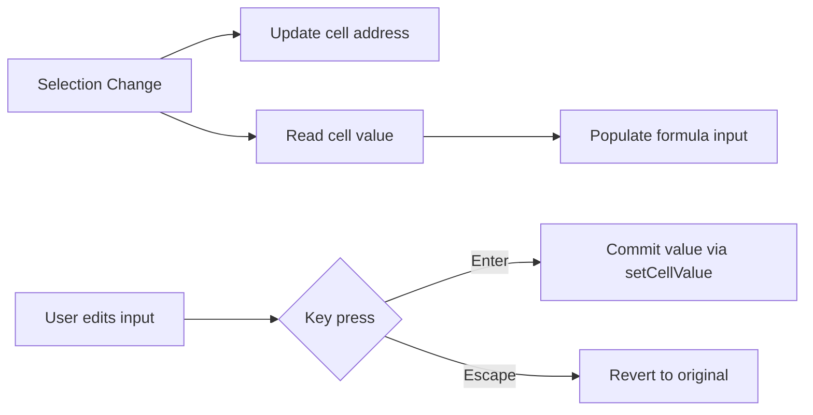

<spec>

# Formula Bar Redesign

## Overview

Redesign the formula bar to match Google Sheets style with a cell address dropdown showing the current cell reference (e.g. A1), an fx icon, and a styled text input for editing cell content. The formula bar syncs with selection changes and provides an alternative to in-cell editing.

## Requirements

### R1 - Cell address display

```yaml
id: R1
priority: high
status: draft
```

Show the current active cell address (e.g. A1, B3) in a styled box on the left side of the formula bar. Clicking it selects the text for manual cell navigation input.

### R2 - fx icon

```yaml
id: R2
priority: medium
status: draft
```

Display a non-interactive fx icon between the cell address and the formula input to visually separate them, matching Google Sheets style.

### R3 - Formula input field

```yaml
id: R3
priority: high
status: draft
```

A text input that shows the raw value/formula of the active cell. Editing and pressing Enter commits the value via rusheet.setCellValue(). Pressing Escape cancels.

### R4 - Selection change sync

```yaml
id: R4
priority: high
status: draft
```

When selection changes, update the cell address display and populate the formula input with the active cell's current value/formula.

### R5 - Visual styling

```yaml
id: R5
priority: medium
status: draft
```

Formula bar has a light gray background with 1px bottom border, matching Google Sheets appearance. Cell address box has a distinct border. Font uses system sans-serif at 13px.

## Acceptance Criteria

### Scenario: Cell address updates on selection

- **GIVEN** Cell A1 is selected
- **WHEN** User clicks on cell C5
- **THEN** Cell address display changes from A1 to C5

### Scenario: Formula input shows cell value

- **GIVEN** Cell B2 contains value 'Hello'
- **WHEN** User selects cell B2
- **THEN** Formula input displays 'Hello'

### Scenario: Edit via formula bar

- **GIVEN** Cell A1 is selected and formula input is focused
- **WHEN** User types 'World' and presses Enter
- **THEN** Cell A1 value is set to 'World' via rusheet.setCellValue()

### Scenario: Cancel edit via Escape

- **GIVEN** Formula input has edited text
- **WHEN** User presses Escape
- **THEN** Formula input reverts to original cell value

## Flow Diagram



</spec>