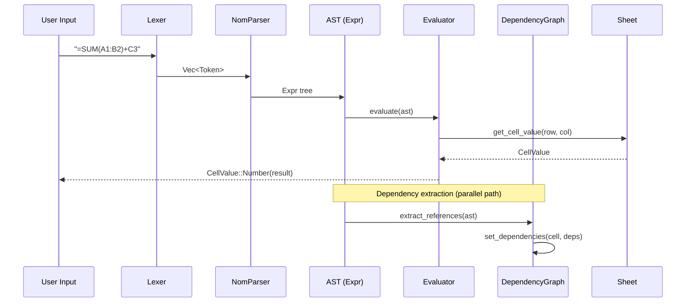
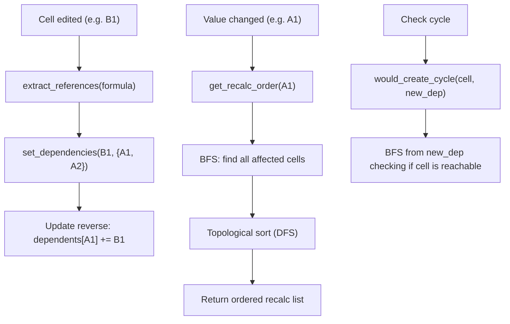

# cclab-grid Formula Module

## Overview
<!-- type: overview lang: markdown -->

Formula parsing, evaluation, dependency tracking, and reference shifting for the spreadsheet engine. Supports Excel-compatible expressions with cross-sheet references.

## Formula Processing Pipeline
<!-- type: interaction lang: mermaid -->



## AST Schema
<!-- type: schema lang: json -->

```json
{
  "$id": "grid-formula-ast",
  "definitions": {
    "Expr": {
      "description": "Formula AST node",
      "oneOf": [
        { "type": "object", "properties": { "type": { "const": "Number" }, "value": { "type": "number" } }, "required": ["type", "value"] },
        { "type": "object", "properties": { "type": { "const": "String" }, "value": { "type": "string" } }, "required": ["type", "value"] },
        { "type": "object", "properties": { "type": { "const": "Boolean" }, "value": { "type": "boolean" } }, "required": ["type", "value"] },
        { "type": "object", "properties": { "type": { "const": "Error" }, "value": { "type": "string" } }, "required": ["type", "value"] },
        {
          "type": "object",
          "properties": {
            "type": { "const": "CellRef" },
            "col": { "type": "integer", "format": "u32" },
            "row": { "type": "integer", "format": "u32" },
            "abs_col": { "type": "boolean", "description": "$ prefix on column" },
            "abs_row": { "type": "boolean", "description": "$ prefix on row" }
          },
          "required": ["type", "col", "row", "abs_col", "abs_row"]
        },
        {
          "type": "object",
          "properties": {
            "type": { "const": "Range" },
            "start": { "$ref": "#/definitions/Expr", "description": "Must be CellRef" },
            "end": { "$ref": "#/definitions/Expr", "description": "Must be CellRef" }
          },
          "required": ["type", "start", "end"]
        },
        {
          "type": "object",
          "properties": {
            "type": { "const": "SheetRef" },
            "sheet_name": { "type": "string" },
            "reference": { "$ref": "#/definitions/Expr" }
          },
          "required": ["type", "sheet_name", "reference"]
        },
        {
          "type": "object",
          "properties": {
            "type": { "const": "Binary" },
            "left": { "$ref": "#/definitions/Expr" },
            "op": { "$ref": "#/definitions/BinaryOp" },
            "right": { "$ref": "#/definitions/Expr" }
          },
          "required": ["type", "left", "op", "right"]
        },
        {
          "type": "object",
          "properties": {
            "type": { "const": "Unary" },
            "op": { "$ref": "#/definitions/UnaryOp" },
            "operand": { "$ref": "#/definitions/Expr" }
          },
          "required": ["type", "op", "operand"]
        },
        {
          "type": "object",
          "properties": {
            "type": { "const": "FunctionCall" },
            "name": { "type": "string" },
            "args": { "type": "array", "items": { "$ref": "#/definitions/Expr" } }
          },
          "required": ["type", "name", "args"]
        },
        {
          "type": "object",
          "properties": {
            "type": { "const": "Grouped" },
            "inner": { "$ref": "#/definitions/Expr" }
          },
          "required": ["type", "inner"]
        }
      ]
    },
    "BinaryOp": {
      "enum": ["Add", "Sub", "Mul", "Div", "Pow", "Concat", "Eq", "Ne", "Lt", "Gt", "Le", "Ge"],
      "x-display-map": {
        "Add": "+", "Sub": "-", "Mul": "*", "Div": "/", "Pow": "^",
        "Concat": "&", "Eq": "=", "Ne": "<>", "Lt": "<", "Gt": ">", "Le": "<=", "Ge": ">="
      }
    },
    "UnaryOp": {
      "enum": ["Neg", "Pos", "Percent"],
      "x-display-map": { "Neg": "-", "Pos": "+", "Percent": "%" }
    }
  }
}
```

## Operator Precedence
<!-- type: overview lang: markdown -->

| Precedence | Operators | Associativity |
|------------|-----------|---------------|
| 5 (highest) | `^` (Pow) | Right |
| 4 | `*` `/` (Mul, Div) | Left |
| 3 | `+` `-` (Add, Sub) | Left |
| 2 | `&` (Concat) | Left |
| 1 (lowest) | `=` `<>` `<` `>` `<=` `>=` | Left |

Unary `-`, `+` bind tighter than binary. Postfix `%` binds tightest.

## Token Types
<!-- type: schema lang: json -->

```json
{
  "$id": "grid-formula-tokens",
  "definitions": {
    "Token": {
      "description": "Lexer output tokens",
      "enum": [
        "Number(f64)", "String(String)", "Boolean(bool)", "CellRef(String)",
        "Plus", "Minus", "Multiply", "Divide", "Power", "Percent", "Concat",
        "Equal", "NotEqual", "LessThan", "GreaterThan", "LessEqual", "GreaterEqual",
        "LeftParen", "RightParen", "Comma", "Colon", "Semicolon", "Exclaim",
        "Identifier(String)", "Error(CellError)", "EOF"
      ]
    }
  }
}
```

## Lexer Rules
<!-- type: overview lang: markdown -->

| Input Pattern | Token | Notes |
|---------------|-------|-------|
| `[0-9]+(\.[0-9]+)?([eE][+-]?[0-9]+)?` | Number(f64) | Scientific notation supported |
| `"..."` | String | `""` escapes to single `"` |
| `TRUE` / `FALSE` | Boolean | Case-insensitive after uppercasing |
| `$?[A-Z]+$?[0-9]+` | CellRef | Absolute refs with `$` prefix |
| `[A-Z_]+` (no digits) | Identifier | Function names |
| `[A-Z]+[0-9]+` (mixed) | CellRef | Ambiguous resolved as cell ref |
| `<>` | NotEqual | Two-char operator |
| `<=` | LessEqual | Two-char operator |
| `>=` | GreaterEqual | Two-char operator |
| `!` | Exclaim | Sheet reference separator |

## Dependency Graph
<!-- type: logic lang: mermaid -->



| Operation | Complexity | Description |
|-----------|-----------|-------------|
| `set_dependencies(cell, deps)` | O(d) | Update forward + reverse mappings, d = dependency count |
| `get_direct_dependents(cell)` | O(1) | Lookup reverse map |
| `get_recalc_order(changed)` | O(V+E) | BFS affected set + topological sort |
| `would_create_cycle(cell, dep)` | O(V+E) | BFS cycle detection |

Circular references detected during topological sort return `CellError::CircularReference`.

## Function Library
<!-- type: overview lang: markdown -->

### Math Functions

| Function | Args | Description |
|----------|------|-------------|
| SUM | values... | Sum all numeric values (skip text/empty) |
| AVERAGE | values... | Average of numeric values |
| COUNT | values... | Count of numeric values |
| COUNTA | values... | Count of non-empty values |
| MIN | values... | Minimum numeric value |
| MAX | values... | Maximum numeric value |
| ABS | value | Absolute value |
| ROUND | value, digits | Round to N decimal places |
| CEILING | value, significance | Round up to nearest multiple |
| FLOOR | value, significance | Round down to nearest multiple |
| INT | value | Truncate to integer |
| MOD | num, divisor | Modulo |
| POWER | base, exp | Exponentiation |
| SQRT | value | Square root |
| LOG | value[, base] | Logarithm (default base 10) |
| LN | value | Natural logarithm |
| PI | (none) | 3.14159... |
| RAND | (none) | Random [0, 1) |
| SUMPRODUCT | array1, array2 | Sum of element-wise products |

### Text Functions

| Function | Args | Description |
|----------|------|-------------|
| CONCAT / CONCATENATE | values... | Concatenate to string |
| LEN | text | Character count |
| UPPER | text | Uppercase |
| LOWER | text | Lowercase |
| TRIM | text | Strip leading/trailing whitespace |
| LEFT | text, count | First N characters |
| RIGHT | text, count | Last N characters |
| MID | text, start, count | Substring (1-indexed start) |
| SUBSTITUTE | text, old, new[, nth] | Replace occurrences |
| FIND | search, text[, start] | Case-sensitive position (1-indexed) |
| TEXT | value, format | Format number as text |

### Logical Functions

| Function | Args | Description |
|----------|------|-------------|
| IF | condition, true_val[, false_val] | Conditional |
| AND | values... | All truthy |
| OR | values... | Any truthy |
| NOT | value | Negate |
| IFERROR | value, fallback | Return fallback on error |
| ISBLANK | value | Check empty |
| ISNUMBER | value | Check numeric |
| ISTEXT | value | Check text |

### Lookup Functions

| Function | Args | Description |
|----------|------|-------------|
| MATCH | lookup, array, match_type | Search position (1-indexed). match_type: 0=exact, 1=less_than, -1=greater_than |

### DateTime Functions

| Function | Args | Description |
|----------|------|-------------|
| DATE | year, month, day | Excel serial number (days since 1900-01-01) |
| TODAY | (none) | Current date serial |
| NOW | (none) | Current datetime serial |
| YEAR | serial | Extract year |
| MONTH | serial | Extract month |
| DAY | serial | Extract day |

Excel's 1900 leap year bug (Feb 29, 1900 = serial 60) is preserved for compatibility.

## Evaluator Architecture
<!-- type: overview lang: markdown -->

| Evaluator | Type Parameter | Cross-Sheet | Description |
|-----------|---------------|-------------|-------------|
| `Evaluator<F>` | `F: Fn(u32, u32) -> CellValue` | No | Single-sheet evaluation |
| `CrossSheetEvaluator<F>` | `F: Fn(Option<&str>, u32, u32) -> CellValue` | Yes | Multi-sheet with SheetRef support |

Both evaluators:
- Propagate errors (first error wins in binary ops)
- Division by zero returns `CellError::DivisionByZero`
- Range expressions only valid inside function arguments (otherwise `CellError::InvalidValue`)
- Function dispatch by uppercase name matching

## Reference Shifting
<!-- type: overview lang: markdown -->

| Function | Purpose | Skips |
|----------|---------|-------|
| `shift_formula_rows(expr, start, delta)` | Shift row references after row insert/delete | `abs_row == true` |
| `shift_formula_cols(expr, start, delta)` | Shift col references after col insert/delete | `abs_col == true` |

Used by `InsertRowsCommand`, `DeleteRowsCommand`, `InsertColsCommand`, `DeleteColsCommand` in the history module.

## Public API
<!-- type: overview lang: markdown -->

| Function | Signature | Description |
|----------|-----------|-------------|
| `evaluate_formula` | `(expr: &str, get_cell: Fn(u32,u32)->CellValue) -> CellValue` | Parse + evaluate single-sheet |
| `evaluate_formula_cross_sheet` | `(expr, sheet, get_cell: Fn(Option<&str>,u32,u32)->CellValue) -> CellValue` | Parse + evaluate cross-sheet |
| `extract_references` | `(expr: &str) -> Vec<(u32, u32)>` | Extract cell refs |
| `extract_references_cross_sheet` | `(expr: &str) -> Vec<(Option<String>, u32, u32)>` | Extract with sheet names |
