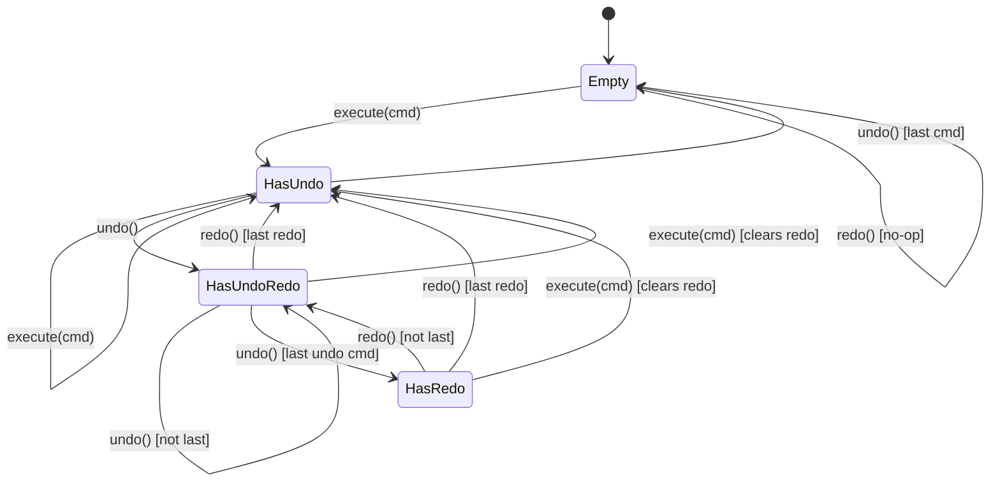
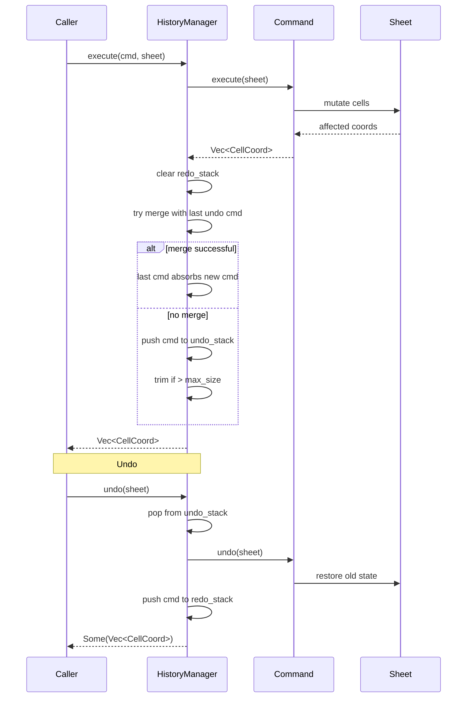
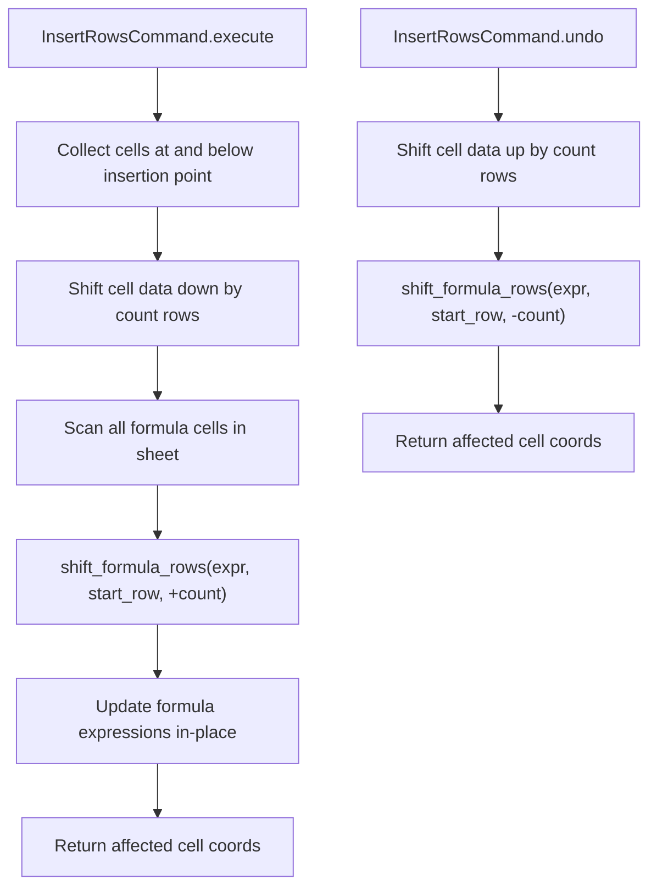

# cclab-grid History Module

## Overview
<!-- type: overview lang: markdown -->

Command-pattern undo/redo system for spreadsheet operations. All mutations go through `HistoryManager.execute()` which captures state for reversal.

## Undo/Redo State Machine
<!-- type: state-machine lang: mermaid -->



## Command Trait
<!-- type: schema lang: json -->

```json
{
  "$id": "grid-history-command",
  "definitions": {
    "Command": {
      "description": "Trait: dyn Command (Send + Sync + Debug)",
      "type": "object",
      "properties": {
        "execute": { "description": "(&mut self, &mut Sheet) -> Vec<CellCoord>. Apply command, return affected cells" },
        "undo": { "description": "(&mut self, &mut Sheet) -> Vec<CellCoord>. Reverse command, return affected cells" },
        "description": { "description": "(&self) -> &str. Human-readable label for UI" },
        "can_merge": { "description": "(&self, &dyn Command) -> bool. Check merge compatibility. Default: false" },
        "merge": { "description": "(&mut self, &dyn Command) -> bool. Absorb another command. Default: false" }
      }
    },
    "CommandBox": {
      "description": "Box<dyn Command> - type-erased owned command"
    }
  }
}
```

## Command Implementations
<!-- type: overview lang: markdown -->

| Command | Description | Captures for Undo |
|---------|-------------|-------------------|
| `SetCellValueCommand` | Set single cell value/formula | old CellContent |
| `SetCellFormatCommand` | Set single cell format | old CellFormat |
| `SetRangeFormatCommand` | Set format on range of cells | old CellFormat per cell |
| `ClearCellCommand` | Clear single cell | old CellContent |
| `ClearRangeCommand` | Clear range of cells | old Cell per coord |
| `InsertRowsCommand` | Insert N rows at position | row_index, count (reverse = delete) |
| `DeleteRowsCommand` | Delete N rows at position | deleted cells map |
| `InsertColsCommand` | Insert N columns at position | col_index, count (reverse = delete) |
| `DeleteColsCommand` | Delete N columns at position | deleted cells map |
| `MergeCellsCommand` | Merge a cell range | old merged_ranges |
| `UnmergeCellsCommand` | Unmerge a cell range | old merged_ranges |
| `SortRangeCommand` | Sort cells in a range | old cell values |
| `ApplyFilterCommand` | Apply column filter | old filter state |
| `ClearFilterCommand` | Clear column filters | old filter state |
| `CompositeCommand` | Group of sub-commands | ordered list of CommandBox |

## HistoryManager
<!-- type: schema lang: json -->

```json
{
  "$id": "grid-history-manager",
  "type": "object",
  "properties": {
    "undo_stack": { "type": "array", "items": { "$ref": "grid-history-command#/definitions/CommandBox" } },
    "redo_stack": { "type": "array", "items": { "$ref": "grid-history-command#/definitions/CommandBox" } },
    "max_size": { "type": "integer", "description": "Maximum undo levels. Oldest commands evicted when exceeded." },
    "enable_merging": { "type": "boolean", "default": true, "description": "Whether to try merging consecutive similar commands" }
  }
}
```

## Execution Flow
<!-- type: interaction lang: mermaid -->



## Row/Column Insert with Formula Shifting
<!-- type: logic lang: mermaid -->



Reference shifting skips absolute references (`$A$1`) and only adjusts relative references at or after the insertion/deletion point.

## Merging Rules
<!-- type: overview lang: markdown -->

Command merging collapses consecutive similar operations into one undo step (e.g., typing characters rapidly into the same cell).

| Condition | Result |
|-----------|--------|
| `can_merge` returns false | No merge, separate undo entry |
| `can_merge` returns true, `merge` succeeds | Single undo entry for combined operation |
| `start_group()` called | Merging disabled until `end_group()` |
| New command type differs from last | No merge possible |
