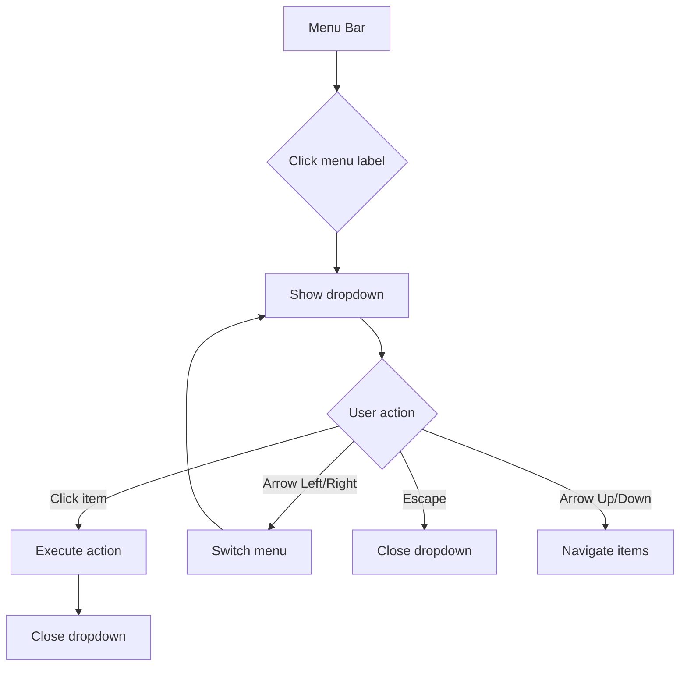

<spec>

# Menu Bar with Dropdown Menus

## Overview

Create a Google Sheets-style menu bar with File, Edit, View, Insert, Format, and Data dropdown menus. Each menu contains actionable items that trigger grid operations through the RusheetAPI. The menu bar follows the ContextMenu DOM overlay pattern with keyboard navigation support.

## Requirements

### R1 - Menu bar with 6 menus

```yaml
id: R1
priority: high
status: draft
```

Render a horizontal menu bar at the top of the application with labels: File, Edit, View, Insert, Format, Data. Each label opens a dropdown on click.

### R2 - File menu items

```yaml
id: R2
priority: high
status: draft
```

File menu contains: New, Open (load JSON), Save, Download as CSV, Download as JSON. Items wire to existing save/load/export functionality.

### R3 - Edit menu items

```yaml
id: R3
priority: high
status: draft
```

Edit menu contains: Undo, Redo, Cut, Copy, Paste, Select All. Items wire to existing clipboard and history operations.

### R4 - View menu items

```yaml
id: R4
priority: medium
status: draft
```

View menu contains: Freeze rows, Freeze columns, Show gridlines toggle, Show formula bar toggle.

### R5 - Insert menu items

```yaml
id: R5
priority: medium
status: draft
```

Insert menu contains: Row above, Row below, Column left, Column right. Items wire to existing insert operations.

### R6 - Format menu items

```yaml
id: R6
priority: medium
status: draft
```

Format menu contains: Bold, Italic, Underline, Font size, Text color, Fill color, Merge cells, Alignment. Items wire to setRangeFormat.

### R7 - Data menu items

```yaml
id: R7
priority: medium
status: draft
```

Data menu contains: Sort A to Z, Sort Z to A, Create filter. Items wire to existing sort and filter operations.

### R8 - Keyboard navigation

```yaml
id: R8
priority: medium
status: draft
```

Arrow keys navigate between menu items, Enter activates, Escape closes. Left/Right arrows switch between menus when a dropdown is open.

## Acceptance Criteria

### Scenario: Open File menu

- **WHEN** User clicks File label in menu bar
- **THEN** Dropdown appears below with New, Open, Save, Download items

### Scenario: Edit > Undo

- **GIVEN** Edit menu is open and undo history exists
- **WHEN** User clicks Undo item
- **THEN** Last action is undone, menu closes

### Scenario: Insert > Row above

- **GIVEN** Cell B3 is selected
- **WHEN** User clicks Insert > Row above
- **THEN** New row is inserted at row 3, existing data shifts down

### Scenario: Keyboard navigation between menus

- **GIVEN** File menu dropdown is open
- **WHEN** User presses Right arrow
- **THEN** File dropdown closes, Edit dropdown opens

### Scenario: Escape closes menu

- **GIVEN** Format menu dropdown is open
- **WHEN** User presses Escape
- **THEN** Dropdown closes, focus returns to grid

## Flow Diagram



</spec>