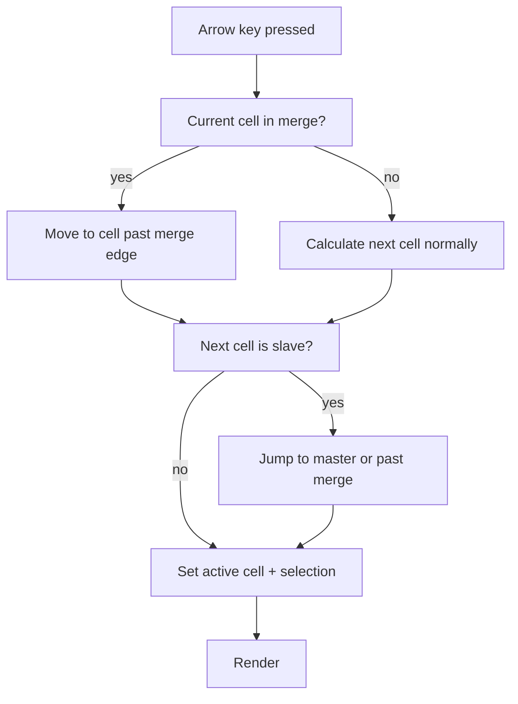

<spec>

# Merge-Aware Selection and Keyboard Navigation

## Overview

Keyboard navigation (arrow keys, Tab, Enter) and mouse click selection must be aware of merged cell regions. Clicking any cell within a merged region selects the master cell and expands the selection to cover the full merge. Arrow keys skip over slave cells, jumping from one edge of a merge to the next non-merged cell. This aligns with Google Sheets merge navigation behavior.

## Requirements

### R1 - Click on slave cell selects merge region

```yaml
id: R1
priority: high
status: draft
```

When user clicks on any cell within a merged region, the active cell is set to the master cell (top-left) and the selection range expands to cover the full merge dimensions.

### R2 - Arrow key navigation skips slave cells

```yaml
id: R2
priority: high
status: draft
```

When navigating with arrow keys, if the next cell is a slave cell of a merge, jump to the far edge of the merge in the navigation direction. E.g., pressing Right into a 3-column merge jumps to the column after the merge's endCol.

### R3 - Arrow key exits merged region correctly

```yaml
id: R3
priority: high
status: draft
```

When the active cell is in a merged region, pressing an arrow key exits to the first non-merged cell in that direction. E.g., pressing Down from a 3-row merge goes to the row after endRow.

### R4 - Tab and Enter respect merged regions

```yaml
id: R4
priority: medium
status: draft
```

Tab moves to the next cell after the merged region's endCol. Enter moves to the next row after the merged region's endRow. Both skip slave cells.

### R5 - Shift+Arrow extends selection across merges

```yaml
id: R5
priority: medium
status: draft
```

Shift+Arrow for range selection extends the selection to include the full extent of any merged region at the selection boundary.

## Acceptance Criteria

### Scenario: Click slave cell selects merge

- **GIVEN** Cells A1:C3 are merged, user clicks on B2 (slave)
- **WHEN** Mouse click on B2
- **THEN** Active cell is set to A1 (master), selection is A1:C3

### Scenario: Arrow right into merged region

- **GIVEN** Active cell is at D1, cells E1:G1 are merged
- **WHEN** User presses Right arrow
- **THEN** Active cell jumps to E1 (master of the merge), selection covers E1:G1

### Scenario: Arrow right out of merged region

- **GIVEN** Active cell is E1, cells E1:G1 are merged
- **WHEN** User presses Right arrow
- **THEN** Active cell moves to H1 (first cell after merge endCol)

### Scenario: Arrow down into merged region

- **GIVEN** Active cell is A1, cells A2:A4 are merged
- **WHEN** User presses Down arrow
- **THEN** Active cell jumps to A2 (master), selection covers A2:A4

### Scenario: Arrow down out of merged region

- **GIVEN** Active cell is A2, cells A2:A4 are merged
- **WHEN** User presses Down arrow
- **THEN** Active cell moves to A5 (first row after merge endRow)

## Diagrams

### Arrow Key Navigation with Merges



</spec>