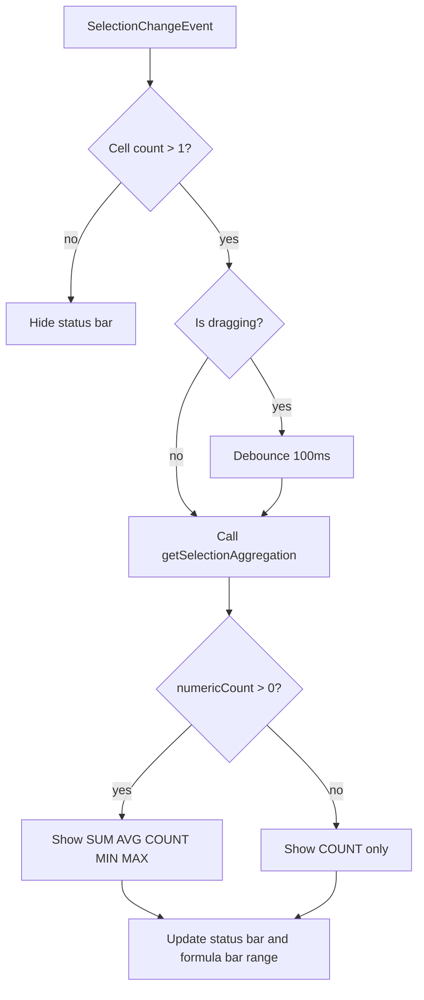

<spec>

# Selection Status Bar Aggregation

## Overview

Add a status bar at the bottom of the RuSheet React component that displays real-time aggregation results (SUM, AVG, COUNT, MIN, MAX) for the currently selected range. The status bar fetches aggregation data from the WASM layer via getSelectionAggregation() and updates on every selection change. Only displays when more than one cell is selected.

## Requirements

### R1 - Status bar component

```yaml
id: R1
priority: high
status: draft
```

A horizontal bar rendered between the canvas and sheet tabs in RuSheet.tsx. Displays aggregation values in the format: 'SUM: 123 | AVG: 41 | COUNT: 3 | MIN: 10 | MAX: 60'. Uses monospace font, subtle gray background (#f5f5f5), 24px height.

### R2 - Aggregation on selection change

```yaml
id: R2
priority: high
status: draft
```

When SelectionChangeEvent fires and the selection covers more than 1 cell, call getSelectionAggregation() and update the status bar. Debounce during active drag (100ms) to avoid excessive WASM calls.

### R3 - Hide for single cell

```yaml
id: R3
priority: medium
status: draft
```

Status bar is hidden (display: none or collapsed) when only a single cell is selected. It appears when 2+ cells are in the selection.

### R4 - Handle non-numeric selections

```yaml
id: R4
priority: medium
status: draft
```

When no numeric cells are in the selection, status bar shows 'COUNT: N' only (where N is total cell count). SUM, AVG, MIN, MAX are omitted when numericCount is 0.

### R5 - Range address display

```yaml
id: R5
priority: medium
status: draft
```

Status bar also displays the current selection range in A1 notation (e.g., 'A1:C5') on the left side. For multi-selection, shows primary range. The formula bar cell address also updates to show range notation.

## Acceptance Criteria

### Scenario: Status bar appears for range selection

- **GIVEN** Single cell selected, status bar hidden
- **WHEN** User selects range A1:A3 containing values 10, 20, 30
- **THEN** Status bar appears showing 'A1:A3 | SUM: 60 | AVG: 20 | COUNT: 3 | MIN: 10 | MAX: 30'

### Scenario: Status bar hides for single cell

- **GIVEN** Range A1:C3 selected, status bar visible
- **WHEN** User clicks on single cell E1
- **THEN** Status bar disappears

### Scenario: Non-numeric selection shows count only

- **GIVEN** User selects A1:A3 containing text values
- **WHEN** Status bar updates
- **THEN** Status bar shows 'A1:A3 | COUNT: 3'

### Scenario: Debounced update during drag

- **GIVEN** User starts dragging from A1
- **WHEN** User drags through 50 cells rapidly
- **THEN** Status bar updates at most every 100ms, not on every cell

### Scenario: Formula bar shows range address

- **GIVEN** User selects range B2:D5
- **WHEN** Formula bar updates
- **THEN** Cell address shows 'B2:D5' instead of 'B2'

## Flow Diagram



</spec>