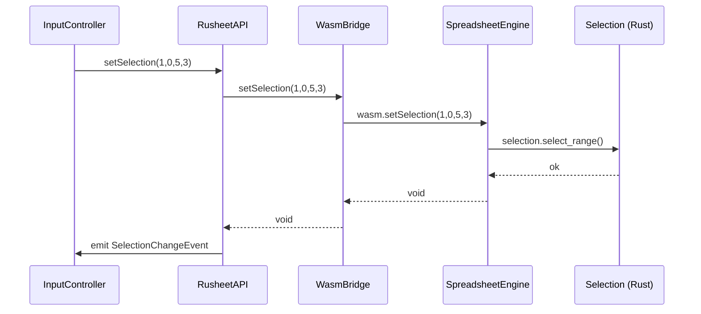

<spec>

# Selection WASM API

## Overview

Expose the existing Rust Selection model through the SpreadsheetEngine WASM API and add corresponding TypeScript WasmBridge methods. This spec covers the WASM function signatures, serialization format for selection state, and the bridge layer that connects TypeScript to Rust selection operations. It also extends RusheetAPI.ts to track and emit range selection events.

## Requirements

### R1 - WASM selection setter

```yaml
id: R1
priority: high
status: draft
```

SpreadsheetEngine exposes setSelection(startRow: u32, startCol: u32, endRow: u32, endCol: u32) that updates the Rust Selection state's primary range and active cell.

### R2 - WASM selection getter

```yaml
id: R2
priority: high
status: draft
```

SpreadsheetEngine exposes getSelection() -> JsValue that returns the current selection state as JSON: {activeCell: {row, col}, primary: {start: {row, col}, end: {row, col}}, additional: [{start, end}, ...]}.

### R3 - WASM extend selection

```yaml
id: R3
priority: high
status: draft
```

SpreadsheetEngine exposes extendSelection(row: u32, col: u32) that extends the primary selection range to the given position while keeping the active cell as the anchor.

### R4 - WASM add selection

```yaml
id: R4
priority: high
status: draft
```

SpreadsheetEngine exposes addSelection(startRow: u32, startCol: u32, endRow: u32, endCol: u32) that adds a new disjoint range to the additional selections list (Ctrl+Click multi-select).

### R5 - WASM selection aggregation

```yaml
id: R5
priority: medium
status: draft
```

SpreadsheetEngine exposes getSelectionAggregation() -> JsValue that returns {sum: f64, avg: f64, count: u32, min: f64, max: f64, numericCount: u32} for all numeric cells in the current selection (primary + additional ranges).

### R6 - WasmBridge TypeScript methods

```yaml
id: R6
priority: high
status: draft
```

WasmBridge.ts adds corresponding TypeScript methods: setSelection(), getSelection(), extendSelection(), addSelection(), getSelectionAggregation() that call the WASM functions.

### R7 - RusheetAPI selection state

```yaml
id: R7
priority: high
status: draft
```

RusheetAPI.ts updates its selection tracking from single {row, col} to full range: {activeCell: {row, col}, primary: {start, end}, additional: [...]}. SelectionChangeEvent is extended to include range info.

## Acceptance Criteria

### Scenario: Set single cell selection via WASM

- **GIVEN** Grid is loaded with data
- **WHEN** setSelection(2, 3, 2, 3) is called
- **THEN** getSelection() returns {activeCell: {row:2, col:3}, primary: {start: {row:2, col:3}, end: {row:2, col:3}}, additional: []}

### Scenario: Set range selection via WASM

- **WHEN** setSelection(1, 0, 5, 3) is called
- **THEN** getSelection() returns primary range from (1,0) to (5,3) with activeCell at (1,0)

### Scenario: Extend selection

- **GIVEN** Selection is at (2,2) single cell
- **WHEN** extendSelection(5, 4) is called
- **THEN** Primary range extends from (2,2) to (5,4), activeCell remains (2,2)

### Scenario: Add disjoint selection

- **GIVEN** Primary selection is (0,0)-(2,2)
- **WHEN** addSelection(5, 5, 7, 7) is called
- **THEN** additional array contains [{start:{row:5,col:5}, end:{row:7,col:7}}]

### Scenario: Aggregation for numeric cells

- **GIVEN** Cells A1=10, A2=20, A3=30 are selected (range A1:A3)
- **WHEN** getSelectionAggregation() is called
- **THEN** Returns {sum:60, avg:20, count:3, min:10, max:30, numericCount:3}

### Scenario: WasmBridge passes through correctly

- **WHEN** WasmBridge.setSelection(1, 0, 5, 3) is called
- **THEN** Underlying WASM setSelection is invoked with same parameters and getSelection returns matching state

### Scenario: RusheetAPI emits range event

- **GIVEN** Selection change listener is registered
- **WHEN** Selection changes from single cell to range
- **THEN** SelectionChangeEvent fires with full range info including primary and additional ranges

## Flow Diagram



</spec>