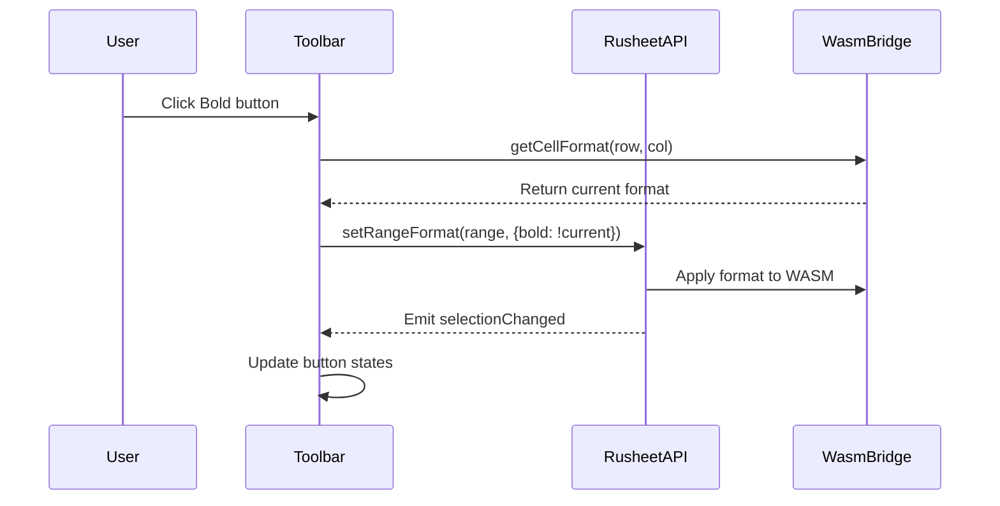

<spec>

# Formatting Toolbar

## Overview

Create a Google Sheets-style formatting toolbar as a DOM overlay component. The toolbar provides buttons for undo/redo, font family, font size, bold/italic/underline/strikethrough, text color, fill color, borders, cell merge, and text alignment. All formatting buttons are wired to the WASM API via RusheetAPI and sync state with the active cell's current format on selection change.

## Requirements

### R1 - Toolbar layout with button groups

```yaml
id: R1
priority: high
status: draft
```

Toolbar renders as a horizontal bar below the menu bar with logically grouped buttons separated by vertical dividers: [Undo/Redo] | [Font/Size] | [B/I/U/S] | [TextColor/FillColor] | [Borders] | [Merge] | [Alignment]

### R2 - Formatting buttons wire to WASM

```yaml
id: R2
priority: high
status: draft
```

Each formatting button calls rusheet.setRangeFormat() on the current selection with the appropriate CellFormat property. Toggle buttons (bold, italic, underline) read current state and toggle.

### R3 - Selection state sync

```yaml
id: R3
priority: high
status: draft
```

Toolbar listens to rusheet.onSelectionChange and reads the active cell's format via WasmBridge.getCellFormat() to update button active/inactive states (e.g., bold button pressed if active cell is bold).

### R4 - Undo/Redo buttons

```yaml
id: R4
priority: high
status: draft
```

Undo and Redo buttons call WasmBridge.undo()/redo() and are disabled when canUndo()/canRedo() returns false.

### R5 - Color picker dropdowns

```yaml
id: R5
priority: medium
status: draft
```

Text color and fill color buttons show a color picker dropdown on click. Selected color is applied to the selection via setRangeFormat.

### R6 - Font and size selectors

```yaml
id: R6
priority: medium
status: draft
```

Font family dropdown and font size dropdown allow selection from predefined lists. Changes apply to the current selection.

## Acceptance Criteria

### Scenario: Toggle bold on selection

- **GIVEN** Cells A1:B2 are selected and not bold
- **WHEN** User clicks Bold button
- **THEN** setRangeFormat is called with bold:true for A1:B2, Bold button shows active state

### Scenario: Toolbar reflects active cell format

- **GIVEN** Cell A1 has bold and italic formatting
- **WHEN** User clicks on cell A1
- **THEN** Bold and Italic buttons show active/pressed state

### Scenario: Undo button state

- **GIVEN** User has made formatting changes
- **WHEN** User clicks Undo
- **THEN** Last change is undone, Undo button stays enabled if more history exists

### Scenario: Color picker applies fill color

- **GIVEN** Cells A1:A3 are selected
- **WHEN** User opens fill color picker and selects red
- **THEN** setRangeFormat is called with backgroundColor:#ff0000 for A1:A3

## Flow Diagram



</spec>