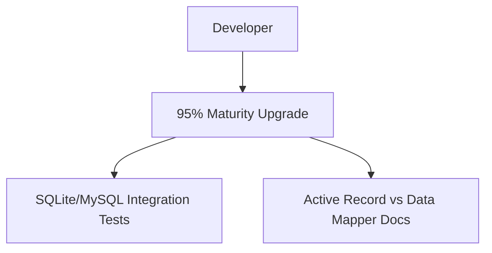

<spec>

# Testing and Documentation Gaps

## Overview

This specification addresses the testing and documentation gaps identified in the maturity assessment. It focuses on cross-dialect consistency, advanced query examples, and architectural guidance.

## Requirements

### R1 - Multi-Dialect Testing

```yaml
id: R1
priority: medium
status: draft
```

Add integration tests for SQLite and MySQL to verify cross-dialect consistency.

### R2 - Transaction Isolation Tests

```yaml
id: R2
priority: medium
status: draft
```

Verify transaction isolation levels and savepoint behavior across all supported dialects.

### R3 - Migration Rollback Tests

```yaml
id: R3
priority: medium
status: draft
```

Add tests for migration rollback logic to ensure schema reliability.

### R4 - Architectural Documentation

```yaml
id: R4
priority: medium
status: draft
```

Create a comprehensive guide on 'Active Record vs Data Mapper' patterns in cclab-titan.

### R5 - CTE Documentation

```yaml
id: R5
priority: medium
status: draft
```

Provide advanced CTE (Common Table Expression) examples in the documentation.

## Acceptance Criteria

### Scenario: Migration Rollback Scenario

- **GIVEN** A migration with an error in the second step
- **WHEN** The migration is applied
- **THEN** The system rolls back the first step and leaves the database in the original state.

### Scenario: Documentation Scenario

- **GIVEN** Documentation request for Data Mapper
- **WHEN** User searches for architecture guide
- **THEN** The guide clearly explains how to use Session for Data Mapper pattern.

## Diagrams

### Closing Maturity Gaps



</spec>
