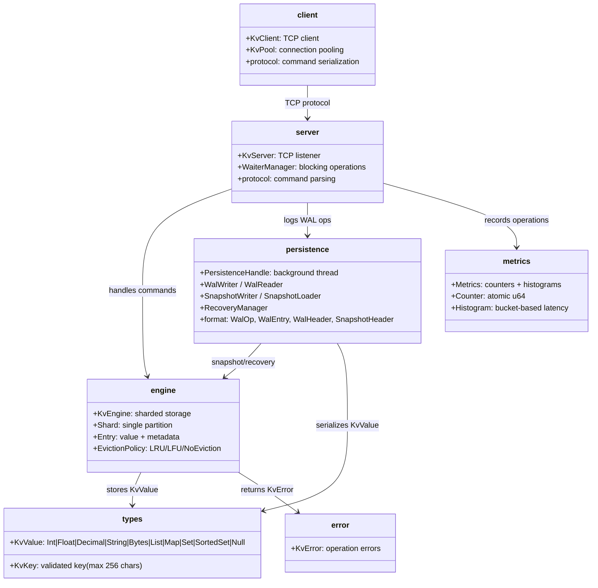
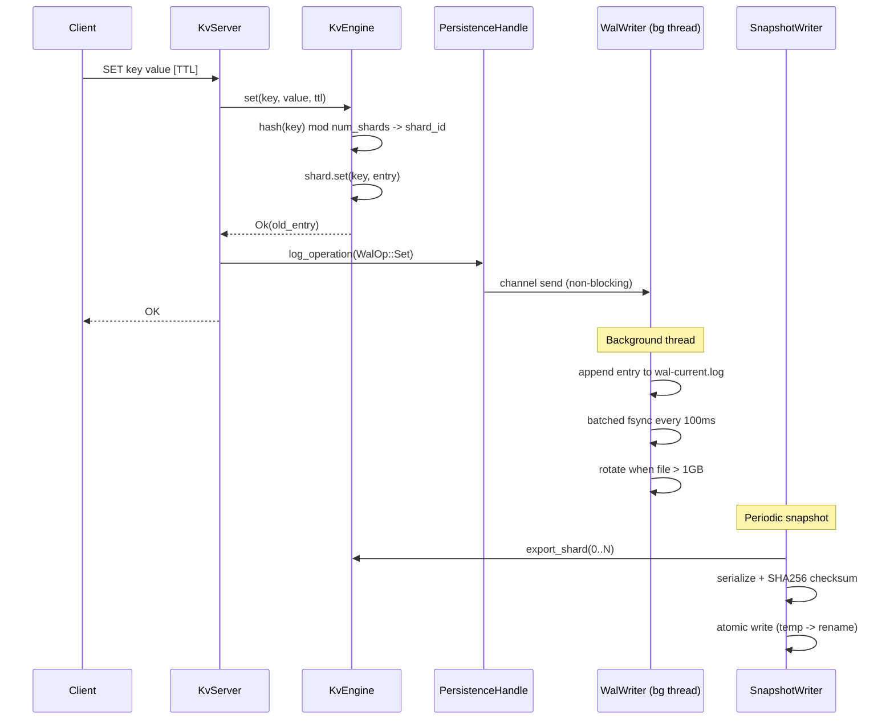
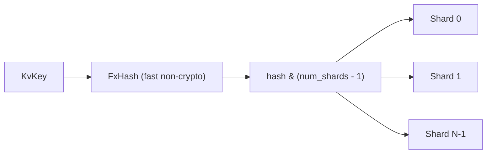
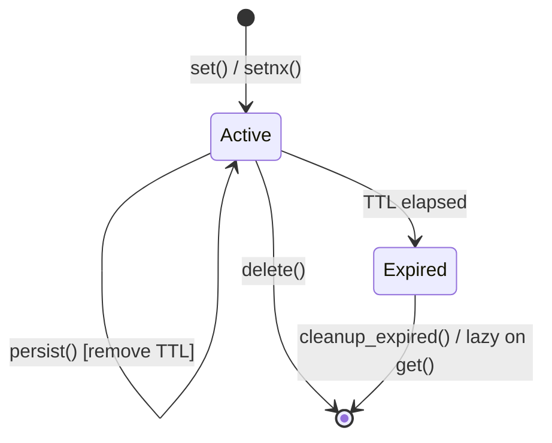

# cclab-kv Architecture

## Overview
<!-- type: overview lang: markdown -->

High-performance, multi-core key-value store with sharded in-memory storage, crash-safe WAL persistence, periodic snapshots, TCP server/client, and Redis-compatible data type operations.

## System Architecture
<!-- type: dependency lang: mermaid -->

## Data Flow
<!-- type: interaction lang: mermaid -->

## Sharding Strategy
<!-- type: logic lang: mermaid -->

| Parameter | Value | Rationale |
|-----------|-------|-----------|
| DEFAULT_NUM_SHARDS | 256 | Power of 2 for bitwise modulo |
| Shard lock | parking_lot::RwLock | Concurrent reads, exclusive writes |
| Hash function | std DefaultHasher (FxHash-like) | Fast, non-cryptographic |

## Entry Lifecycle
<!-- type: state-machine lang: mermaid -->

## Feature Summary
<!-- type: overview lang: markdown -->

| Feature | Description |
|---------|-------------|
| Sharded storage | 256 shards with RwLock for multi-core scalability |
| Value types | Int, Float, Decimal, String, Bytes, List, Map, Set, SortedSet, Null |
| TTL | Per-key expiration with lazy cleanup + periodic cleanup |
| CAS | Compare-and-swap with version tracking |
| Distributed locks | lock/unlock/extend_lock with owner ID |
| Eviction | AllKeysLru, VolatileLru, AllKeysLfu, NoEviction |
| WAL | Append-only with CRC32, batched fsync (100ms), rotation at 1GB |
| Snapshots | Periodic full state dump with SHA256, atomic writes |
| Recovery | Snapshot + WAL replay, skip corrupted entries |
| TCP server | Async TCP with custom protocol |
| Connection pool | Client-side pooling via KvPool |
| Metrics | Atomic counters + histograms for all operation types |

## Module Layout
<!-- type: overview lang: markdown -->

| Module | Files | Feature Gate |
|--------|-------|-------------|
| engine | engine.rs | default |
| types | types.rs | default |
| error | error.rs | default |
| metrics | metrics.rs | default |
| persistence | persistence/{mod, format, wal, snapshot, recovery, handle}.rs | default |
| server | server/{mod, server, protocol, waiter, main}.rs | default |
| client | client/{mod, client, pool, protocol}.rs | default |
