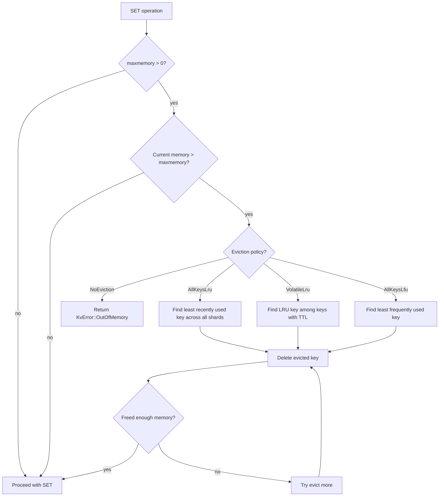

# cclab-kv Engine

## Overview
<!-- type: overview lang: markdown -->

Sharded in-memory key-value engine. Partitions keyspace across N shards (default 256) using hash-based routing. Each shard is an independent HashMap protected by RwLock. Supports Redis-compatible data type operations, CAS, distributed locks, TTL, and eviction policies.

## KvEngine Schema
<!-- type: schema lang: json -->

```json
{
  "$id": "kv-engine",
  "definitions": {
    "KvEngine": {
      "type": "object",
      "properties": {
        "shards": { "type": "array", "items": { "$ref": "#/definitions/Shard" }, "minItems": 1 },
        "num_shards": { "type": "integer", "default": 256 },
        "persistence": { "description": "Optional Arc<PersistenceHandle> for WAL + snapshots" },
        "maxmemory": { "type": "integer", "default": 0, "description": "0 = unlimited" },
        "eviction_policy": { "$ref": "#/definitions/EvictionPolicy" }
      }
    },
    "Shard": {
      "type": "object",
      "properties": {
        "data": { "description": "RwLock<HashMap<String, Entry>>" },
        "lru_times": { "description": "RwLock<HashMap<String, Instant>> - last access time per key" },
        "lfu_counts": { "description": "RwLock<HashMap<String, u64>> - access frequency per key" }
      }
    },
    "Entry": {
      "type": "object",
      "properties": {
        "value": { "$ref": "#/definitions/KvValue" },
        "created_at": { "type": "string", "format": "instant" },
        "expires_at": { "type": "string", "format": "instant", "description": "Optional TTL expiration" },
        "version": { "type": "integer", "format": "u64", "minimum": 1, "description": "Monotonic version for CAS" }
      },
      "required": ["value", "created_at", "version"]
    },
    "EvictionPolicy": {
      "enum": ["AllKeysLru", "VolatileLru", "AllKeysLfu", "NoEviction"],
      "default": "AllKeysLru",
      "x-descriptions": {
        "AllKeysLru": "Evict least recently used key (any key)",
        "VolatileLru": "Evict least recently used key (only keys with TTL)",
        "AllKeysLfu": "Evict least frequently used key (any key)",
        "NoEviction": "Return OOM error, never evict"
      }
    }
  }
}
```

## KvValue Type Schema
<!-- type: schema lang: json -->

```json
{
  "$id": "kv-value-types",
  "definitions": {
    "KvKey": {
      "type": "string",
      "minLength": 1,
      "maxLength": 256,
      "description": "UTF-8 key, 1-256 characters"
    },
    "KvValue": {
      "description": "Tagged union of supported value types",
      "oneOf": [
        { "type": "object", "properties": { "type": { "const": "Int" }, "value": { "type": "integer", "format": "i64" } } },
        { "type": "object", "properties": { "type": { "const": "Float" }, "value": { "type": "number", "format": "f64" } } },
        { "type": "object", "properties": { "type": { "const": "Decimal" }, "value": { "type": "string", "description": "128-bit fixed-point via rust_decimal" } } },
        { "type": "object", "properties": { "type": { "const": "String" }, "value": { "type": "string" } } },
        { "type": "object", "properties": { "type": { "const": "Bytes" }, "value": { "type": "string", "contentEncoding": "base64" } } },
        { "type": "object", "properties": { "type": { "const": "List" }, "value": { "type": "array", "items": { "$ref": "#/definitions/KvValue" } } } },
        { "type": "object", "properties": { "type": { "const": "Map" }, "value": { "type": "object", "additionalProperties": { "$ref": "#/definitions/KvValue" } } } },
        { "type": "object", "properties": { "type": { "const": "Set" }, "value": { "type": "array", "items": { "type": "string" }, "uniqueItems": true } } },
        { "type": "object", "properties": { "type": { "const": "SortedSet" }, "value": { "type": "object", "additionalProperties": { "type": "number" }, "description": "member -> score (BTreeMap)" } } },
        { "const": "Null" }
      ]
    }
  }
}
```

## KvError Schema
<!-- type: schema lang: json -->

```json
{
  "$id": "kv-errors",
  "definitions": {
    "KvError": {
      "oneOf": [
        { "type": "object", "properties": { "type": { "const": "KeyNotFound" }, "key": { "type": "string" } } },
        { "type": "object", "properties": { "type": { "const": "KeyTooLong" }, "length": { "type": "integer" } } },
        { "const": "EmptyKey" },
        { "type": "object", "properties": { "type": { "const": "TypeMismatch" }, "expected": { "type": "string" }, "actual": { "type": "string" } } },
        { "type": "object", "properties": { "type": { "const": "CasConflict" }, "expected": { "type": "integer" }, "current": { "type": "integer" } } },
        { "const": "LockNotHeld" },
        { "type": "object", "properties": { "type": { "const": "LockOwnerMismatch" }, "expected": { "type": "string" }, "actual": { "type": "string" } } },
        { "type": "object", "properties": { "type": { "const": "Storage" }, "message": { "type": "string" } } },
        { "const": "OutOfMemory" },
        { "type": "object", "properties": { "type": { "const": "IndexOutOfRange" }, "index": { "type": "integer" }, "len": { "type": "integer" } } }
      ]
    }
  }
}
```

## Shard Operations
<!-- type: overview lang: markdown -->

### Core Operations

| Operation | Method | Lock | Complexity | Description |
|-----------|--------|------|-----------|-------------|
| GET | `shard.get(key)` | Read | O(1) | Return entry if not expired, update LRU/LFU |
| SET | `shard.set(key, value, ttl)` | Write | O(1) | Insert/replace entry |
| DELETE | `shard.delete(key)` | Write | O(1) | Remove entry |
| EXISTS | `shard.exists(key)` | Read | O(1) | Check existence (not expired) |
| INCR | `shard.incr(key, delta)` | Write | O(1) | Atomic increment Int value |
| CAS | `shard.cas(key, expected, new, ttl)` | Write | O(1) | Compare-and-swap |
| SETNX | `shard.setnx(key, value, ttl)` | Write | O(1) | Set if not exists |
| SCAN | `shard.scan(prefix, limit)` | Read | O(N) | Prefix scan with limit |

### TTL Operations

| Operation | Method | Description |
|-----------|--------|-------------|
| EXPIRE | `shard.expire(key, ttl)` | Set TTL on existing key. Returns 1/0 |
| PEXPIRE | same, ms precision | Set TTL in milliseconds |
| TTL | `shard.ttl(key)` | Get remaining TTL in seconds. -2=no key, -1=no TTL |
| PTTL | `shard.pttl(key)` | Get remaining TTL in milliseconds |
| PERSIST | `shard.persist(key)` | Remove TTL. Returns 1/0 |
| GETEX | `shard.getex(key, ttl, persist)` | Get value and optionally update/remove TTL |

### Hash Operations (Map type)

| Operation | Method | Description |
|-----------|--------|-------------|
| HSET | `shard.hset(key, fields)` | Set fields in hash. Returns new field count |
| HGET | `shard.hget(key, field)` | Get single field |
| HMGET | `shard.hmget(key, fields)` | Get multiple fields |
| HGETALL | `shard.hgetall(key)` | Get all fields and values |
| HDEL | `shard.hdel(key, fields)` | Delete fields. Returns removed count |

### Distributed Lock Operations

| Operation | Method | Description |
|-----------|--------|-------------|
| LOCK | `shard.lock(key, owner, ttl)` | Acquire lock (implemented as SETNX with owner string) |
| UNLOCK | `shard.unlock(key, owner)` | Release lock (only if owned) |
| EXTEND_LOCK | `shard.extend_lock(key, owner, ttl)` | Extend lock TTL (only if owned) |

## Eviction Flow
<!-- type: logic lang: mermaid -->



## Expiration Handling
<!-- type: overview lang: markdown -->

| Strategy | Trigger | Description |
|----------|---------|-------------|
| Lazy | On `get()` / `exists()` | Check `is_expired()` before returning; return None if expired |
| Active | `cleanup_expired()` | Iterate shard, `retain` non-expired entries |
| Background | Server periodic task | Calls `cleanup_expired()` on all shards |

Expired entries are not immediately reclaimed. They remain in memory until lazy check or active cleanup removes them.

## Metrics Integration
<!-- type: schema lang: json -->

```json
{
  "$id": "kv-metrics",
  "definitions": {
    "Operation": {
      "enum": ["Get", "Set", "Delete", "Exists", "Incr", "Decr", "Cas", "MGet", "MSet", "MDel", "Scan", "Lock", "Unlock"]
    },
    "Metrics": {
      "type": "object",
      "properties": {
        "get_total": { "type": "integer", "description": "Counter" },
        "set_total": { "type": "integer" },
        "delete_total": { "type": "integer" },
        "exists_total": { "type": "integer" },
        "incr_total": { "type": "integer" },
        "cas_total": { "type": "integer" },
        "scan_total": { "type": "integer" },
        "lock_total": { "type": "integer" },
        "errors_total": { "type": "integer" },
        "key_not_found_total": { "type": "integer" },
        "get_latency": { "description": "Histogram with buckets: 10us, 50us, 100us, 250us, 500us, 1ms, 5ms, 10ms, 50ms, 100ms" },
        "set_latency": { "description": "Histogram" },
        "delete_latency": { "description": "Histogram" },
        "active_connections": { "type": "integer" },
        "total_connections": { "type": "integer" },
        "keys_total": { "type": "integer" },
        "memory_bytes": { "type": "integer" }
      }
    }
  }
}
```
