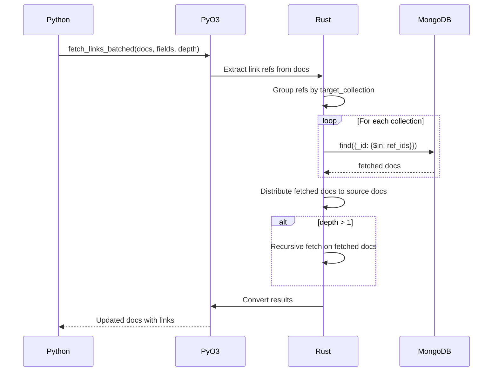

<spec>

# PyO3 Link Fetching Bindings

## Overview

\u5be6\u4f5c PyO3 bindings \u5c07 Rust Link Fetching \u529f\u80fd\u66b4\u9732\u7d66 Python\u3002\u5305\u542b fetch_links_batched async \u51fd\u6578\uff0c\u652f\u63f4 recursive depth \u548c batch query\u3002

## Requirements

### R1 - fetch_links_batched 函數

```yaml
id: R1
priority: high
status: draft
```

實作 async fn fetch_links_batched(docs: Vec<PyDict>, link_fields: Vec<LinkField>, depth: u32) -> PyResult<Vec<PyDict>>

### R2 - Ref 收集

```yaml
id: R2
priority: high
status: draft
```

從 documents 中收集所有 link refs，按 target_collection 分組

### R3 - Batch query

```yaml
id: R3
priority: high
status: draft
```

對每個 collection 執行單一 $in query 取得所有 linked docs

### R4 - 分配回 document

```yaml
id: R4
priority: high
status: draft
```

將 fetched docs 分配回原始 documents 的對應 fields

### R5 - Recursive fetch

```yaml
id: R5
priority: medium
status: draft
```

如果 depth > 1，對 fetched docs 遞迴執行 link fetching

## Acceptance Criteria

### Scenario: 單層 fetch

- **GIVEN** documents 包含 link fields, depth=1
- **WHEN** 呼叫 fetch_links_batched(docs, fields, 1)
- **THEN** 所有 link fields 被填充為實際 documents

### Scenario: 多層 recursive fetch

- **GIVEN** linked docs 也包含 link fields, depth=2
- **WHEN** 呼叫 fetch_links_batched(docs, fields, 2)
- **THEN** 兩層 link fields 都被填充

### Scenario: 空 refs

- **GIVEN** documents 沒有 link refs
- **WHEN** 呼叫 fetch_links_batched
- **THEN** 直接回傳原始 documents

## Flow Diagram


```

</spec>
