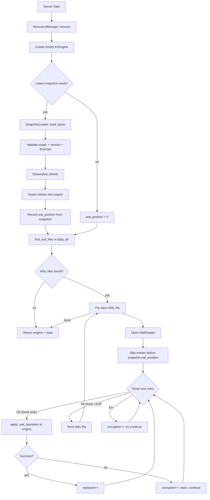
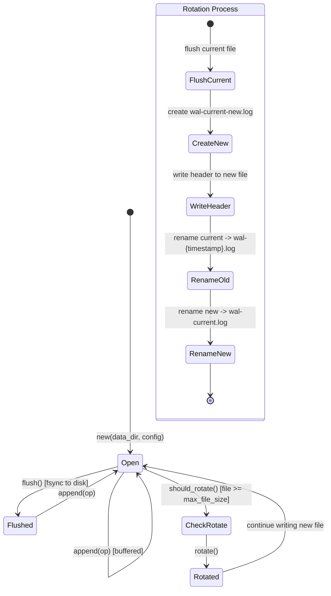
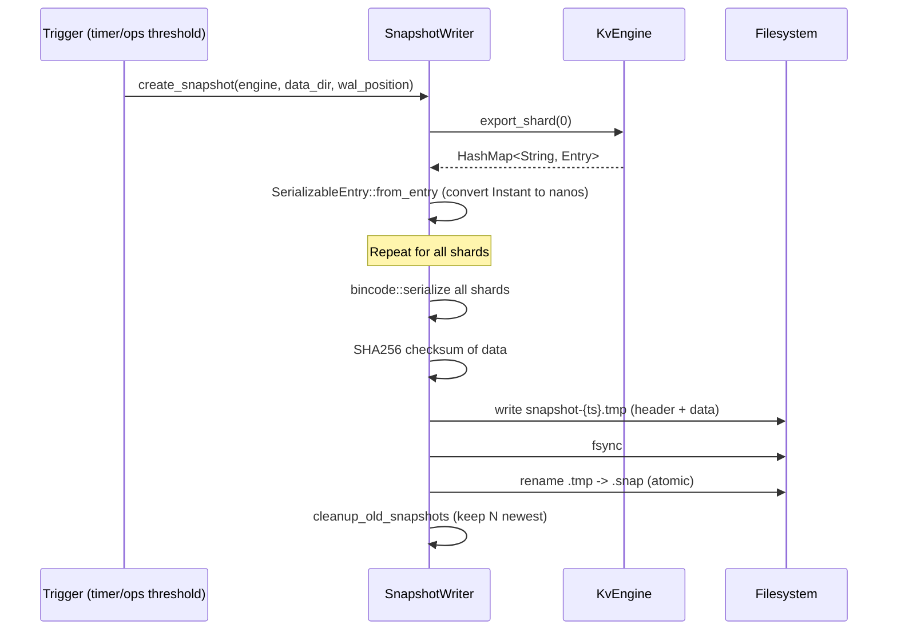
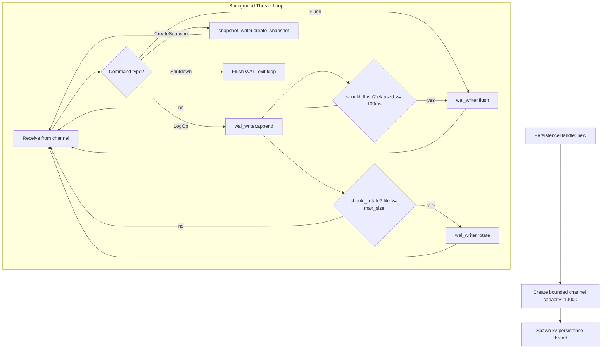

# cclab-kv Persistence

## Overview
<!-- type: overview lang: markdown -->

Crash-safe durability using Write-Ahead Log (WAL) with periodic snapshots. All writes are logged to WAL before acknowledging to client. Background thread handles batched fsync (100ms intervals) and snapshot creation.

Durability guarantee: at most ~100ms of data loss on crash (acceptable for task backends).

## Recovery Flow
<!-- type: logic lang: mermaid -->



## WAL File Format
<!-- type: schema lang: json -->

```json
{
  "$id": "kv-wal-format",
  "definitions": {
    "WalHeader": {
      "description": "32-byte file header",
      "type": "object",
      "properties": {
        "magic": { "const": "KVWAL001", "description": "8 bytes" },
        "version": { "type": "integer", "const": 1, "description": "4 bytes, big-endian u32" },
        "created_at": { "type": "integer", "format": "i64", "description": "8 bytes, Unix timestamp seconds" },
        "reserved": { "description": "12 bytes, zero-filled" }
      },
      "x-total-size-bytes": 32
    },
    "WalEntry": {
      "description": "Variable-length entry: [Length:4 | Timestamp:8 | OpType:1 | Payload:N | CRC32:4]",
      "type": "object",
      "properties": {
        "length": { "type": "integer", "format": "u32", "description": "Total bytes of timestamp + op_type + payload + crc32" },
        "timestamp": { "type": "integer", "format": "i64", "description": "Nanoseconds since Unix epoch" },
        "op_type": { "$ref": "#/definitions/WalOpType", "description": "1 byte" },
        "payload": { "description": "bincode-serialized WalOp (variable length)" },
        "crc32": { "type": "integer", "format": "u32", "description": "CRC32 of [timestamp + op_type + payload]" }
      }
    },
    "WalOpType": {
      "description": "1-byte operation discriminant",
      "type": "integer",
      "enum": [1, 2, 3, 4, 5, 6, 7, 8, 9, 10],
      "x-name-map": {
        "1": "Set",
        "2": "Delete",
        "3": "Incr",
        "4": "Decr",
        "5": "MSet",
        "6": "MDel",
        "7": "SetNx",
        "8": "Lock",
        "9": "Unlock",
        "10": "ExtendLock"
      }
    },
    "WalOp": {
      "description": "Operation payload (bincode serialized)",
      "oneOf": [
        { "type": "object", "properties": { "type": { "const": "Set" }, "key": { "type": "string" }, "value": { "$ref": "kv-value-types#/definitions/KvValue" }, "ttl": { "type": "integer", "description": "Optional Duration in nanos" } } },
        { "type": "object", "properties": { "type": { "const": "Delete" }, "key": { "type": "string" } } },
        { "type": "object", "properties": { "type": { "const": "Incr" }, "key": { "type": "string" }, "delta": { "type": "integer", "format": "i64" } } },
        { "type": "object", "properties": { "type": { "const": "Decr" }, "key": { "type": "string" }, "delta": { "type": "integer", "format": "i64" } } },
        { "type": "object", "properties": { "type": { "const": "MSet" }, "pairs": { "type": "array", "items": { "type": "array", "items": [{ "type": "string" }, { "$ref": "kv-value-types#/definitions/KvValue" }] } }, "ttl": {} } },
        { "type": "object", "properties": { "type": { "const": "MDel" }, "keys": { "type": "array", "items": { "type": "string" } } } },
        { "type": "object", "properties": { "type": { "const": "SetNx" }, "key": { "type": "string" }, "value": { "$ref": "kv-value-types#/definitions/KvValue" }, "ttl": {} } },
        { "type": "object", "properties": { "type": { "const": "Lock" }, "key": { "type": "string" }, "owner": { "type": "string" }, "ttl": { "type": "integer" } } },
        { "type": "object", "properties": { "type": { "const": "Unlock" }, "key": { "type": "string" }, "owner": { "type": "string" } } },
        { "type": "object", "properties": { "type": { "const": "ExtendLock" }, "key": { "type": "string" }, "owner": { "type": "string" }, "ttl": { "type": "integer" } } }
      ]
    }
  }
}
```

## WAL Writer Lifecycle
<!-- type: state-machine lang: mermaid -->



## WAL Configuration
<!-- type: config lang: json -->

```json
{
  "$id": "kv-wal-config",
  "type": "object",
  "properties": {
    "flush_interval_ms": {
      "type": "integer",
      "default": 100,
      "description": "Batched fsync interval in milliseconds"
    },
    "max_file_size": {
      "type": "integer",
      "default": 1073741824,
      "description": "Maximum WAL file size before rotation (default 1GB)"
    }
  }
}
```

## WAL File Naming
<!-- type: overview lang: markdown -->

| File Pattern | Purpose |
|-------------|---------|
| `wal-current.log` | Active WAL receiving writes |
| `wal-{unix_timestamp}.log` | Rotated WAL (read-only, for recovery) |
| `wal-current-new.log` | Temporary during rotation (renamed to wal-current.log) |

## Snapshot File Format
<!-- type: schema lang: json -->

```json
{
  "$id": "kv-snapshot-format",
  "definitions": {
    "SnapshotHeader": {
      "description": "64-byte file header",
      "type": "object",
      "properties": {
        "magic": { "const": "KVSN0001", "description": "8 bytes" },
        "version": { "type": "integer", "const": 1, "description": "4 bytes, big-endian u32" },
        "created_at": { "type": "integer", "format": "i64", "description": "8 bytes, nanoseconds since epoch" },
        "num_shards": { "type": "integer", "format": "u32", "description": "4 bytes" },
        "total_entries": { "type": "integer", "format": "u64", "description": "8 bytes" },
        "wal_position": { "type": "integer", "format": "u64", "description": "8 bytes, WAL file position when snapshot taken" },
        "checksum": { "type": "string", "description": "32 bytes, SHA256 of all shard data" }
      },
      "x-total-size-bytes": 72
    },
    "SnapshotData": {
      "description": "Concatenated bincode-serialized shards after header",
      "type": "array",
      "items": { "$ref": "#/definitions/SerializableShard" }
    },
    "SerializableShard": {
      "type": "object",
      "properties": {
        "shard_id": { "type": "integer", "format": "u32" },
        "entries": {
          "type": "object",
          "additionalProperties": { "$ref": "#/definitions/SerializableEntry" }
        }
      }
    },
    "SerializableEntry": {
      "description": "Entry with absolute timestamps (not Instant)",
      "type": "object",
      "properties": {
        "value": { "$ref": "kv-value-types#/definitions/KvValue" },
        "created_at_nanos": { "type": "integer", "format": "i64", "description": "Nanoseconds since Unix epoch" },
        "expires_at_nanos": { "type": "integer", "format": "i64", "description": "Optional expiration timestamp" },
        "version": { "type": "integer", "format": "u64" }
      },
      "required": ["value", "created_at_nanos", "version"]
    }
  }
}
```

## Snapshot Configuration
<!-- type: config lang: json -->

```json
{
  "$id": "kv-snapshot-config",
  "type": "object",
  "properties": {
    "interval_secs": {
      "type": "integer",
      "default": 300,
      "description": "Snapshot interval in seconds (default 5 minutes)"
    },
    "ops_threshold": {
      "type": "integer",
      "default": 100000,
      "description": "Operations count triggering snapshot (default 100K)"
    },
    "keep_count": {
      "type": "integer",
      "default": 3,
      "description": "Number of snapshot files to retain"
    }
  }
}
```

## Snapshot File Naming
<!-- type: overview lang: markdown -->

| File Pattern | Purpose |
|-------------|---------|
| `snapshot-{unix_timestamp}.snap` | Completed snapshot (sorted by timestamp for latest selection) |
| `snapshot-{unix_timestamp}.tmp` | Temporary during write (renamed atomically on completion) |

## Snapshot Creation Flow
<!-- type: interaction lang: mermaid -->



## PersistenceHandle (Background Thread)
<!-- type: logic lang: mermaid -->



| Method | Blocking | Description |
|--------|----------|-------------|
| `log_operation(op)` | No (try_send) | Send WalOp to background thread. Drops if channel full. |
| `flush()` | No (try_send) | Request immediate WAL fsync |
| `create_snapshot()` | No (try_send) | Request snapshot creation |
| `shutdown()` | Yes (join) | Flush WAL and stop thread |

## Persistence Configuration
<!-- type: config lang: json -->

```json
{
  "$id": "kv-persistence-config",
  "type": "object",
  "properties": {
    "data_dir": { "type": "string", "default": "./data" },
    "wal_config": { "$ref": "kv-wal-config" },
    "snapshot_config": { "$ref": "kv-snapshot-config" }
  }
}
```

## Recovery Statistics
<!-- type: schema lang: json -->

```json
{
  "$id": "kv-recovery-stats",
  "type": "object",
  "properties": {
    "snapshot_loaded": { "type": "boolean" },
    "snapshot_entries": { "type": "integer" },
    "wal_entries_replayed": { "type": "integer" },
    "corrupted_entries": { "type": "integer" },
    "recovery_duration": { "type": "string", "format": "duration" }
  }
}
```

## Persistence Errors
<!-- type: schema lang: json -->

```json
{
  "$id": "kv-persistence-errors",
  "definitions": {
    "PersistenceError": {
      "oneOf": [
        { "type": "object", "properties": { "type": { "const": "Io" }, "message": { "type": "string" } } },
        { "type": "object", "properties": { "type": { "const": "CorruptedWal" }, "pos": { "type": "integer" }, "reason": { "type": "string" } } },
        { "type": "object", "properties": { "type": { "const": "CorruptedSnapshot" }, "message": { "type": "string" } } },
        { "type": "object", "properties": { "type": { "const": "Serialization" }, "message": { "type": "string" } } },
        { "type": "object", "properties": { "type": { "const": "ChecksumMismatch" }, "pos": { "type": "integer" }, "expected": { "type": "string" }, "actual": { "type": "string" } } },
        { "type": "object", "properties": { "type": { "const": "UnsupportedVersion" }, "version": { "type": "integer" } } },
        { "type": "object", "properties": { "type": { "const": "InvalidMagic" }, "expected": { "type": "string" }, "actual": { "type": "string" } } },
        { "type": "object", "properties": { "type": { "const": "DataDirectory" }, "message": { "type": "string" } } }
      ]
    }
  }
}
```

## Integrity Guarantees
<!-- type: overview lang: markdown -->

| Layer | Mechanism | Detects |
|-------|-----------|---------|
| WAL entry | CRC32 checksum | Bit-flip corruption, partial writes |
| WAL file | Magic + version header | Wrong file type, incompatible version |
| Snapshot data | SHA256 checksum | Data corruption during write/storage |
| Snapshot file | Magic + version header | Wrong file type, incompatible version |
| WAL write | BufWriter (64KB) + batched fsync | Ensures data reaches disk within 100ms |
| Snapshot write | Temp file + atomic rename | Prevents partial snapshot reads |
