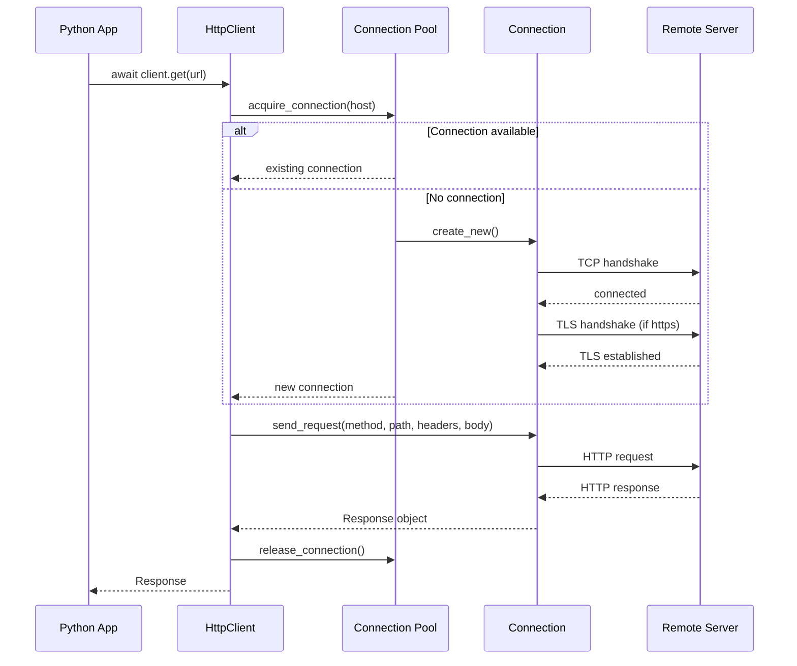
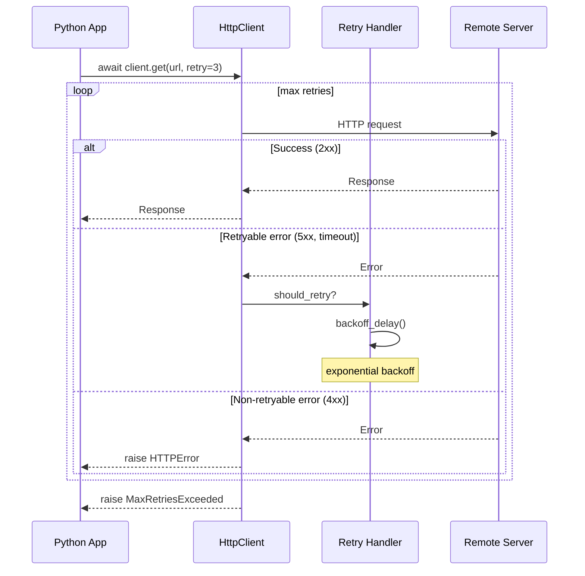
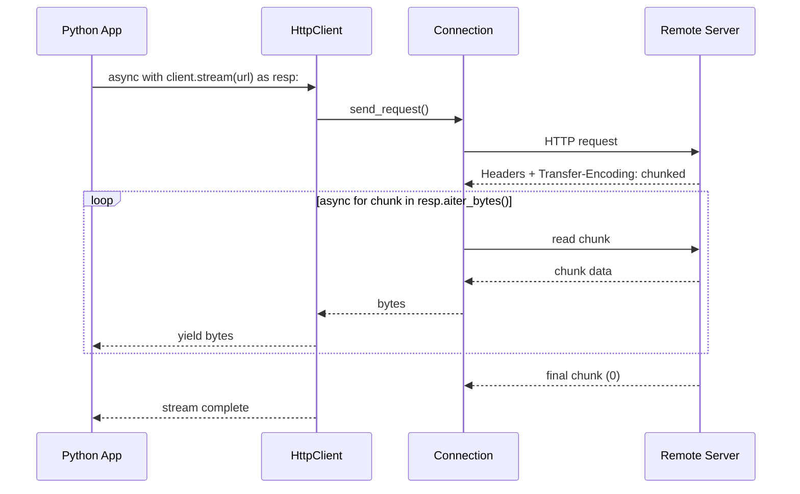

<spec>

# Photon HTTP Client Sequences

## Overview

Photon provides high-performance async HTTP client for Python with Rust backend.

## HTTP Request Flow

## Retry Flow

## Streaming Response

</spec>
