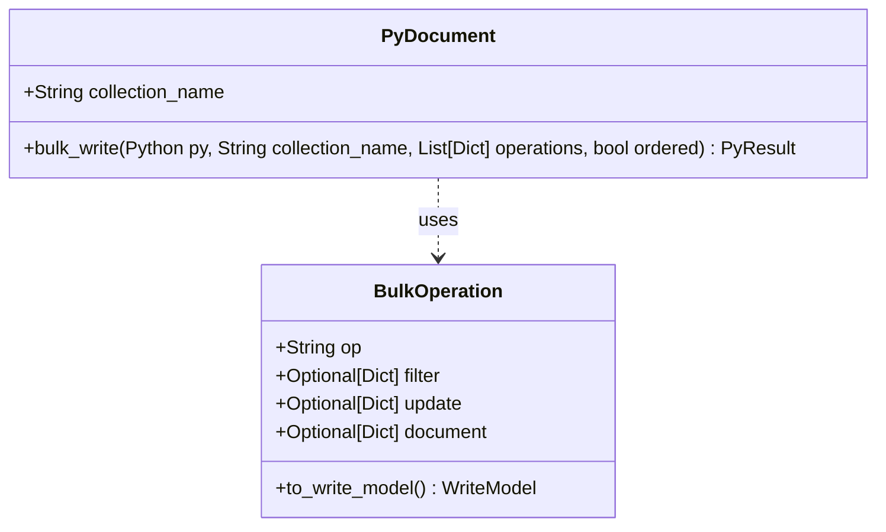
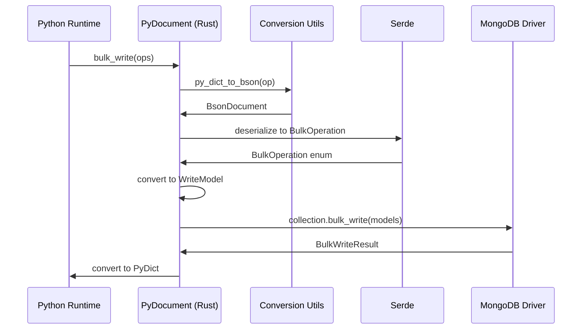

<spec>

# Bulk Write Operations

## Overview

Implement high-performance bulk write operations in the Rust backend, exposed through the Mamba binding layer. The Rust `bulk_write` entrypoint accepts host-runtime operation dictionaries, converts them into the Rust `BulkOperation` enum and then `mongodb::options::WriteModel` items, executes `collection.bulk_write`, and returns a structured result dict back to Python-compatible callers. This replaces the Python-side loop for batching operations and preserves existing behavior while improving performance.

## Requirements

### R1 - Expose bulk_write

```yaml
id: R1
priority: medium
status: draft
```

Expose a `bulk_write` static method on the `PyDocument` Python class implemented in Rust.

### R2 - Accept Operation List

```yaml
id: R2
priority: medium
status: draft
```

Accept a list of operation dictionaries from Python matching the format generated by `cclab.nebula.bulk` operation classes.

### R3 - Convert to BulkOperation

```yaml
id: R3
priority: medium
status: draft
```

Convert each Python operation dictionary into the Rust `BulkOperation` enum using BSON serialization/deserialization.

### R4 - Map to WriteModel

```yaml
id: R4
priority: medium
status: draft
```

Convert `BulkOperation` values into `mongodb::options::WriteModel` instances for the Rust MongoDB driver.

### R5 - Execute Bulk Write

```yaml
id: R5
priority: medium
status: draft
```

Execute the bulk write using `collection.bulk_write`, honoring the `ordered` option provided by Python.

### R6 - Return Results

```yaml
id: R6
priority: medium
status: draft
```

Return a dictionary containing bulk write results (inserted/matched/modified/deleted counts and upserted IDs) to Python.

## Acceptance Criteria

### Scenario: Mixed Bulk Write

- **GIVEN** A list of valid insert, update, and delete operations
- **WHEN** bulk_write is called with these operations
- **THEN** All operations are executed and the returned counts reflect the executed operations.

### Scenario: Ordered Bulk Write Failure

- **GIVEN** An ordered list of operations where the second operation fails
- **WHEN** bulk_write is called with ordered=True
- **THEN** The first operation succeeds, the second fails, and subsequent operations are not executed; an error is raised.

### Scenario: Unordered Bulk Write Failure

- **GIVEN** An unordered list of operations where one operation fails
- **WHEN** bulk_write is called with ordered=False
- **THEN** The failed operation reports an error, but other operations are still executed.

## Diagrams

### Bulk Write Class Diagram



### Bulk Write Sequence



## Data Model

```json
{
  "definitions": {
    "BulkWriteResult": {
      "properties": {
        "deleted_count": {
          "type": "integer"
        },
        "inserted_count": {
          "type": "integer"
        },
        "matched_count": {
          "type": "integer"
        },
        "modified_count": {
          "type": "integer"
        },
        "upserted_count": {
          "type": "integer"
        },
        "upserted_ids": {
          "additionalProperties": {
            "type": "string"
          },
          "type": "object"
        }
      },
      "required": [
        "inserted_count",
        "matched_count",
        "modified_count",
        "deleted_count",
        "upserted_count",
        "upserted_ids"
      ],
      "type": "object"
    }
  },
  "title": "Bulk Write Data Model"
}
```

</spec>
