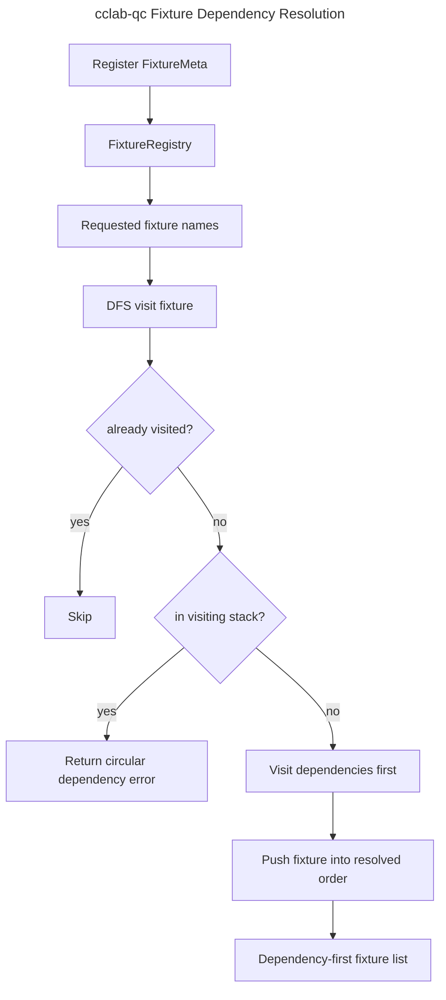

# Fixture DI Integration

## Overview
<!-- type: overview lang: markdown -->

`crates/cclab-qc/src/fixtures.rs` defines the Rust-side fixture metadata and
dependency resolver used by the qc test framework. The Rust layer does not
store executable Python fixture functions. It stores `FixtureMeta`, tracks
dependencies by fixture name, resolves dependency order with DFS topological
sorting, detects cycles, and exposes scope cleanup rules.

The binding or runner layer is responsible for inspecting actual test function
signatures, calling fixture functions, injecting values, and running teardown
callbacks. This spec covers the contract that those layers consume.

## Requirements
<!-- type: schema lang: yaml -->

```yaml
requirements:
  - id: R1
    title: Fixture metadata
    priority: must
    statement: "The registry must store fixture metadata independently of executable fixture functions."
    implementation:
      - "`FixtureMeta` stores name, scope, autouse flag, dependency names, and teardown flag."
      - "`FixtureMeta::new` defaults dependencies to empty and `has_teardown` to false."
      - "Builder helpers add one dependency, replace dependencies, or set teardown presence."

  - id: R2
    title: Scope semantics
    priority: must
    statement: "Fixture scopes must be explicit and parseable from CLI/Python-facing strings."
    implementation:
      - "Support `function`, `class`, `module`, and `session` scopes."
      - "Render scopes with matching lowercase display names."
      - "Reject unknown scope strings with a descriptive error."

  - id: R3
    title: Dependency order
    priority: must
    statement: "The registry must resolve requested fixtures in dependency-first order."
    implementation:
      - "Use DFS topological ordering."
      - "Visit each fixture at most once."
      - "Return an error when dependency traversal sees the current visiting stack."

  - id: R4
    title: Cycle detection
    priority: must
    statement: "The registry must expose a whole-graph cycle check for fixture dependency validation."
    implementation:
      - "`detect_circular_deps` walks all registered fixtures."
      - "The error payload contains the detected dependency cycle."

  - id: R5
    title: Autouse lookup
    priority: should
    statement: "The registry should return autouse fixtures by exact scope."
    implementation:
      - "`get_autouse_fixtures(scope)` filters fixtures where `autouse` is true and scope matches."
```

## Scenarios
<!-- type: scenarios lang: yaml -->

```yaml
scenarios:
  - name: Register fixture metadata
    given:
      - "An empty `FixtureRegistry`."
    when:
      - "A `FixtureMeta` named `database` is registered."
    then:
      - "`has_fixture(\"database\")` returns true."
      - "`get_meta(\"database\")` returns the stored metadata."

  - name: Resolve dependent fixtures
    given:
      - "`fixture_b` depends on `fixture_a`."
      - "`fixture_c` depends on both `fixture_a` and `fixture_b`."
    when:
      - "`resolve_order([\"fixture_c\"])` is called."
    then:
      - "`fixture_a` appears before `fixture_b` and `fixture_c`."
      - "`fixture_b` appears before `fixture_c`."

  - name: Detect circular fixture graph
    given:
      - "A dependency graph `a -> c -> b -> a`."
    when:
      - "`detect_circular_deps()` is called."
    then:
      - "The registry returns an error containing the cycle path."

  - name: Autouse fixture lookup
    given:
      - "One class-scoped autouse fixture."
      - "One class-scoped manual fixture."
    when:
      - "`get_autouse_fixtures(FixtureScope::Class)` is called."
    then:
      - "Only the autouse fixture is returned."
```

## Schema
<!-- type: schema lang: yaml -->

```yaml
types:
  FixtureScope:
    module: crates/cclab-qc/src/fixtures.rs
    variants:
      - Function
      - Class
      - Module
      - Session
    methods:
      - "Display -> function|class|module|session"
      - "FromStr -> Result<FixtureScope, String>"
      - "should_cleanup_before(&self, other: &FixtureScope) -> bool"

  FixtureMeta:
    module: crates/cclab-qc/src/fixtures.rs
    fields:
      name: String
      scope: FixtureScope
      autouse: bool
      dependencies: "Vec<String>"
      has_teardown: bool
    methods:
      - "new(name, scope, autouse) -> Self"
      - "with_dependency(dep) -> Self"
      - "with_dependencies(deps) -> Self"
      - "with_teardown(has_teardown) -> Self"

  FixtureRegistry:
    module: crates/cclab-qc/src/fixtures.rs
    storage:
      fixtures: "HashMap<String, FixtureMeta>"
    methods:
      - "register(meta)"
      - "get_meta(name) -> Option<&FixtureMeta>"
      - "get_all_names() -> Vec<String>"
      - "get_autouse_fixtures(scope) -> Vec<&FixtureMeta>"
      - "get_dependencies(name) -> Option<&[String]>"
      - "resolve_order(fixture_names) -> Result<Vec<String>, String>"
      - "detect_circular_deps() -> Result<(), Vec<String>>"
      - "has_fixture(name) -> bool"
      - "len() -> usize"
      - "is_empty() -> bool"
```

## Logic
<!-- type: logic lang: mermaid -->



## Changes
<!-- type: changes lang: yaml -->

```yaml
changes:
  - path: .aw/tech-design/crates/cclab-qc/fixture-di-integration-alt.md
    action: delete
    section: doc
    impl_mode: hand-written
    description: "Remove duplicate legacy fixture DI root spec; the normalized interface spec is the active contract."
  - path: .aw/tech-design/crates/cclab-qc/interfaces/fixture/di-integration.md
    action: move
    section: overview
    impl_mode: hand-written
    description: "Move the fixture DI spec out of the crate spec root and align it with the current FixtureRegistry contract."
  - path: .aw/tech-design/crates/cclab-qc/README.md
    action: modify
    section: doc
    impl_mode: hand-written
    description: "Link the normalized fixture DI integration spec from the crate spec index."
  - path: crates/cclab-qc/src/fixtures.rs
    action: reference
    section: schema
    impl_mode: hand-written
    description: "Defines FixtureScope, FixtureMeta, FixtureRegistry, dependency resolution, and cycle detection."
  - path: crates/cclab-qc/src/lib.rs
    action: reference
    section: schema
    impl_mode: hand-written
    description: "Re-exports fixture metadata and registry types from cclab-qc."
```
