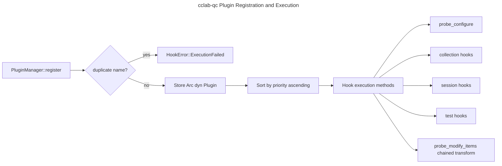

# Plugin System Architecture

## Overview
<!-- type: overview lang: markdown -->

`cclab-qc` exposes a hook-based plugin system in
`crates/cclab-qc/src/plugin.rs`. A plugin implements the `Plugin` trait,
chooses a unique static name, optionally overrides lifecycle hooks, and is
registered into `PluginManager` as an `Arc<dyn Plugin>`.

The manager sorts plugins by ascending priority. Lower priority values execute
earlier, so built-in logging can observe the full session before later plugins
change behavior. The current hook calls are synchronous and intentionally
minimal: hooks either observe lifecycle events, mutate `PluginConfig`, or
transform collected `TestMeta` values.

## Requirements
<!-- type: schema lang: yaml -->

```yaml
requirements:
  - id: R1
    title: Standard hook surface
    priority: must
    statement: "The plugin trait must expose stable lifecycle hooks for runner configuration, collection, sessions, tests, skipped tests, errors, and item mutation."
    implementation:
      - "Represent hook identifiers with `HookSpec`."
      - "Expose default no-op methods on `Plugin` so plugins can implement only the hooks they need."

  - id: R2
    title: Unique registration
    priority: must
    statement: "The manager must reject duplicate plugin names."
    implementation:
      - "Store plugins as `Vec<Arc<dyn Plugin>>`."
      - "Return `HookError::ExecutionFailed` when `register` receives a duplicate name."
      - "Support lookup, unregister, name listing, and presence checks by plugin name."

  - id: R3
    title: Priority order
    priority: must
    statement: "Registered plugins must execute in ascending `priority()` order."
    implementation:
      - "Call `sort_by_priority()` after every successful registration."
      - "Use lower numeric values for earlier execution."

  - id: R4
    title: Context injection
    priority: must
    statement: "Hook methods must receive the runner data needed for their lifecycle point."
    implementation:
      - "`probe_configure` receives mutable `PluginConfig`."
      - "`probe_collection_finish` receives collected `TestMeta` values."
      - "`probe_session_finish` receives `TestSummary`."
      - "`probe_test_finish` receives both `TestMeta` and `TestResult`."

  - id: R5
    title: Built-in plugins
    priority: should
    statement: "The crate should ship reusable plugins for logging, timeout defaults, and tag filtering."
    implementation:
      - "`LoggingPlugin` observes session/test/error events."
      - "`TimeoutPlugin` fills `PluginConfig.timeout` when unset."
      - "`FilterPlugin` filters collected test items by include/exclude tags."
```

## Scenarios
<!-- type: scenarios lang: yaml -->

```yaml
scenarios:
  - name: Register plugin
    given:
      - "A plugin implementing `Plugin::name()` with a unique value."
    when:
      - "`PluginManager::register` is called."
    then:
      - "The plugin is stored."
      - "`has(name)` returns true."
      - "`names()` includes the registered plugin."

  - name: Reject duplicate plugin
    given:
      - "A manager already containing a plugin named `test-plugin`."
    when:
      - "A second plugin with the same name is registered."
    then:
      - "Registration returns `HookError::ExecutionFailed`."
      - "The existing plugin remains registered."

  - name: Execute by priority
    given:
      - "Plugins with priorities -10, 0, and 10."
    when:
      - "They are registered in any order."
    then:
      - "`names()` reports them in -10, 0, 10 execution order."

  - name: Modify collected items
    given:
      - "A `FilterPlugin` configured with include and exclude tags."
    when:
      - "`hook_modify_items` receives collected tests."
    then:
      - "Only matching tests are returned to the runner."
```

## Schema
<!-- type: schema lang: yaml -->

```yaml
interfaces:
  HookSpec:
    module: crates/cclab-qc/src/plugin.rs
    variants:
      - Configure
      - CollectionStart
      - CollectionFinish
      - SessionStart
      - SessionFinish
      - TestStart
      - TestFinish
      - TestSkipped
      - Error
      - ModifyItems

  Plugin:
    module: crates/cclab-qc/src/plugin.rs
    trait_bounds:
      - Send
      - Sync
    required_methods:
      - "name(&self) -> &'static str"
      - "as_any(&self) -> &dyn Any"
    default_methods:
      - "priority(&self) -> i32"
      - "probe_configure(&self, config: &mut PluginConfig)"
      - "probe_collection_start(&self)"
      - "probe_collection_finish(&self, items: &[TestMeta])"
      - "probe_session_start(&self)"
      - "probe_session_finish(&self, summary: &TestSummary)"
      - "probe_test_start(&self, test: &TestMeta)"
      - "probe_test_finish(&self, test: &TestMeta, result: &TestResult)"
      - "probe_test_skipped(&self, test: &TestMeta, reason: &str)"
      - "probe_error(&self, error: &str)"
      - "probe_modify_items(&self, items: Vec<TestMeta>) -> Vec<TestMeta>"

  PluginConfig:
    fields:
      parallel: bool
      workers: usize
      timeout: "Option<f64>"
      verbose: bool
      extra: "HashMap<String, String>"

  HookError:
    variants:
      - ExecutionFailed
      - Timeout
      - PluginNotFound
      - InvalidArguments
```

## Logic
<!-- type: logic lang: mermaid -->



## Changes
<!-- type: changes lang: yaml -->

```yaml
changes:
  - path: .aw/tech-design/crates/cclab-qc/interfaces/plugin/system.md
    action: move
    section: overview
    impl_mode: hand-written
    description: "Move the plugin system spec out of the crate spec root and normalize it around the current Rust plugin interface."
  - path: .aw/tech-design/crates/cclab-qc/README.md
    action: modify
    section: doc
    impl_mode: hand-written
    description: "Link the normalized plugin system spec from the crate spec index."
  - path: crates/cclab-qc/src/plugin.rs
    action: reference
    section: schema
    impl_mode: hand-written
    description: "Defines HookSpec, Plugin, PluginConfig, PluginManager, and built-in plugins."
  - path: crates/cclab-qc/src/lib.rs
    action: reference
    section: schema
    impl_mode: hand-written
    description: "Re-exports the plugin system from the public cclab-qc crate API."
```
