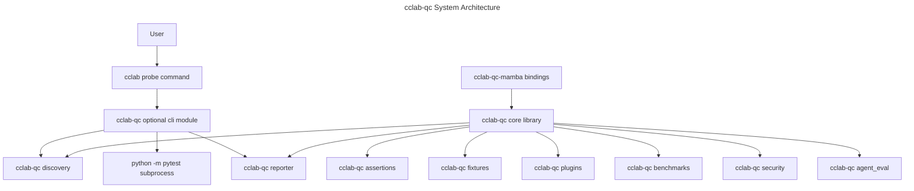

# System Architecture

## Overview
<!-- type: overview lang: markdown -->

`cclab-qc` is the core Rust crate for the CCLab quality and test framework.
The crate exposes discovery, runner metadata, reporting, assertions, fixtures,
plugins, benchmarks, security testing, performance profiling, baseline
tracking, and agent-evaluation primitives. The CLI is optional behind the
`cli` feature and currently drives Python tests through `python -m pytest`.

Mamba integrations are layered over the core crate through
`cclab-qc-mamba`, which registers native Mamba symbols. This keeps
binding-specific runtime details outside the core `cclab-qc` crate.

## Architecture
<!-- type: dependency lang: mermaid -->



## Layer Contracts
<!-- type: schema lang: yaml -->

```yaml
layers:
  core:
    crate: cclab-qc
    role: "Reusable Rust library surface."
    owns:
      - discovery
      - runner metadata and summaries
      - reporting
      - assertions
      - fixtures
      - plugin hooks
      - benchmarks
      - security testing helpers
      - performance profiling
      - agent evaluation

  cli:
    crate: cclab-qc
    feature: cli
    role: "Optional clap command tree for `cclab probe` style workflows."
    owns:
      - "Argument parsing and dispatch."
      - "File discovery preflight."
      - "Pytest subprocess construction."
      - "Test skeleton and benchmark skeleton generation."

  mamba_bindings:
    crate: cclab-qc-mamba
    role: "Mamba native module registration."
    owns:
      - "cclab.qc module registration."
      - "fixture, mark, raises, and parametrize symbols."
```

## Architecture Principles
<!-- type: doc lang: markdown -->

- Keep the core crate reusable from Rust and sibling binding crates.
- Keep CLI behavior optional through the `cli` feature.
- Keep discovery Rust-side and deterministic through `DiscoveryConfig`.
- Treat `python -m pytest` as the current CLI execution backend. Any change to
  embedded Python execution needs separate TD coverage because it changes
  runtime ownership.
- Keep Mamba-specific registration in `cclab-qc-mamba`.
- Re-export stable core APIs from `crates/cclab-qc/src/lib.rs`.

## Changes
<!-- type: changes lang: yaml -->

```yaml
changes:
  - path: .aw/tech-design/crates/cclab-qc/logic/architecture/overview.md
    action: move
    section: overview
    impl_mode: hand-written
    description: "Move the architecture overview out of the crate spec root and align it with the current cclab-qc crate and binding-crate layout."
  - path: .aw/tech-design/crates/cclab-qc/README.md
    action: modify
    section: doc
    impl_mode: hand-written
    description: "Update the architecture overview link to the normalized path."
  - path: crates/cclab-qc/src/lib.rs
    action: reference
    section: schema
    impl_mode: hand-written
    description: "Defines the core module surface and public re-exports."
  - path: crates/cclab-qc/src/cli/mod.rs
    action: reference
    section: schema
    impl_mode: hand-written
    description: "Defines the optional CLI command surface."
  - path: crates/cclab-qc-mamba/src/lib.rs
    action: reference
    section: schema
    impl_mode: hand-written
    description: "Defines Mamba module registration."
```
