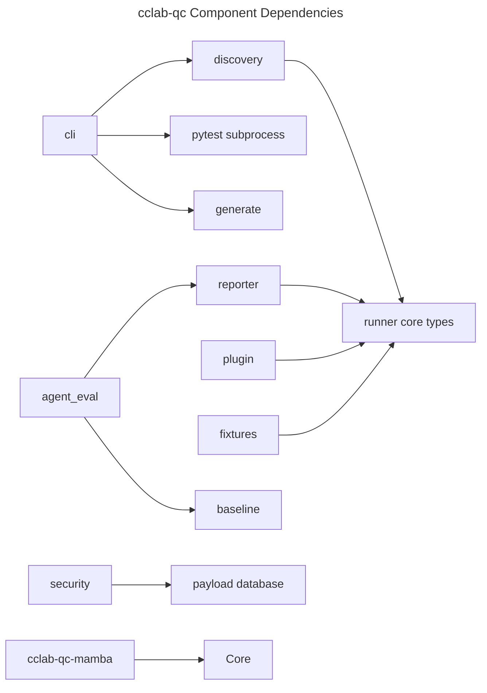

# Components

## Overview
<!-- type: overview lang: markdown -->

`cclab-qc` is organized as a core Rust library with an optional CLI surface and
separate binding crates. Component ownership is module-based: core test data
types live in `runner.rs`, file discovery in `discovery.rs`, report output in
`reporter.rs`, assertion APIs in `assertions.rs`, fixture metadata in
`fixtures.rs`, and extensibility in `plugin.rs`.

The CLI component is intentionally small. It defines clap commands, discovers
candidate files, shells out to pytest for execution, and scaffolds test or
benchmark files. Binding-specific concerns stay in `cclab-qc-mamba`.

## Component Inventory
<!-- type: schema lang: yaml -->

```yaml
components:
  cli:
    paths:
      - crates/cclab-qc/src/cli/mod.rs
      - crates/cclab-qc/src/cli/runner.rs
      - crates/cclab-qc/src/cli/generate.rs
    feature: cli
    responsibilities:
      - "Define `probe` clap subcommands: run, collect, migrate, generate."
      - "Dispatch parsed ArgMatches."
      - "Discover candidate files before execution."
      - "Run pytest subprocesses for test execution."
      - "Generate test and benchmark skeletons."
    notes:
      - "`--security` is accepted by the CLI but currently unused in `run_tests`."

  discovery:
    path: crates/cclab-qc/src/discovery.rs
    responsibilities:
      - "Classify test and benchmark files."
      - "Detect language from extension."
      - "Walk directories with jwalk parallel traversal."
      - "Maintain test and benchmark registries."

  runner_core:
    path: crates/cclab-qc/src/runner.rs
    responsibilities:
      - "Define TestType, TestStatus, Language, TestMeta, TestResult, and TestSummary."
      - "Provide async runner abstractions for native/binding consumers."

  reporting:
    path: crates/cclab-qc/src/reporter.rs
    responsibilities:
      - "Format test reports."
      - "Format coverage information."
      - "Format benchmark and agent-evaluation reports."

  assertions:
    path: crates/cclab-qc/src/assertions.rs
    responsibilities:
      - "Expose `expect(value)`."
      - "Return structured AssertionError values."
      - "Implement equality, boolean, option, numeric, string, vector, and JSON matchers."

  fixtures:
    path: crates/cclab-qc/src/fixtures.rs
    responsibilities:
      - "Represent fixture metadata."
      - "Parse fixture scopes."
      - "Resolve dependency-first fixture order."
      - "Detect circular dependencies."

  plugins:
    path: crates/cclab-qc/src/plugin.rs
    responsibilities:
      - "Expose lifecycle hooks."
      - "Register plugins by unique name."
      - "Sort plugins by priority."
      - "Ship logging, timeout, and filter plugins."

  benchmark:
    path: crates/cclab-qc/src/benchmark.rs
    responsibilities:
      - "Define benchmark configuration, results, stats, and reports."
      - "Compare benchmark result sets."

  baseline:
    path: crates/cclab-qc/src/baseline.rs
    responsibilities:
      - "Persist benchmark and agent-eval baselines."
      - "Detect regressions against baselines."

  security:
    paths:
      - crates/cclab-qc/src/security/mod.rs
      - crates/cclab-qc/src/security/fuzzer.rs
      - crates/cclab-qc/src/security/async_fuzzer.rs
      - crates/cclab-qc/src/security/payloads.rs
      - crates/cclab-qc/src/security/sql_injection.rs
    responsibilities:
      - "Provide fuzzing utilities."
      - "Provide payload databases."
      - "Provide SQL injection test helpers."

  agent_eval:
    path: crates/cclab-qc/src/agent_eval
    responsibilities:
      - "Model agent test cases and results."
      - "Calculate cost and latency metrics."
      - "Support LLM judge evaluation and regression checks."

  binding_crates:
    paths:
      - crates/cclab-qc-mamba
    responsibilities:
      - "Expose cclab-qc APIs to the Mamba runtime."
```

## Component Dependencies
<!-- type: dependency lang: mermaid -->



## Integration Notes
<!-- type: doc lang: markdown -->

- Core modules should not depend on CLI-only clap types.
- CLI code can depend on core modules but should keep subprocess behavior
  isolated in `cli/runner.rs`.
- `cclab-qc-mamba` registers Mamba symbols and should not own core fixture or
  assertion behavior.
- Reporters and baseline storage should consume structured results instead of
  parsing terminal output.

## Changes
<!-- type: changes lang: yaml -->

```yaml
changes:
  - path: .aw/tech-design/crates/cclab-qc/logic/components/overview.md
    action: move
    section: overview
    impl_mode: hand-written
    description: "Move component responsibilities out of the crate spec root and align them with current cclab-qc modules."
  - path: .aw/tech-design/crates/cclab-qc/README.md
    action: modify
    section: doc
    impl_mode: hand-written
    description: "Update the components link to the normalized path."
  - path: crates/cclab-qc/src/lib.rs
    action: reference
    section: schema
    impl_mode: hand-written
    description: "Defines core module ownership and public re-exports."
  - path: crates/cclab-qc/src/cli/
    action: reference
    section: schema
    impl_mode: hand-written
    description: "Defines optional CLI components."
```
