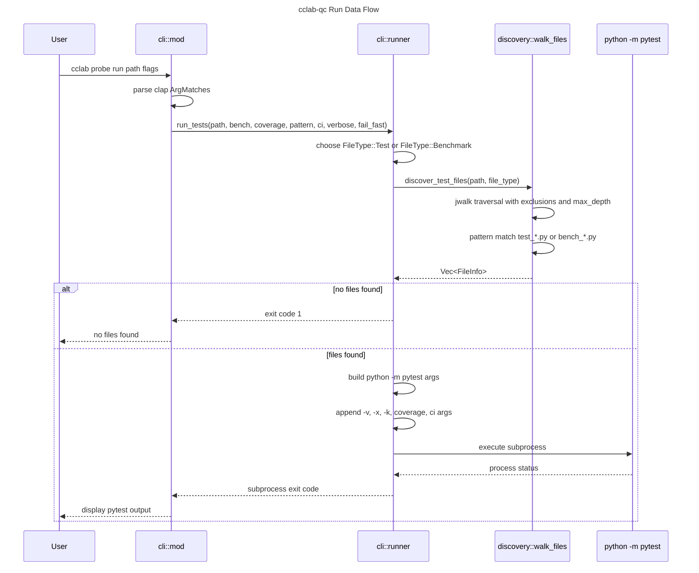
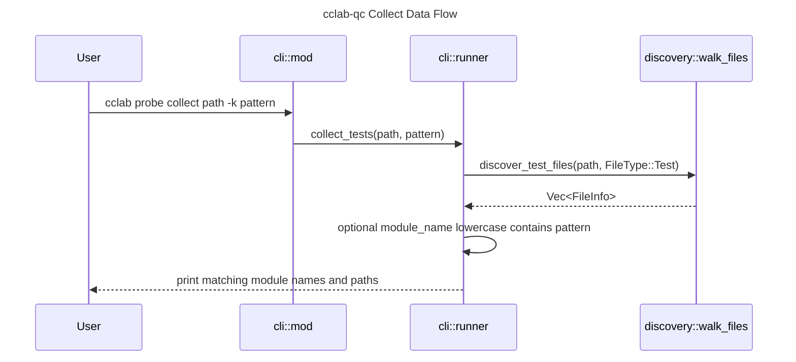
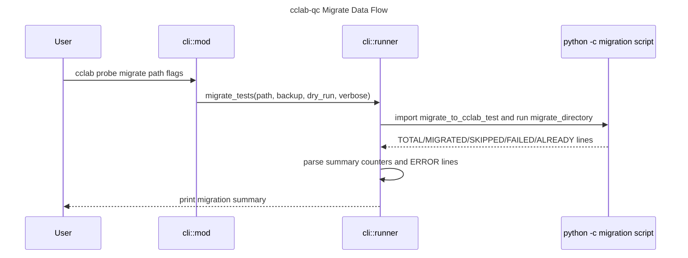

# Data Flows

## Overview
<!-- type: overview lang: markdown -->

`cclab-qc` data flows are currently split between Rust-side discovery and
subprocess-based Python execution. The CLI builds a `DiscoveryConfig`, calls
`walk_files`, filters discovered `FileInfo` values by test or benchmark type,
then constructs a `python -m pytest` command with options derived from the
clap arguments.

Collect and migrate flows are separate. `collect` remains Rust-only after file
discovery. `migrate` shells out to the Python migration tool and parses
summary lines from stdout.

## Run Flow
<!-- type: logic lang: mermaid -->



## Collect Flow
<!-- type: logic lang: mermaid -->



## Migrate Flow
<!-- type: logic lang: mermaid -->



## Data Contracts
<!-- type: schema lang: yaml -->

```yaml
flows:
  run_tests:
    input:
      path: String
      bench: bool
      coverage_enabled: bool
      html: bool
      output: "Option<String>"
      cov_fail_under: "Option<f64>"
      cov_json: bool
      ci: bool
      pattern: "Option<String>"
      verbose: bool
      fail_fast: bool
    discovery:
      test_patterns:
        test: ["test_*.py"]
        benchmark: ["bench_*.py"]
      exclusions:
        - __pycache__
        - .git
        - .venv
        - node_modules
      max_depth: 10
      num_threads: 4
    execution:
      command: "python -m pytest"
      status_mapping:
        success: 0
        failures_or_pytest_error: "pytest process exit code or 1 when unavailable"

  collect_tests:
    input:
      path: String
      pattern: "Option<String>"
    output:
      - "Matching module names"
      - "Matching file paths"
      - "Total discovered file count"

  migrate_tests:
    input:
      path: String
      backup: bool
      dry_run: bool
      verbose: bool
    stdout_contract:
      - "TOTAL=<u32>"
      - "MIGRATED=<u32>"
      - "SKIPPED=<u32>"
      - "FAILED=<u32>"
      - "ALREADY=<u32>"
      - "ERROR:<path>:<message>"
```

## Flow Rules
<!-- type: doc lang: markdown -->

- Discovery errors are fatal for the current CLI command.
- `run_tests` does not execute each discovered `FileInfo` directly; discovery
  is used for preflight and user feedback, while pytest receives the original
  path and options.
- `collect_tests` applies the `-k` pattern against `FileInfo.module_name`.
- Coverage options are passed through to pytest coverage flags.
- CI mode appends `--tb=short` and `-q`.
- `migrate_tests` treats a non-zero migration subprocess status as a command
  failure and surfaces stderr.

## Changes
<!-- type: changes lang: yaml -->

```yaml
changes:
  - path: .aw/tech-design/crates/cclab-qc/logic/flows/data-flows.md
    action: move
    section: overview
    impl_mode: hand-written
    description: "Move data flows out of the crate spec root and align them with the current cclab-qc CLI subprocess flow."
  - path: .aw/tech-design/crates/cclab-qc/README.md
    action: modify
    section: doc
    impl_mode: hand-written
    description: "Update the data-flow link to the normalized path."
  - path: crates/cclab-qc/src/cli/runner.rs
    action: reference
    section: logic
    impl_mode: hand-written
    description: "Defines run, collect, and migrate CLI data flows."
  - path: crates/cclab-qc/src/discovery.rs
    action: reference
    section: schema
    impl_mode: hand-written
    description: "Defines discovery inputs and FileInfo outputs for run and collect flows."
```
