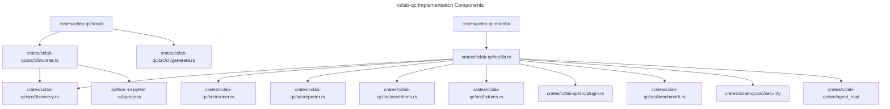
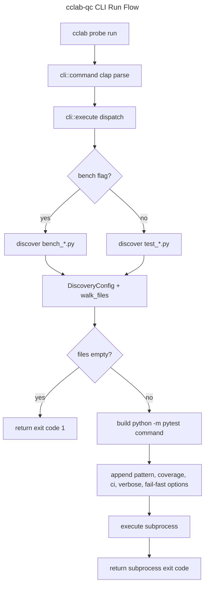

# Implementation Details

## Overview
<!-- type: overview lang: markdown -->

`cclab-qc` is the Rust-powered quality and test framework crate. Its current
implementation is centered on a pure Rust library surface, an optional clap
CLI module, filesystem discovery with `jwalk`, subprocess-based Python test
execution, report formatting, assertions, fixtures, plugins, benchmarking,
security testing, and agent-evaluation helpers.

This spec records the current implementation topology. It intentionally avoids
the older embedded-Python native-extension assumption; Python-compatible
bindings now live in `cclab-qc-mamba`.

## Component Dependencies
<!-- type: dependency lang: mermaid -->



## CLI Execution Flow
<!-- type: logic lang: mermaid -->



## Implementation Schema
<!-- type: schema lang: yaml -->

```yaml
modules:
  lib:
    path: crates/cclab-qc/src/lib.rs
    role: "Public module declarations and re-exports."
    public_groups:
      - agent_eval
      - assertions
      - baseline
      - benchmark
      - discovery
      - fixtures
      - plugin
      - reporter
      - runner
      - security

  cli:
    path: crates/cclab-qc/src/cli
    feature: cli
    role: "Optional clap command tree and command dispatch."
    submodules:
      - "mod.rs: defines command() and execute()."
      - "runner.rs: discovers test files and runs pytest subprocesses."
      - "generate.rs: scaffolds test and benchmark files."

  discovery:
    path: crates/cclab-qc/src/discovery.rs
    role: "Parallel filesystem discovery and file classification."
    key_types:
      - DiscoveryConfig
      - FileInfo
      - FileType
      - DiscoveryStats
      - TestRegistry
      - BenchmarkRegistry

  runner:
    path: crates/cclab-qc/src/runner.rs
    role: "Native test metadata, result, summary, and runner abstractions."

  reporting:
    path: crates/cclab-qc/src/reporter.rs
    role: "Console, JSON, Markdown, HTML, and agent-evaluation report output."

  extension_crates:
    - path: crates/cclab-qc-mamba
      role: "Mamba native module bindings for qc fixtures, marks, and assertions."
```

## Design Rules
<!-- type: doc lang: markdown -->

- CLI behavior is gated by the `cli` feature and must remain a thin command
  surface over library modules.
- File discovery must remain Rust-side and pattern-driven. The CLI runner
  should construct `DiscoveryConfig`, call `walk_files`, then filter by
  `FileType`.
- Python test execution currently happens through `python -m pytest`
  subprocesses. New embedded execution should be introduced only through a
  dedicated TD because it changes runtime ownership and error boundaries.
- Public API types should be exported from `lib.rs` only when they are stable
  enough for sibling crates or users.
- Binding-specific behavior belongs in `cclab-qc-mamba`,
  not in the core `cclab-qc` crate.

## Changes
<!-- type: changes lang: yaml -->

```yaml
changes:
  - path: .aw/tech-design/crates/cclab-qc/logic/implementation/details.md
    action: move
    section: overview
    impl_mode: hand-written
    description: "Move implementation details out of the crate spec root and align the architecture with current cclab-qc modules."
  - path: .aw/tech-design/crates/cclab-qc/README.md
    action: modify
    section: doc
    impl_mode: hand-written
    description: "Update the implementation-details link to the normalized path."
  - path: crates/cclab-qc/src/cli/mod.rs
    action: reference
    section: schema
    impl_mode: hand-written
    description: "Defines the optional clap command tree and dispatch behavior."
  - path: crates/cclab-qc/src/cli/runner.rs
    action: reference
    section: logic
    impl_mode: hand-written
    description: "Defines discovery-backed subprocess execution for CLI runs."
  - path: crates/cclab-qc/src/discovery.rs
    action: reference
    section: schema
    impl_mode: hand-written
    description: "Defines file discovery configuration, file metadata, and registries."
```
