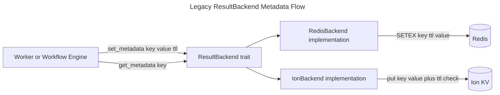

# Result Backend Metadata

## Overview
<!-- type: overview lang: markdown -->

This is a legacy spec imported under `cclab-qc`. It describes a
`ResultBackend` metadata API for Redis/Ion-backed workflow state, including TTL
support for keys used by task chains, chords, and external executors. The
current `crates/cclab-qc` codebase does not define `ResultBackend`,
`RedisBackend`, `IonBackend`, chain/chord workflow state, or Kubernetes task
handoff metadata.

The normalized location keeps the historical design searchable while making
clear that it is not an implemented `cclab-qc` contract. Reintroducing this
behavior requires a new issue and TD scoped to the owning queue/workflow crate.

## Legacy Contract
<!-- type: schema lang: yaml -->

```yaml
legacy_contract:
  status: not_implemented_in_cclab_qc
  intended_owner: "queue/workflow result backend crate, not cclab-qc"
  proposed_trait:
    name: ResultBackend
    methods:
      - "set_metadata(key, value, ttl) -> Result<()>"
      - "get_metadata(key) -> Result<Option<Value>>"
  proposed_backends:
    - name: RedisBackend
      storage: "Redis string keys with TTL."
    - name: IonBackend
      storage: "Ion internal key-value store with TTL checks."
  ttl_requirement:
    reason: "Prevent stale workflow state from accumulating."
    behavior: "Expired metadata must no longer be returned by get_metadata."
```

## Legacy Flow
<!-- type: logic lang: mermaid -->



## Changes
<!-- type: changes lang: yaml -->

```yaml
changes:
  - path: .aw/tech-design/crates/cclab-qc/logic/legacy/backend-metadata.md
    action: move
    section: overview
    impl_mode: hand-written
    description: "Move the legacy backend metadata spec out of the crate spec root and mark it as not implemented by cclab-qc."
  - path: .aw/tech-design/crates/cclab-qc/README.md
    action: modify
    section: doc
    impl_mode: hand-written
    description: "Link the legacy backend metadata note from the crate spec index."
```
