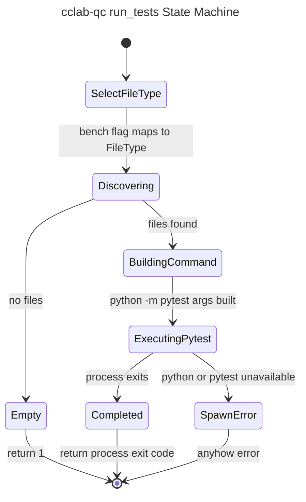
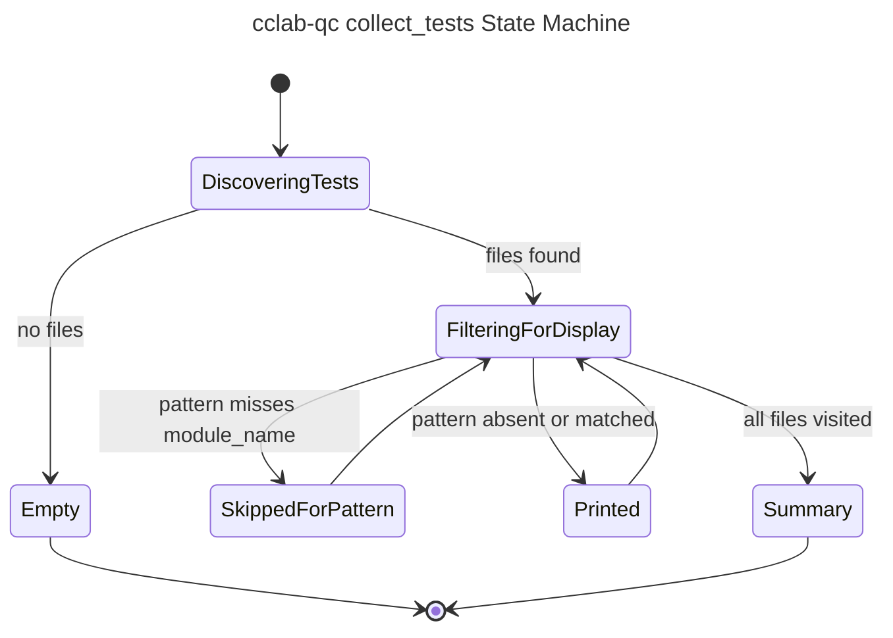
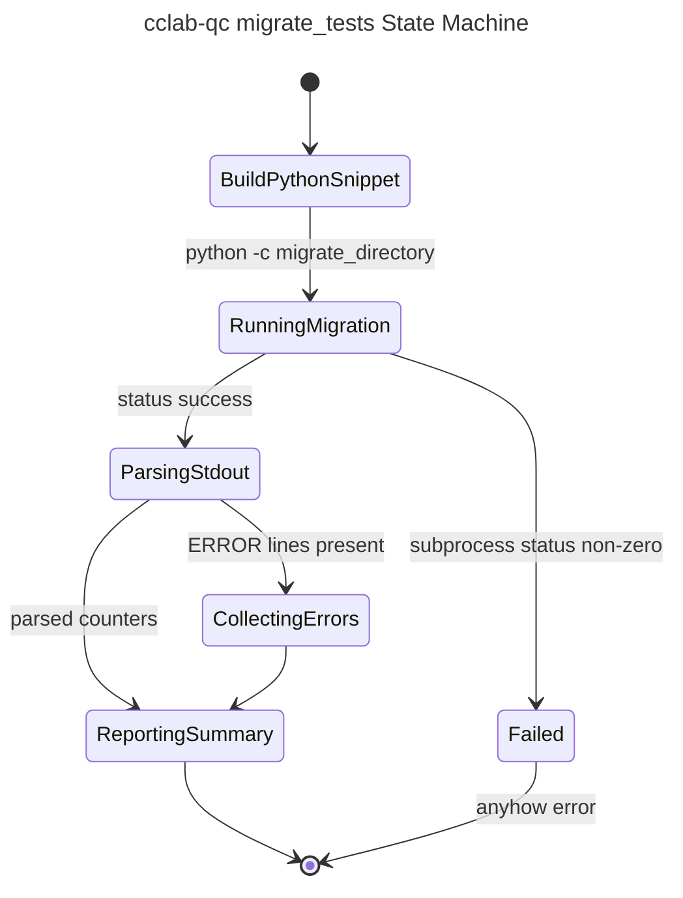

# cclab-qc Framework Lifecycle State Machines

## Overview
<!-- type: overview lang: markdown -->

This spec replaces the legacy crate-root `40-state-machines.md` document. The
old document described `cclab-probe` embedded-Python loading states that no
longer match the current `cclab-qc` implementation. Current `cclab-qc` keeps
discovery and CLI orchestration in Rust, then delegates Python execution and
migration work to subprocesses.

The state machines below reflect the current implementation:

| Lifecycle | Source |
|-----------|--------|
| Discovery | `crates/cclab-qc/src/discovery.rs` |
| CLI run | `crates/cclab-qc/src/cli/runner.rs::run_tests` |
| Collect | `crates/cclab-qc/src/cli/runner.rs::collect_tests` |
| Migrate | `crates/cclab-qc/src/cli/runner.rs::migrate_tests` |
| Final result status | `crates/cclab-qc/src/runner.rs::TestStatus` |

## Discovery State Machine
<!-- type: logic lang: mermaid -->

```mermaid
---
id: cclab-qc-discovery-state-machine
title: cclab-qc Discovery State Machine
refs:
  - $ref: "#cclab-qc-framework-lifecycle-schema"
---
stateDiagram-v2
    [*] --> Configured
    Configured --> Walking: walk_files
    Walking --> SkippingDirectory: excluded directory
    SkippingDirectory --> Walking: retain remaining children
    Walking --> InspectingFile: non-directory entry
    InspectingFile --> Ignored: no configured pattern match
    InspectingFile --> Classifying: pattern match
    Classifying --> Registered: FileInfo::from_path succeeds
    Classifying --> Warned: unknown file type or bad relative path
    Walking --> Failed: jwalk entry error
    Walking --> Ready: traversal complete
    Ignored --> Walking
    Registered --> Walking
    Warned --> Walking
    Ready --> [*]
    Failed --> [*]
```

## CLI Run State Machine
<!-- type: logic lang: mermaid -->



## Collect State Machine
<!-- type: logic lang: mermaid -->



## Migrate State Machine
<!-- type: logic lang: mermaid -->



## State Contracts
<!-- type: schema lang: yaml -->

```yaml
states:
  discovery:
    source: crates/cclab-qc/src/discovery.rs
    config_type: DiscoveryConfig
    output_type: Vec<FileInfo>
    file_types:
      - Test
      - Benchmark
    terminal:
      ready: "Ok(Vec<FileInfo>)"
      failed: "Err(String)"
    notes:
      - "Traversal uses jwalk with configurable parallelism."
      - "Directory exclusions are applied during process_read_dir."
      - "Unknown file types are warning-only when a matched path cannot become FileInfo."
  run_tests:
    source: crates/cclab-qc/src/cli/runner.rs
    output_type: "Result<i32>"
    terminal:
      empty: 1
      completed: "pytest process exit code"
      spawn_error: "anyhow error"
    subprocess:
      command: python
      base_args: ["-m", "pytest"]
      optional_args:
        - "-v"
        - "-x"
        - "-k <pattern>"
        - "--cov=<path>"
        - "--cov-report=html"
        - "--cov-report=html:<output>"
        - "--cov-fail-under=<threshold>"
        - "--cov-report=json"
        - "--tb=short"
        - "-q"
  collect_tests:
    source: crates/cclab-qc/src/cli/runner.rs
    output_type: "Result<()>"
    behavior:
      - "Discovers FileType::Test only."
      - "Optional pattern filters displayed module_name values only."
      - "No Python process is started."
  migrate_tests:
    source: crates/cclab-qc/src/cli/runner.rs
    output_type: "Result<()>"
    subprocess:
      command: python
      mode: "-c migrate_directory"
      parsed_stdout_keys:
        - TOTAL
        - MIGRATED
        - SKIPPED
        - FAILED
        - ALREADY
        - ERROR
  test_status:
    source: crates/cclab-qc/src/runner.rs
    final_values:
      - Passed
      - Failed
      - Skipped
      - Error
```

## Changes
<!-- type: changes lang: yaml -->

```yaml
changes:
  - path: .aw/tech-design/crates/cclab-qc/40-state-machines.md
    action: delete
    impl_mode: hand-written
    description: "Remove stale cclab-probe root spec that referenced embedded Python loading states."
  - path: .aw/tech-design/crates/cclab-qc/logic/state-machines/framework-lifecycle.md
    action: add
    impl_mode: hand-written
    description: "Add current cclab-qc discovery, run, collect, migrate, and result-status state machines under an allowed logic/ subdirectory."
  - path: .aw/tech-design/crates/cclab-qc/README.md
    action: modify
    impl_mode: hand-written
    description: "Update the documentation index to point at the normalized state-machine spec path."
```
