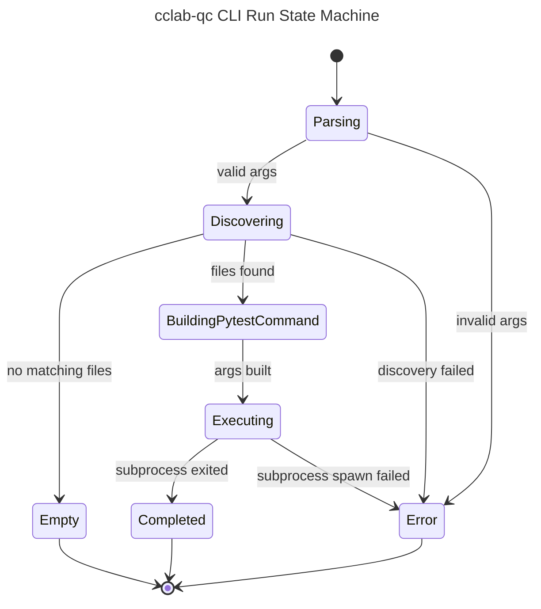

# Probe Test Runner State Machine

## Overview
<!-- type: overview lang: markdown -->

This spec defines the current runner lifecycle states for `cclab-qc`. The CLI
path performs Rust-side discovery and then executes pytest as a subprocess. The
core result model exposes final `TestStatus` values for passed, failed,
skipped, and error outcomes. Fixture state is represented by metadata
registration and dependency resolution in `FixtureRegistry`; executable fixture
setup/teardown is owned by the runtime layer that consumes the metadata.

## CLI Run State Machine
<!-- type: logic lang: mermaid -->



## Test Result State Machine
<!-- type: logic lang: mermaid -->

```mermaid
---
id: cclab-qc-test-result-state-machine
title: cclab-qc Test Result State Machine
---
stateDiagram-v2
    [*] --> Scheduled
    Scheduled --> Running: runner starts test
    Running --> Passed: TestResult::passed
    Running --> Failed: TestResult::failed
    Running --> Skipped: TestResult::skipped
    Running --> Error: TestResult::error
    Passed --> [*]
    Failed --> [*]
    Skipped --> [*]
    Error --> [*]
```

## Fixture Registry State Machine
<!-- type: logic lang: mermaid -->

```mermaid
---
id: cclab-qc-fixture-registry-state-machine
title: cclab-qc Fixture Registry State Machine
---
stateDiagram-v2
    [*] --> Registered: FixtureRegistry::register
    Registered --> Requested: resolve_order input
    Requested --> Resolving: visit fixture
    Resolving --> CycleError: fixture already in visiting stack
    Resolving --> Resolved: dependencies visited
    Resolved --> Ordered: push fixture into result
    CycleError --> [*]
    Ordered --> [*]
```

## State Contracts
<!-- type: schema lang: yaml -->

```yaml
states:
  cli_run:
    source: crates/cclab-qc/src/cli/runner.rs
    terminal:
      - Empty
      - Completed
      - Error
    exit_behavior:
      empty: 1
      completed: "pytest subprocess status code"
      error: "anyhow error or status 1"

  test_result:
    source: crates/cclab-qc/src/runner.rs
    final_status_enum:
      - Passed
      - Failed
      - Skipped
      - Error
    constructors:
      - TestResult::passed
      - TestResult::failed
      - TestResult::skipped
      - TestResult::error

  fixture_registry:
    source: crates/cclab-qc/src/fixtures.rs
    resolver:
      algorithm: "DFS topological order"
      success_output: "Vec<String> dependency-first fixture names"
      cycle_error: "String from resolve_order or Vec<String> from detect_circular_deps"
```

## Changes
<!-- type: changes lang: yaml -->

```yaml
changes:
  - path: .aw/tech-design/crates/cclab-qc/logic/state-machines/runner-lifecycle.md
    action: move
    section: overview
    impl_mode: hand-written
    description: "Move the runner state machine out of the crate spec root and align it with current cclab-qc CLI, TestResult, and FixtureRegistry states."
  - path: crates/cclab-qc/src/cli/runner.rs
    action: reference
    section: logic
    impl_mode: hand-written
    description: "Defines the CLI discovery and pytest subprocess execution lifecycle."
  - path: crates/cclab-qc/src/runner.rs
    action: reference
    section: schema
    impl_mode: hand-written
    description: "Defines TestStatus and TestResult constructors."
  - path: crates/cclab-qc/src/fixtures.rs
    action: reference
    section: schema
    impl_mode: hand-written
    description: "Defines fixture registration and dependency-resolution states."
```
