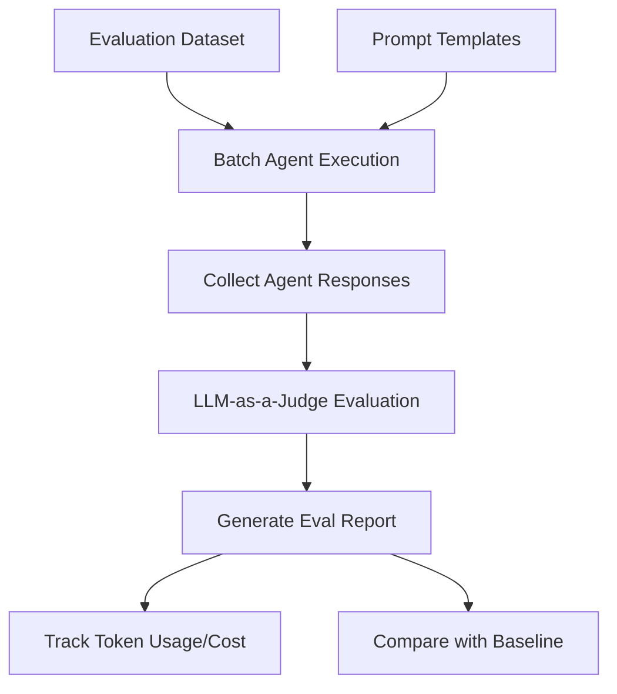

# File: specs/agent-eval.md

---
id: agent-eval
type: spec
title: "Agent Evaluation Framework"
version: 1
spec_type: algorithm
created_at: 2026-01-28T16:58:08.413102+00:00
updated_at: 2026-01-28T16:58:08.413102+00:00
requirements:
  total: 5
  ids:
    - R1
    - R2
    - R3
    - R4
    - R5
design_elements:
  has_mermaid: true
  has_json_schema: false
  has_pseudo_code: false
  has_api_spec: false
  has_semantic_diagrams: false
  diagrams:
    - type: flowchart
      title: "Agent Eval Flow"
history:
  - timestamp: 2026-01-28T16:58:08.413102+00:00
    agent: "mcp"
    tool: "create_spec"
    action: "created"
---

<spec>

# Agent Evaluation Framework

## Overview

Implement an evaluation framework for AI agents, supporting dataset-based testing, LLM-as-a-Judge scoring, cost tracking, and regression analysis. This system allows for systematic evaluation of agent performance and reliability.

## Requirements

### R1 - Dataset Management

```yaml
id: R1
priority: medium
status: draft
```

Support for managing and iterating over evaluation datasets.

### R2 - Test Case Definition

```yaml
id: R2
priority: medium
status: draft
```

Define and execute individual evaluation test cases.

### R3 - LLM-as-a-Judge

```yaml
id: R3
priority: medium
status: draft
```

Use LLMs to score and evaluate agent outputs based on rubrics.

### R4 - Cost Tracking

```yaml
id: R4
priority: medium
status: draft
```

Track token usage and financial cost of agent runs and evaluations.

### R5 - Regression Testing

```yaml
id: R5
priority: medium
status: draft
```

Compare current results against a baseline to detect performance regressions.

## Acceptance Criteria

### Scenario: Batch Evaluation Run

- **GIVEN** A dataset of 100 queries and an agent under test.
- **WHEN** The batch eval is triggered.
- **THEN** The system should execute all queries and produce a summary report.

### Scenario: LLM Scoring

- **GIVEN** An agent response and an evaluation rubric.
- **WHEN** The evaluator is called.
- **THEN** The LLM judge should provide a score and reasoning based on the rubric.

### Scenario: Regression Detection

- **GIVEN** A current eval run and a previously saved baseline.
- **WHEN** The regression check is executed.
- **THEN** The system should highlight any significant drop in scores.

## Diagrams

### Agent Eval Flow



</spec>
