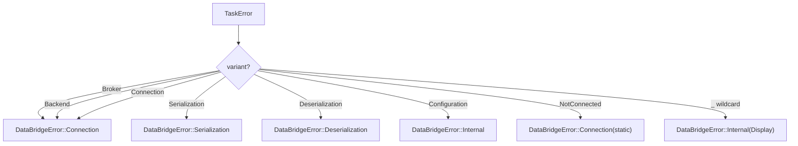

# Error Types

## Overview

<!-- type: overview lang: markdown -->

`TaskError` is the unified error enum for cclab-queue. It covers 17 variants spanning broker, backend, serialization, connection, task-lifecycle, workflow, auth, and rate-limiting failures. Three `From` impls provide automatic conversion:

- `TaskError → DataBridgeError` (upstream propagation to cclab-core)
- `serde_json::Error → TaskError::Serialization`
- `uuid::Error → TaskError::InvalidTaskId`

This spec defines the variant schema, conversion logic, and test plan for achieving full unit test coverage of `crates/cclab-queue/src/error.rs`.
## Requirements
<!-- type: requirements lang: markdown -->

<!-- TODO -->

## Scenarios
<!-- type: scenarios lang: markdown -->

<!-- TODO -->

## Diagrams

### Interaction
<!-- type: interaction lang: mermaid -->
<!-- TODO -->

### Logic
<!-- type: logic lang: mermaid -->
<!-- TODO -->

### Dependencies
<!-- type: dependency lang: mermaid -->
<!-- TODO -->

### State Machine
<!-- type: state-machine lang: mermaid -->
<!-- TODO -->

### Data Model
<!-- type: db-model lang: mermaid -->
<!-- TODO -->

## API Spec

### REST API
<!-- type: rest-api lang: yaml -->
<!-- TODO -->

### RPC API
<!-- type: rpc-api lang: json -->
<!-- TODO -->

### Async API
<!-- type: async-api lang: yaml -->
<!-- TODO -->

### CLI
<!-- type: cli lang: yaml -->
<!-- TODO -->

### Schema
<!-- type: schema lang: json -->
<!-- TODO -->

### Config
<!-- type: config lang: json -->
<!-- TODO -->

## Test Plan

<!-- type: test-plan lang: markdown -->

All tests go in `crates/cclab-queue/src/error.rs` as `#[cfg(test)] mod tests`.

| ID | Test | Covers | Assertion |
|----|------|--------|-----------|
| T1 | `display_broker` | Display impl | `TaskError::Broker("conn refused".into()).to_string() == "Broker error: conn refused"` |
| T2 | `display_backend` | Display impl | output starts with `"Backend error: "` |
| T3 | `display_connection` | Display impl | output starts with `"Connection error: "` |
| T4 | `display_task_not_found` | Display impl | output starts with `"Task not found: "` |
| T5 | `display_invalid_task_id` | Display impl | output starts with `"Invalid task ID: "` |
| T6 | `display_serialization` | Display impl | output starts with `"Serialization error: "` |
| T7 | `display_deserialization` | Display impl | output starts with `"Deserialization error: "` |
| T8 | `display_timeout` | Display impl | output starts with `"Timeout: "` |
| T9 | `display_revoked` | Display impl | output starts with `"Task revoked: "` |
| T10 | `display_max_retries` | Display impl | output starts with `"Max retries exceeded: "` |
| T11 | `display_invalid_workflow` | Display impl | output starts with `"Invalid workflow: "` |
| T12 | `display_configuration` | Display impl | output starts with `"Configuration error: "` |
| T13 | `display_authentication` | Display impl | output starts with `"Authentication error: "` |
| T14 | `display_already_exists` | Display impl | output starts with `"Already exists: "` |
| T15 | `display_not_connected` | Display impl | `TaskError::NotConnected.to_string() == "Not connected"` |
| T16 | `display_rate_limited` | Display impl | `TaskError::RateLimited(Duration::from_secs(5)).to_string()` contains `"5s"` |
| T17 | `display_internal` | Display impl | output starts with `"Internal error: "` |
| T18 | `from_broker_to_databridge` | From<TaskError> for DataBridgeError | `Broker(s) → Connection(s)` |
| T19 | `from_backend_to_databridge` | From<TaskError> for DataBridgeError | `Backend(s) → Connection(s)` |
| T20 | `from_connection_to_databridge` | From<TaskError> for DataBridgeError | `Connection(s) → Connection(s)` |
| T21 | `from_serialization_to_databridge` | From<TaskError> for DataBridgeError | `Serialization(s) → Serialization(s)` |
| T22 | `from_deserialization_to_databridge` | From<TaskError> for DataBridgeError | `Deserialization(s) → Deserialization(s)` |
| T23 | `from_configuration_to_databridge` | From<TaskError> for DataBridgeError | `Configuration(s) → Internal(s)` |
| T24 | `from_not_connected_to_databridge` | From<TaskError> for DataBridgeError | `NotConnected → Connection("Not connected")` |
| T25 | `from_wildcard_to_databridge_internal` | From<TaskError> for DataBridgeError, catch-all | `TaskNotFound(s) → Internal("Task not found: {s}")` |
| T26 | `from_wildcard_revoked` | From<TaskError> for DataBridgeError, catch-all | `Revoked(s) → Internal("Task revoked: {s}")` |
| T27 | `from_wildcard_rate_limited` | From<TaskError> for DataBridgeError, catch-all | `RateLimited(d) → Internal(display)` |
| T28 | `from_serde_json_error` | From<serde_json::Error> for TaskError | invalid JSON parse → `Serialization(msg)` |
| T29 | `from_uuid_error` | From<uuid::Error> for TaskError | invalid UUID string → `InvalidTaskId(msg)` |
| T30 | `error_is_send_sync` | trait bounds | `fn assert_send_sync<T: Send + Sync>() {}; assert_send_sync::<TaskError>();` |
| T31 | `debug_impl_exists` | Debug derive | `format!("{:?}", TaskError::NotConnected)` does not panic |
## Changes

<!-- type: changes lang: yaml -->

```yaml
_sdd:
  id: error-types-changes
  refs:
    - $ref: "#task-error-schema"
changes:
  - path: crates/cclab-queue/src/error.rs
    action: modify
    description: Add #[cfg(test)] mod tests with 31 unit tests covering Display, From conversions, Debug, and Send+Sync bounds
```
## Wireframe
<!-- type: wireframe lang: yaml -->

<!-- TODO -->

## Component
<!-- type: component lang: json -->

<!-- TODO -->

## Design Token
<!-- type: design-token lang: json -->

<!-- TODO -->

## Doc
<!-- type: doc lang: markdown -->

<!-- TODO -->


## Schema

<!-- type: schema lang: json -->

```json
{
  "$id": "task-error",
  "title": "TaskError",
  "description": "Task-specific error enum for cclab-queue",
  "type": "object",
  "oneOf": [
    {
      "properties": { "Broker": { "type": "string" } },
      "required": ["Broker"]
    },
    {
      "properties": { "Backend": { "type": "string" } },
      "required": ["Backend"]
    },
    {
      "properties": { "Connection": { "type": "string" } },
      "required": ["Connection"]
    },
    {
      "properties": { "TaskNotFound": { "type": "string" } },
      "required": ["TaskNotFound"]
    },
    {
      "properties": { "InvalidTaskId": { "type": "string" } },
      "required": ["InvalidTaskId"]
    },
    {
      "properties": { "Serialization": { "type": "string" } },
      "required": ["Serialization"]
    },
    {
      "properties": { "Deserialization": { "type": "string" } },
      "required": ["Deserialization"]
    },
    {
      "properties": { "Timeout": { "type": "string" } },
      "required": ["Timeout"]
    },
    {
      "properties": { "Revoked": { "type": "string" } },
      "required": ["Revoked"]
    },
    {
      "properties": { "MaxRetriesExceeded": { "type": "string" } },
      "required": ["MaxRetriesExceeded"]
    },
    {
      "properties": { "InvalidWorkflow": { "type": "string" } },
      "required": ["InvalidWorkflow"]
    },
    {
      "properties": { "Configuration": { "type": "string" } },
      "required": ["Configuration"]
    },
    {
      "properties": { "Authentication": { "type": "string" } },
      "required": ["Authentication"]
    },
    {
      "properties": { "AlreadyExists": { "type": "string" } },
      "required": ["AlreadyExists"]
    },
    {
      "properties": { "NotConnected": { "type": "null" } },
      "required": ["NotConnected"]
    },
    {
      "properties": { "RateLimited": { "type": "object", "properties": { "secs": { "type": "integer" }, "nanos": { "type": "integer" } }, "required": ["secs", "nanos"], "description": "std::time::Duration" } },
      "required": ["RateLimited"]
    },
    {
      "properties": { "Internal": { "type": "string" } },
      "required": ["Internal"]
    }
  ],
  "x-sdd": {
    "id": "task-error-schema",
    "source": "crates/cclab-queue/src/error.rs",
    "derives": ["Error", "Debug"]
  }
}
```

### Conversion Map

| Source Type | Target Type | Mapping |
|-------------|-------------|----------|
| `TaskError::Broker(s)` | `DataBridgeError::Connection(s)` | direct |
| `TaskError::Backend(s)` | `DataBridgeError::Connection(s)` | direct |
| `TaskError::Connection(s)` | `DataBridgeError::Connection(s)` | direct |
| `TaskError::Serialization(s)` | `DataBridgeError::Serialization(s)` | direct |
| `TaskError::Deserialization(s)` | `DataBridgeError::Deserialization(s)` | direct |
| `TaskError::Configuration(s)` | `DataBridgeError::Internal(s)` | remapped |
| `TaskError::NotConnected` | `DataBridgeError::Connection("Not connected")` | static msg |
| `TaskError::*` (all others) | `DataBridgeError::Internal(err.to_string())` | catch-all via Display |
| `serde_json::Error` | `TaskError::Serialization(err.to_string())` | From impl |
| `uuid::Error` | `TaskError::InvalidTaskId(err.to_string())` | From impl |


## Logic

<!-- type: logic lang: mermaid -->

TaskError → DataBridgeError conversion routing:



### Display Format

| Variant | Display output |
|---------|----------------|
| `Broker(s)` | `Broker error: {s}` |
| `Backend(s)` | `Backend error: {s}` |
| `Connection(s)` | `Connection error: {s}` |
| `TaskNotFound(s)` | `Task not found: {s}` |
| `InvalidTaskId(s)` | `Invalid task ID: {s}` |
| `Serialization(s)` | `Serialization error: {s}` |
| `Deserialization(s)` | `Deserialization error: {s}` |
| `Timeout(s)` | `Timeout: {s}` |
| `Revoked(s)` | `Task revoked: {s}` |
| `MaxRetriesExceeded(s)` | `Max retries exceeded: {s}` |
| `InvalidWorkflow(s)` | `Invalid workflow: {s}` |
| `Configuration(s)` | `Configuration error: {s}` |
| `Authentication(s)` | `Authentication error: {s}` |
| `AlreadyExists(s)` | `Already exists: {s}` |
| `NotConnected` | `Not connected` |
| `RateLimited(d)` | `Rate limited, retry after {d:?}` |
| `Internal(s)` | `Internal error: {s}` |