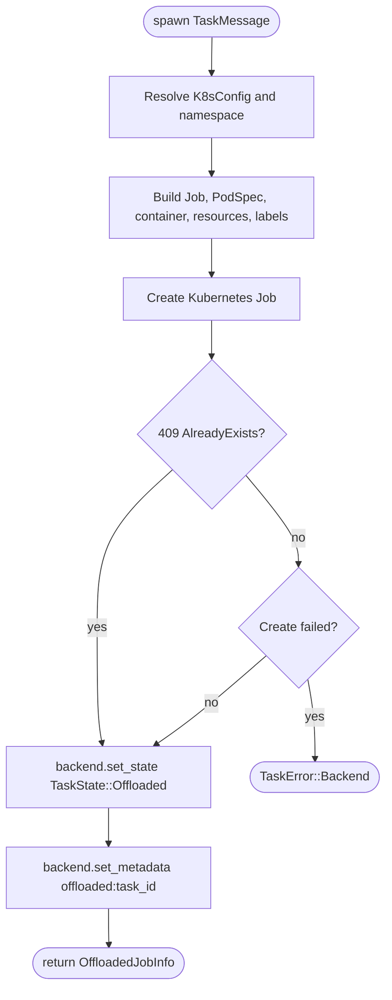
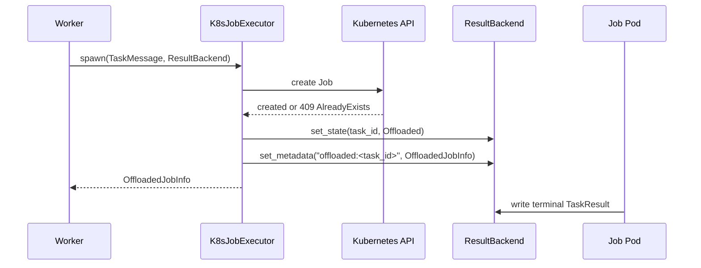

# K8s Job Executor

## Overview
<!-- type: overview lang: markdown -->

`K8sJobExecutor` belongs to `cclab-queue`, not `cclab-qc`. It is the optional
`k8s` feature executor that offloads a `TaskMessage` to a Kubernetes `Job`
instead of running it in the in-process worker slot.

The current implementation lives in:

| Concern | Source |
|---------|--------|
| Executor module export | `crates/cclab-queue/src/executor/mod.rs` |
| K8s executor implementation | `crates/cclab-queue/src/executor/k8s.rs` |
| Task message executor fields | `crates/cclab-queue/src/message.rs` |
| Offloaded task state | `crates/cclab-queue/src/state.rs` |
| Metadata persistence API | `crates/cclab-queue/src/backend/mod.rs` |

The executor creates the Kubernetes Job, records `TaskState::Offloaded`, stores
`OffloadedJobInfo` under result-backend metadata key `offloaded:<task_id>`, and
returns to the caller. The pod-side runner contract is passed through
environment variables; the task result itself is written by the job container
through the configured result backend.

## Requirements
<!-- type: schema lang: yaml -->

```yaml
requirements:
  - id: R1
    priority: must
    statement: "Task messages must select execution mode with ExecutorType."
    source_contract: "ExecutorType::{InProcess, K8sJob} serializes as kebab-case and defaults to InProcess."
  - id: R2
    priority: must
    statement: "with_k8s_config must force K8s execution."
    source_contract: "TaskMessage::with_k8s_config sets executor = ExecutorType::K8sJob and stores K8sConfig."
  - id: R3
    priority: must
    statement: "The executor must use kube to create namespaced Kubernetes Jobs."
    source_contract: "Api<Job>::namespaced(client, namespace).create(PostParams::default(), job) is the creation boundary."
  - id: R4
    priority: must
    statement: "K8s resource configuration must map onto pod resource requirements."
    source_contract: "CPU and memory populate requests and limits; GPU, TPU, and extended resources populate limits."
  - id: R5
    priority: must
    statement: "Node placement and runtime controls must be task-configurable."
    source_contract: "namespace, image, node_selector, tolerations, service_account, active_deadline_seconds, and backoff_limit are sourced from K8sConfig with executor defaults."
  - id: R6
    priority: must
    statement: "Job creation retries must be idempotent at the task/job-name boundary."
    source_contract: "Kubernetes API 409 AlreadyExists is accepted and proceeds with the existing job."
  - id: R7
    priority: must
    statement: "Successful offload must not wait for pod completion."
    source_contract: "spawn returns after Job creation, state update, and metadata write."
  - id: R8
    priority: must
    statement: "Offload metadata must be persisted through ResultBackend."
    source_contract: "The executor writes serialized OffloadedJobInfo to set_metadata('offloaded:<task_id>', value, None)."
  - id: R9
    priority: must
    statement: "Job containers must receive the complete single-task runner contract."
    source_contract: "Env vars include METEOR_TASK_PAYLOAD, METEOR_TASK_ID, METEOR_TASK_NAME, METEOR_RESULT_BACKEND, METEOR_BROKER_URL, METEOR_ROOT_ID, and METEOR_PARENT_ID."
  - id: R10
    priority: should
    statement: "Cleanup must be explicit and namespaced."
    source_contract: "delete_job(job_name, namespace) calls Kubernetes Job delete through the same client."
```

## Scenarios
<!-- type: scenarios lang: yaml -->

```yaml
scenarios:
  - name: Task is marked for K8s execution
    covers: [R1, R2]
    given:
      - "A TaskMessage created with default executor state."
    when:
      - "with_k8s_config(K8sConfig::default()) is applied."
    then:
      - "executor becomes ExecutorType::K8sJob."
      - "is_k8s_job() returns true."
      - "The config is available to K8sJobExecutor::spawn."
  - name: Executor creates a Job and records offload
    covers: [R3, R4, R5, R7, R8]
    given:
      - "A TaskMessage whose executor is K8sJob."
      - "A K8sJobExecutor with a Kubernetes client."
    when:
      - "spawn(message, backend) creates or observes the named Job."
    then:
      - "The backend state for the task is set to TaskState::Offloaded."
      - "OffloadedJobInfo is stored under metadata key offloaded:<task_id>."
      - "spawn returns OffloadedJobInfo without waiting for pod completion."
  - name: Existing Job is treated as an idempotent retry
    covers: [R6, R7, R8]
    given:
      - "Kubernetes returns API error code 409 for the generated Job name."
    when:
      - "spawn handles the create response."
    then:
      - "The executor logs the existing Job."
      - "The executor continues to update offload state and metadata."
      - "The executor returns the same offload identity instead of failing the retry."
  - name: Job container receives runner inputs
    covers: [R5, R9]
    given:
      - "A task with optional root_id and parent_id."
    when:
      - "The executor builds the Job pod."
    then:
      - "The container command is meteor-runner run-once."
      - "The task payload plus backend and broker URLs are injected as environment variables."
      - "Absent workflow IDs produce absent env var values rather than synthetic IDs."
  - name: Job cleanup is explicit
    covers: [R10]
    given:
      - "An offloaded Job name and namespace."
    when:
      - "delete_job(job_name, namespace) is called."
    then:
      - "The executor deletes that namespaced Kubernetes Job."
      - "Kubernetes deletion errors are converted into TaskError::Backend."
```

## Diagrams
<!-- type: doc lang: markdown -->

### Logic

<!-- type: logic lang: mermaid -->



### Interaction

<!-- type: interaction lang: mermaid -->



## API Spec
<!-- type: doc lang: markdown -->

### Schema

<!-- type: schema lang: json -->

```json
{
  "$schema": "https://json-schema.org/draft/2020-12/schema",
  "$id": "https://cclab.dev/schemas/cclab-queue/k8s-job-executor.schema.json",
  "title": "K8s Job Executor Contract",
  "type": "object",
  "required": ["task_message", "executor_config", "offload_metadata"],
  "properties": {
    "task_message": {
      "type": "object",
      "required": ["id", "task_name", "args", "executor"],
      "properties": {
        "id": { "type": "string" },
        "task_name": { "type": "string" },
        "args": {},
        "kwargs": {},
        "parent_id": { "type": ["string", "null"] },
        "root_id": { "type": ["string", "null"] },
        "executor": { "type": "string", "enum": ["in-process", "k8s-job"] },
        "k8s_config": { "$ref": "#/$defs/K8sConfig" }
      }
    },
    "executor_config": { "$ref": "#/$defs/K8sJobExecutorConfig" },
    "offload_metadata": { "$ref": "#/$defs/OffloadedJobInfo" }
  },
  "$defs": {
    "K8sResources": {
      "type": "object",
      "properties": {
        "cpu": { "type": ["string", "null"] },
        "memory": { "type": ["string", "null"] },
        "gpu": { "type": ["integer", "null"], "minimum": 0 },
        "tpu": { "type": ["integer", "null"], "minimum": 0 },
        "extended": {
          "type": "object",
          "additionalProperties": { "type": "string" }
        }
      },
      "additionalProperties": false
    },
    "K8sToleration": {
      "type": "object",
      "required": ["key"],
      "properties": {
        "key": { "type": "string" },
        "operator": { "type": ["string", "null"] },
        "value": { "type": ["string", "null"] },
        "effect": { "type": ["string", "null"] }
      },
      "additionalProperties": false
    },
    "K8sConfig": {
      "type": "object",
      "properties": {
        "image": { "type": ["string", "null"] },
        "resources": { "$ref": "#/$defs/K8sResources" },
        "node_selector": {
          "type": "object",
          "additionalProperties": { "type": "string" }
        },
        "tolerations": {
          "type": "array",
          "items": { "$ref": "#/$defs/K8sToleration" }
        },
        "namespace": { "type": ["string", "null"] },
        "service_account": { "type": ["string", "null"] },
        "active_deadline_seconds": { "type": ["integer", "null"] },
        "backoff_limit": { "type": ["integer", "null"] }
      },
      "additionalProperties": false
    },
    "K8sJobExecutorConfig": {
      "type": "object",
      "required": ["namespace", "default_image", "result_backend_url", "broker_url", "job_prefix", "default_backoff_limit"],
      "properties": {
        "namespace": { "type": "string" },
        "default_image": { "type": "string" },
        "default_service_account": { "type": ["string", "null"] },
        "result_backend_url": { "type": "string" },
        "broker_url": { "type": "string" },
        "job_prefix": { "type": "string" },
        "default_deadline_seconds": { "type": ["integer", "null"] },
        "default_backoff_limit": { "type": "integer" },
        "labels": {
          "type": "object",
          "additionalProperties": { "type": "string" }
        },
        "ttl_seconds_after_finished": { "type": ["integer", "null"] }
      },
      "additionalProperties": false
    },
    "OffloadedJobInfo": {
      "type": "object",
      "required": ["job_name", "namespace", "task_id", "created_at"],
      "properties": {
        "job_name": { "type": "string" },
        "namespace": { "type": "string" },
        "task_id": { "type": "string" },
        "created_at": { "type": "string", "format": "date-time" }
      },
      "additionalProperties": false
    }
  }
}
```

### Config

<!-- type: config lang: json -->

```json
{
  "default": {
    "namespace": "default",
    "default_image": "ghcr.io/cclab/meteor-runner:latest",
    "default_service_account": null,
    "result_backend_url": "redis://localhost:6379",
    "broker_url": "nats://localhost:4222",
    "job_prefix": "meteor-job",
    "default_deadline_seconds": 3600,
    "default_backoff_limit": 0,
    "labels": {},
    "ttl_seconds_after_finished": 3600
  }
}
```

## Test Plan
<!-- type: doc lang: markdown -->

| ID | Covers | Test Target | Coverage |
|----|--------|-------------|----------|
| T1 | R1, R2 | `TaskMessage::with_k8s_config` | Forces `ExecutorType::K8sJob` and stores the config. |
| T2 | R1, R2 | `TaskMessage::is_k8s_job` | Returns false by default and true after K8s config is attached. |
| T3 | R5 | `K8sJobExecutorConfig::default` | Confirms namespace, job prefix, default backoff, and cleanup defaults. |
| T4 | R3, R6 | `job_name` behavior | Ensures generated names use the prefix, replace underscores, lowercase IDs, and stay under Kubernetes name length limits. |
| T5 | R4, R5 | `build_resources` behavior | Confirms CPU/memory requests and limits plus GPU/TPU/extended limits. |
| T6 | R5, R9 | `build_env_vars` behavior | Confirms task payload, backend URL, broker URL, task IDs, and workflow IDs are injected. |
| T7 | R3, R7, R8 | `spawn` success path | Uses a test Kubernetes client/backend harness to assert Job creation, `Offloaded` state, and metadata write. |
| T8 | R6, R7, R8 | `spawn` 409 path | Confirms `AlreadyExists` proceeds to state and metadata writes. |
| T9 | R10 | `delete_job` path | Confirms namespaced Job deletion maps Kubernetes errors into `TaskError::Backend`. |

Existing unit coverage includes `TaskMessage` K8s marker tests and basic
executor default/name tests. The Kubernetes client paths need an isolated test
harness before they can be fully asserted without a live cluster.

## Changes
<!-- type: changes lang: yaml -->

```yaml
_sdd:
  id: k8s-job-executor-changes
  refs:
    - "crates/cclab-queue/src/executor/k8s.rs"
    - "crates/cclab-queue/src/message.rs"
    - "crates/cclab-queue/src/backend/mod.rs"
changes:
  - path: .aw/tech-design/crates/cclab-qc/k8s-job-executor.md
    action: delete
    description: >-
      Remove the misplaced loose root spec from cclab-qc. The K8s Job executor
      is not part of the QC test framework.
  - path: .aw/tech-design/crates/cclab-queue/logic/executor/k8s-job-executor.md
    action: add
    description: >-
      Re-home and normalize the spec under cclab-queue, aligned to the existing
      optional k8s feature implementation.
```
