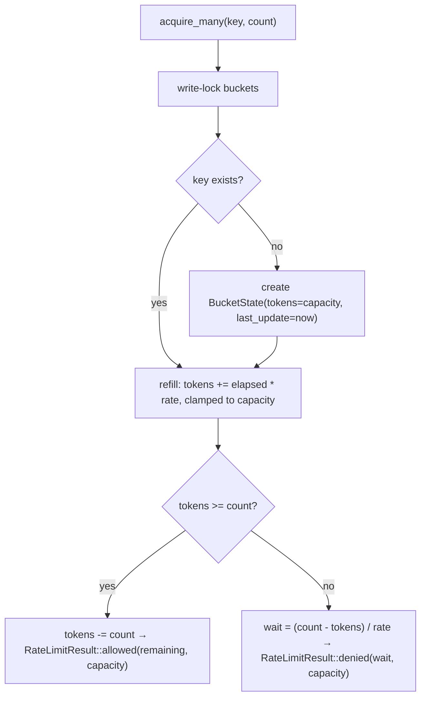
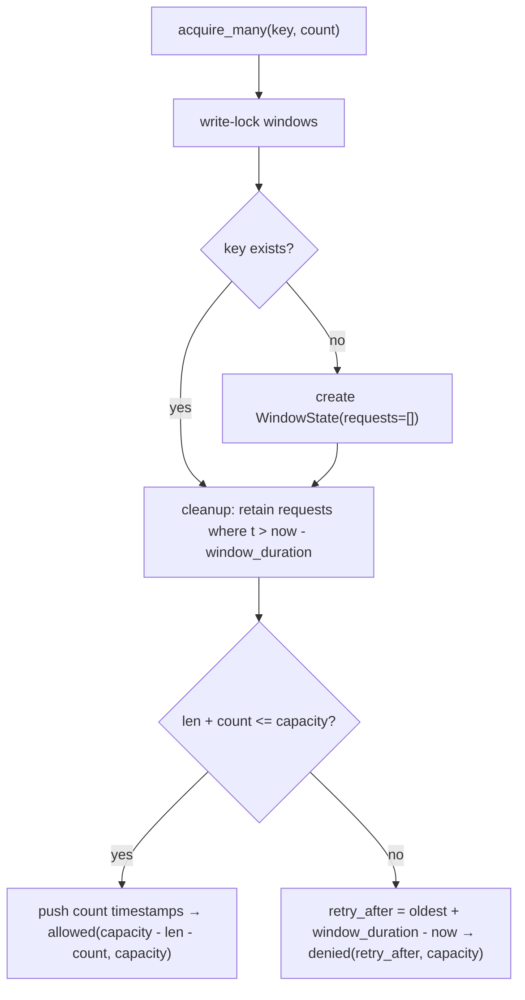
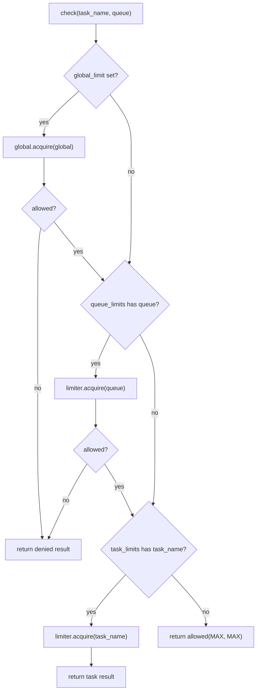

# Ratelimit

## Overview

<!-- type: overview lang: markdown -->

Rate limiting module for cclab-queue task execution. Provides two algorithm implementations behind a common `RateLimiter` async trait, plus a composite `RateLimitManager` for layered enforcement.

| Component | Type | Purpose |
|-----------|------|--------|
| `RateLimitConfig` | Config struct | Rate (tokens/sec), burst capacity, key; convenience constructors `per_second`, `per_minute`, `per_hour`, `with_key` |
| `RateLimitResult` | Value object | Outcome of rate check: `allowed`, `retry_after`, `remaining`, `limit`; constructors `allowed()`, `denied()` |
| `RateLimiter` | Async trait | `acquire`, `acquire_many`, `peek`, `reset` — Send + Sync |
| `TokenBucket` | Impl | Token bucket algorithm — smooth rate with burst; refills tokens at `config.rate` per second up to `capacity` |
| `SlidingWindow` | Impl | Sliding window algorithm — tracks request timestamps; evicts entries older than `window_duration` |
| `RateLimitManager` | Composite | Manages per-task, per-queue, and global rate limits; checks in order: global → queue → task |

This spec defines the logic, data model, and test plan for achieving comprehensive unit test coverage of `crates/cclab-queue/src/ratelimit.rs`.
## Requirements
<!-- type: requirements lang: markdown -->

<!-- TODO -->

## Scenarios
<!-- type: scenarios lang: markdown -->

<!-- TODO -->

## Diagrams

### Interaction
<!-- type: interaction lang: mermaid -->
<!-- TODO -->

### Logic
<!-- type: logic lang: mermaid -->
<!-- TODO -->

### Dependencies
<!-- type: dependency lang: mermaid -->
<!-- TODO -->

### State Machine
<!-- type: state-machine lang: mermaid -->
<!-- TODO -->

### Data Model
<!-- type: db-model lang: mermaid -->
<!-- TODO -->

## API Spec

### REST API
<!-- type: rest-api lang: yaml -->
<!-- TODO -->

### RPC API
<!-- type: rpc-api lang: json -->
<!-- TODO -->

### Async API
<!-- type: async-api lang: yaml -->
<!-- TODO -->

### CLI
<!-- type: cli lang: yaml -->
<!-- TODO -->

### Schema
<!-- type: schema lang: json -->
<!-- TODO -->

### Config
<!-- type: config lang: json -->
<!-- TODO -->

## Test Plan

<!-- type: test-plan lang: markdown -->

All tests go in `crates/cclab-queue/src/ratelimit.rs` as `#[cfg(test)] mod tests`. Existing 6 tests are kept; new tests fill coverage gaps.

### RateLimitConfig

| ID | Test | Covers | Assertion |
|----|------|--------|-----------|
| T1 | `config_default` | `Default` impl | `rate == 10.0`, `capacity == 10`, `key == "default"` |
| T2 | `config_per_second` | `per_second(5)` | `rate == 5.0`, `capacity == 5`, `key == "default"` |
| T3 | `config_per_minute` | `per_minute(60)` | `rate == 1.0`, `capacity == 60` |
| T4 | `config_per_minute_cap_clamped` | `per_minute(200)` | `capacity == 100` (clamped by `.min(100)`) |
| T5 | `config_per_hour` | `per_hour(3600)` | `rate == 1.0`, `capacity == 60` (3600/60=60) |
| T6 | `config_per_hour_clamp_min` | `per_hour(1)` | `capacity == 1` (clamp lower bound) |
| T7 | `config_per_hour_clamp_max` | `per_hour(360_000)` | `capacity == 100` (clamp upper bound) |
| T8 | `config_with_key` | `with_key` builder | `RateLimitConfig::per_second(1).with_key("custom").key == "custom"` |
| T9 | `config_serde_roundtrip` | Serialize + Deserialize | `serde_json::to_string` then `from_str` recovers identical config |
| T10 | `config_debug_impl` | Debug derive | `format!("{:?}", RateLimitConfig::default())` contains `"rate"` |
| T11 | `config_clone` | Clone derive | cloned config equals original field-by-field |

### RateLimitResult

| ID | Test | Covers | Assertion |
|----|------|--------|-----------|
| T12 | `result_allowed_fields` | `RateLimitResult::allowed(5, 10)` | `allowed == true`, `retry_after == None`, `remaining == 5`, `limit == 10` |
| T13 | `result_denied_fields` | `RateLimitResult::denied(Duration::from_secs(2), 10)` | `allowed == false`, `retry_after == Some(2s)`, `remaining == 0`, `limit == 10` |
| T14 | `result_debug_impl` | Debug derive | `format!("{:?}", result)` does not panic |
| T15 | `result_clone` | Clone derive | cloned result matches original fields |

### TokenBucket

| ID | Test | Covers | Assertion |
|----|------|--------|-----------|
| T16 | `tb_new_starts_at_capacity` | `TokenBucket::new` initial state | First `peek` returns `remaining == capacity` |
| T17 | `tb_per_minute_constructor` | `TokenBucket::per_minute(60)` | First acquire allowed; internal config rate == 1.0 |
| T18 | `tb_acquire_decrements_tokens` | `acquire` | After acquiring 1 from capacity=3, peek shows remaining == 2 |
| T19 | `tb_acquire_many_success` | `acquire_many` with count <= tokens | `acquire_many(key, 3)` on capacity=5 → allowed, remaining == 2 |
| T20 | `tb_acquire_many_denied` | `acquire_many` with count > tokens | `acquire_many(key, 6)` on capacity=5 → denied, retry_after > 0 |
| T21 | `tb_acquire_many_retry_after_calculation` | Denied wait time | `acquire_many(key, 6)` on capacity=5 rate=10.0 → `retry_after ≈ 0.1s` (1 token needed / 10 rate) |
| T22 | `tb_peek_does_not_consume` | `peek` non-destructive | Two consecutive peeks return same remaining |
| T23 | `tb_key_isolation` | Per-key buckets | Consuming all tokens on key "a" does not affect key "b" |
| T24 | `tb_refill_restores_tokens` | `refill` logic | After exhausting tokens, sleep(50ms) with rate=100 → acquire succeeds |
| T25 | `tb_refill_capped_at_capacity` | Refill ceiling | After long sleep, remaining does not exceed capacity |
| T26 | `tb_reset_restores_full_capacity` | `reset` | After exhausting + reset, peek shows remaining == capacity |
| T27 | `tb_acquire_delegates_to_acquire_many` | `acquire` calls `acquire_many(key, 1)` | Behavior matches manual `acquire_many(key, 1)` |

### SlidingWindow

| ID | Test | Covers | Assertion |
|----|------|--------|-----------|
| T28 | `sw_new_starts_empty` | Constructor initial state | `peek` returns `remaining == capacity` |
| T29 | `sw_per_second_constructor` | `SlidingWindow::per_second(3)` | 3 acquires allowed, 4th denied |
| T30 | `sw_per_minute_constructor` | `SlidingWindow::per_minute(60)` | config.rate == 1.0, capacity == 60 |
| T31 | `sw_acquire_many_success` | `acquire_many` within limit | `acquire_many(key, 2)` on capacity=3 → allowed, remaining == 1 |
| T32 | `sw_acquire_many_denied` | `acquire_many` exceeding limit | `acquire_many(key, 4)` on capacity=3 → denied |
| T33 | `sw_peek_does_not_consume` | `peek` non-destructive | Two peeks return same remaining |
| T34 | `sw_key_isolation` | Per-key windows | Exhausting key "a" does not affect key "b" |
| T35 | `sw_window_expiry` | `cleanup` evicts old entries | After capacity requests, sleep(window_duration + margin), next acquire allowed |
| T36 | `sw_retry_after_is_positive` | Denied retry_after | When denied, `retry_after.unwrap() > Duration::ZERO` |
| T37 | `sw_retry_after_empty_requests_fallback` | Denied with empty Vec edge | Verify denied path when `requests.first()` is None returns 100ms |
| T38 | `sw_reset_clears_window` | `reset` | After exhausting + reset, acquire succeeds |
| T39 | `sw_remaining_decrements_correctly` | Remaining tracking | After 2 acquires on capacity=5, remaining == 3 |
| T40 | `sw_acquire_delegates_to_acquire_many` | `acquire` calls `acquire_many(key, 1)` | Behavior consistent with manual `acquire_many(key, 1)` |

### RateLimitManager

| ID | Test | Covers | Assertion |
|----|------|--------|-----------|
| T41 | `manager_default` | `Default` impl | `RateLimitManager::default()` equivalent to `new()` — no limits set |
| T42 | `manager_no_limits_allows_all` | No limits path | `check("any", "any")` → `allowed == true`, `remaining == u32::MAX`, `limit == u32::MAX` |
| T43 | `manager_global_blocks_first` | Global enforcement priority | Global limit of 1 → second check denied regardless of task/queue |
| T44 | `manager_queue_blocks_before_task` | Queue enforcement priority | Queue limit=1, task limit=10 → second call on same queue denied |
| T45 | `manager_task_limit_enforced` | Task limit | task_limit("t", per_second(1)) → second `check("t", "q")` denied |
| T46 | `manager_different_task_not_affected` | Task limit isolation | Exhausting task "a" limit does not affect task "b" |
| T47 | `manager_peek_no_limits` | `peek` with no limits | returns `allowed(MAX, MAX)` |
| T48 | `manager_peek_global` | `peek` with global limit | peek reflects global remaining without consuming |
| T49 | `manager_peek_queue` | `peek` with queue limit | peek reflects queue remaining without consuming |
| T50 | `manager_peek_task` | `peek` with task limit | peek reflects task remaining without consuming |
| T51 | `manager_builder_chaining` | Fluent builder | `new().task_limit(...).queue_limit(...).global_limit(...)` compiles and all limits active |

### Trait + Thread Safety

| ID | Test | Covers | Assertion |
|----|------|--------|-----------|
| T52 | `token_bucket_is_send_sync` | Send + Sync bounds | `fn assert<T: Send + Sync>(){}; assert::<TokenBucket>()` |
| T53 | `sliding_window_is_send_sync` | Send + Sync bounds | `fn assert<T: Send + Sync>(){}; assert::<SlidingWindow>()` |
| T54 | `concurrent_token_bucket` | Thread safety | Spawn 10 tasks each acquiring 1 token from capacity=10 — no panic, total consumed == 10 |
## Changes

<!-- type: changes lang: yaml -->

```yaml
_sdd:
  id: ratelimit-changes
  refs:
    - $ref: "#manager-check-chain"
    - $ref: "#token-bucket-acquire"
    - $ref: "#sliding-window-acquire"
changes:
  - path: crates/cclab-queue/src/ratelimit.rs
    action: modify
    description: >
      Expand existing #[cfg(test)] mod tests from 6 to 54 tests.
      Add coverage for: RateLimitConfig (Default, per_second, per_minute, per_hour, with_key, serde roundtrip, Debug, Clone),
      RateLimitResult (allowed/denied constructors, Debug, Clone),
      TokenBucket (new, per_minute, acquire_many, peek, key isolation, refill cap, reset),
      SlidingWindow (new, per_second, per_minute, acquire_many, peek, key isolation, window expiry, retry_after, reset),
      RateLimitManager (Default, no-limits path, global/queue/task priority, peek variants, builder chaining),
      trait bounds (Send+Sync), and concurrent access safety.
```
## Wireframe
<!-- type: wireframe lang: yaml -->

<!-- TODO -->

## Component
<!-- type: component lang: json -->

<!-- TODO -->

## Design Token
<!-- type: design-token lang: json -->

<!-- TODO -->

## Doc
<!-- type: doc lang: markdown -->

<!-- TODO -->


## Logic

<!-- type: logic lang: mermaid -->

Token bucket refill + acquire logic:



Sliding window acquire logic:



RateLimitManager check priority chain:



### RateLimitConfig Convenience Constructors

| Constructor | rate | capacity | key |
|-------------|------|----------|-----|
| `Default::default()` | 10.0 | 10 | `"default"` |
| `per_second(n)` | n as f64 | n | `"default"` |
| `per_minute(n)` | n / 60.0 | min(n, 100) | `"default"` |
| `per_hour(n)` | n / 3600.0 | clamp(n/60, 1, 100) | `"default"` |
| `with_key(k)` | unchanged | unchanged | k |

### RateLimitResult Constructors

| Constructor | allowed | retry_after | remaining | limit |
|-------------|---------|-------------|-----------|-------|
| `allowed(rem, lim)` | true | None | rem | lim |
| `denied(dur, lim)` | false | Some(dur) | 0 | lim |