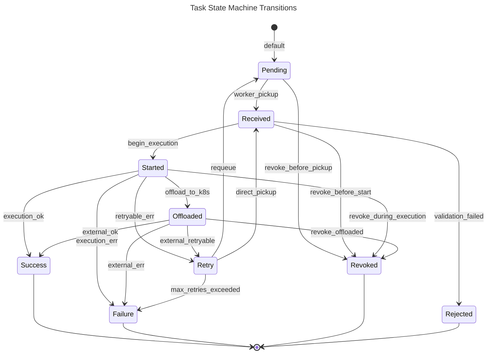
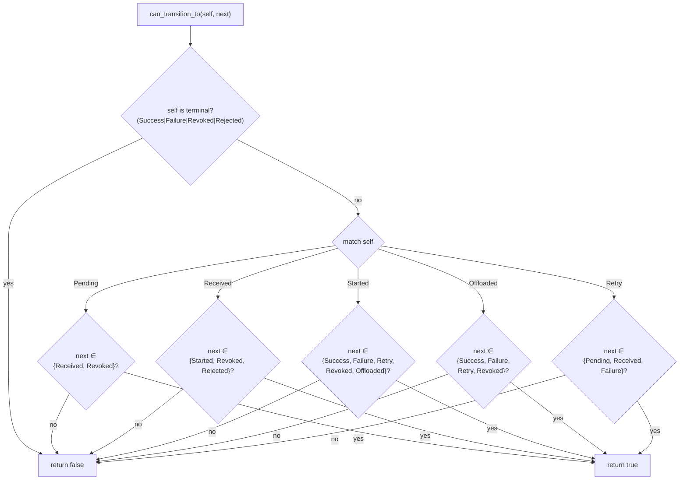
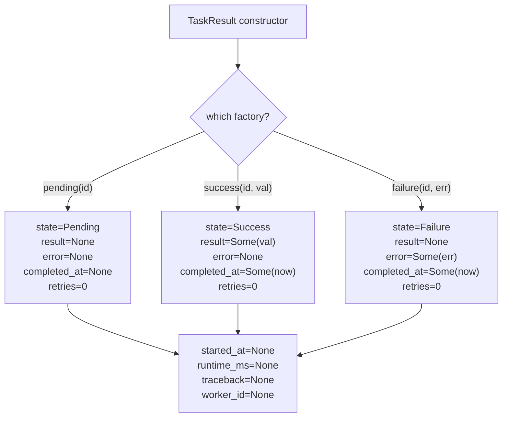

# Task State Machine

## Overview

<!-- type: overview lang: markdown -->

The task state machine in `crates/cclab-queue/src/state.rs` defines `TaskState` — a 9-variant enum (Pending, Received, Started, Offloaded, Success, Failure, Retry, Revoked, Rejected) governing task lifecycle. It provides:

- `is_terminal()` — classifies Success, Failure, Revoked, Rejected as terminal
- `is_active()` — classifies Received, Started, Retry, Offloaded as active
- `is_offloaded()` — checks Offloaded state
- `can_transition_to()` — validates 16 legal state transitions across 5 source states

`TaskResult` is a companion struct holding task execution metadata (task_id, state, result, error, traceback, timestamps, retries, worker_id) with factory constructors `pending()`, `success()`, `failure()`.

This spec defines the state machine schema, transition rules, and test plan for achieving full unit test coverage of `state.rs`.
## Requirements
<!-- type: requirements lang: markdown -->

<!-- TODO -->

## Scenarios
<!-- type: scenarios lang: markdown -->

<!-- TODO -->

## Diagrams

### Interaction
<!-- type: interaction lang: mermaid -->
<!-- TODO -->

### Logic
<!-- type: logic lang: mermaid -->
<!-- TODO -->

### Dependencies
<!-- type: dependency lang: mermaid -->
<!-- TODO -->

### State Machine
<!-- type: state-machine lang: mermaid -->
<!-- TODO -->

### Data Model
<!-- type: db-model lang: mermaid -->
<!-- TODO -->

## API Spec

### REST API
<!-- type: rest-api lang: yaml -->
<!-- TODO -->

### RPC API
<!-- type: rpc-api lang: json -->
<!-- TODO -->

### Async API
<!-- type: async-api lang: yaml -->
<!-- TODO -->

### CLI
<!-- type: cli lang: yaml -->
<!-- TODO -->

### Schema
<!-- type: schema lang: json -->
<!-- TODO -->

### Config
<!-- type: config lang: json -->
<!-- TODO -->

## Test Plan

<!-- type: test-plan lang: markdown -->

All tests go in `crates/cclab-queue/src/state.rs` as `#[cfg(test)] mod tests`.

### TaskState Enum

| ID | Test | Covers | Assertion |
|----|------|--------|-----------|
| T1 | `default_is_pending` | Default impl | `TaskState::default() == TaskState::Pending` |
| T2 | `serde_round_trip` | Serialize/Deserialize + rename_all | `serde_json::to_string(Pending) == "\"PENDING\""`, round-trip all 9 variants |
| T3 | `serde_screaming_snake_case` | serde rename_all | Each variant serializes to SCREAMING_SNAKE_CASE: PENDING, RECEIVED, STARTED, OFFLOADED, SUCCESS, FAILURE, RETRY, REVOKED, REJECTED |

### is_terminal()

| ID | Test | Covers | Assertion |
|----|------|--------|-----------|
| T4 | `terminal_states` | is_terminal true | Success, Failure, Revoked, Rejected all return true |
| T5 | `non_terminal_states` | is_terminal false | Pending, Received, Started, Offloaded, Retry all return false |

### is_active()

| ID | Test | Covers | Assertion |
|----|------|--------|-----------|
| T6 | `active_states` | is_active true | Received, Started, Retry, Offloaded all return true |
| T7 | `non_active_states` | is_active false | Pending, Success, Failure, Revoked, Rejected all return false |

### is_offloaded()

| ID | Test | Covers | Assertion |
|----|------|--------|-----------|
| T8 | `offloaded_true` | is_offloaded true | `Offloaded.is_offloaded() == true` |
| T9 | `offloaded_false_all_others` | is_offloaded false | All 8 non-Offloaded variants return false |

### can_transition_to() — Valid Transitions

| ID | Test | Covers | Assertion |
|----|------|--------|-----------|
| T10 | `pending_to_received` | Pending→Received | `Pending.can_transition_to(Received) == true` |
| T11 | `pending_to_revoked` | Pending→Revoked | `Pending.can_transition_to(Revoked) == true` |
| T12 | `received_to_started` | Received→Started | `Received.can_transition_to(Started) == true` |
| T13 | `received_to_revoked` | Received→Revoked | `Received.can_transition_to(Revoked) == true` |
| T14 | `received_to_rejected` | Received→Rejected | `Received.can_transition_to(Rejected) == true` |
| T15 | `started_to_success` | Started→Success | `Started.can_transition_to(Success) == true` |
| T16 | `started_to_failure` | Started→Failure | `Started.can_transition_to(Failure) == true` |
| T17 | `started_to_retry` | Started→Retry | `Started.can_transition_to(Retry) == true` |
| T18 | `started_to_revoked` | Started→Revoked | `Started.can_transition_to(Revoked) == true` |
| T19 | `started_to_offloaded` | Started→Offloaded | `Started.can_transition_to(Offloaded) == true` |
| T20 | `offloaded_to_success` | Offloaded→Success | `Offloaded.can_transition_to(Success) == true` |
| T21 | `offloaded_to_failure` | Offloaded→Failure | `Offloaded.can_transition_to(Failure) == true` |
| T22 | `offloaded_to_retry` | Offloaded→Retry | `Offloaded.can_transition_to(Retry) == true` |
| T23 | `offloaded_to_revoked` | Offloaded→Revoked | `Offloaded.can_transition_to(Revoked) == true` |
| T24 | `retry_to_pending` | Retry→Pending | `Retry.can_transition_to(Pending) == true` |
| T25 | `retry_to_received` | Retry→Received | `Retry.can_transition_to(Received) == true` |
| T26 | `retry_to_failure` | Retry→Failure | `Retry.can_transition_to(Failure) == true` |

### can_transition_to() — Invalid Transitions

| ID | Test | Covers | Assertion |
|----|------|--------|-----------|
| T27 | `terminal_no_transitions` | terminal states cannot transition | Success, Failure, Revoked, Rejected `.can_transition_to(x) == false` for all x |
| T28 | `pending_invalid_transitions` | Pending rejects invalid targets | Pending→Started, Pending→Success, Pending→Failure, Pending→Retry, Pending→Rejected, Pending→Offloaded, Pending→Pending all false |
| T29 | `received_invalid_transitions` | Received rejects invalid targets | Received→Success, Received→Failure, Received→Retry, Received→Pending, Received→Offloaded, Received→Received all false |
| T30 | `started_invalid_transitions` | Started rejects invalid targets | Started→Pending, Started→Received, Started→Rejected, Started→Started all false |
| T31 | `offloaded_invalid_transitions` | Offloaded rejects invalid targets | Offloaded→Pending, Offloaded→Received, Offloaded→Started, Offloaded→Rejected, Offloaded→Offloaded all false |
| T32 | `retry_invalid_transitions` | Retry rejects invalid targets | Retry→Started, Retry→Success, Retry→Revoked, Retry→Rejected, Retry→Offloaded, Retry→Retry all false |

### TaskResult Constructors

| ID | Test | Covers | Assertion |
|----|------|--------|-----------|
| T33 | `pending_result` | TaskResult::pending | state==Pending, result==None, error==None, retries==0, completed_at==None |
| T34 | `success_result` | TaskResult::success | state==Success, result==Some(val), error==None, completed_at==Some(_) |
| T35 | `failure_result` | TaskResult::failure | state==Failure, result==None, error==Some(msg), completed_at==Some(_) |
| T36 | `result_serde_round_trip` | Serialize/Deserialize TaskResult | serialize→deserialize preserves all fields |

### Trait Bounds

| ID | Test | Covers | Assertion |
|----|------|--------|-----------|
| T37 | `task_state_is_copy_clone_eq` | Copy+Clone+Eq derives | `let a = TaskState::Pending; let b = a; assert_eq!(a, b);` |
| T38 | `task_state_debug` | Debug derive | `format!("{:?}", TaskState::Pending)` contains "Pending" |
| T39 | `task_result_is_clone` | Clone derive | `TaskResult::pending(id).clone()` works |
## Changes

<!-- type: changes lang: yaml -->

```yaml
_sdd:
  id: task-state-machine-changes
  refs:
    - $ref: "#task-state-schema"
changes:
  - path: crates/cclab-queue/src/state.rs
    action: modify
    section: state-machine
    description: TaskState enum + is_terminal / is_active / is_offloaded / can_transition_to — from state-machine frontmatter
  - path: crates/cclab-queue/src/state.rs
    action: modify
    section: schema
    description: TaskResult struct + TaskId alias — from JSON Schema
  - path: crates/cclab-queue/src/state.rs
    action: modify
    section: test-plan
    description: 39 #[test] stubs for TaskState / TaskResult coverage — from markdown tables
```
## Wireframe
<!-- type: wireframe lang: yaml -->

<!-- TODO -->

## Component
<!-- type: component lang: json -->

<!-- TODO -->

## Design Token
<!-- type: design-token lang: json -->

<!-- TODO -->

## Doc
<!-- type: doc lang: markdown -->

<!-- TODO -->


## State Machine

<!-- type: state-machine lang: mermaid -->



### State Classification

| Category | States | Method |
|----------|--------|--------|
| Terminal | Success, Failure, Revoked, Rejected | `is_terminal()` |
| Active | Received, Started, Retry, Offloaded | `is_active()` |
| Offloaded | Offloaded | `is_offloaded()` |
| Initial | Pending | `Default::default()` |

### Transition Matrix

| From \ To | Pending | Received | Started | Offloaded | Success | Failure | Retry | Revoked | Rejected |
|-----------|---------|----------|---------|-----------|---------|---------|-------|---------|----------|
| Pending   |         | ✓        |         |           |         |         |       | ✓       |          |
| Received  |         |          | ✓       |           |         |         |       | ✓       | ✓        |
| Started   |         |          |         | ✓         | ✓       | ✓       | ✓     | ✓       |          |
| Offloaded |         |          |         |           | ✓       | ✓       | ✓     | ✓       |          |
| Retry     | ✓       | ✓        |         |           |         | ✓       |       |         |          |


## Schema

<!-- type: schema lang: json -->

```json
{
  "$id": "task-state-schema",
  "definitions": {
    "TaskState": {
      "title": "TaskState",
      "description": "Task lifecycle state enum",
      "type": "string",
      "enum": ["PENDING", "RECEIVED", "STARTED", "OFFLOADED", "SUCCESS", "FAILURE", "RETRY", "REVOKED", "REJECTED"],
      "default": "PENDING",
      "x-sdd": {
        "source": "crates/cclab-queue/src/state.rs",
        "derives": ["Debug", "Clone", "Copy", "PartialEq", "Eq", "Serialize", "Deserialize", "Default"],
        "serde": "rename_all=SCREAMING_SNAKE_CASE"
      }
    },
    "TaskResult": {
      "title": "TaskResult",
      "description": "Full task result with execution metadata",
      "type": "object",
      "required": ["task_id", "state", "retries"],
      "properties": {
        "task_id": { "$ref": "#/definitions/TaskId" },
        "state": { "$ref": "#/definitions/TaskState" },
        "result": { "type": ["object", "null"], "description": "JSON result value on success" },
        "error": { "type": ["string", "null"], "description": "Error message on failure" },
        "traceback": { "type": ["string", "null"], "description": "Stack trace on failure" },
        "started_at": { "type": ["string", "null"], "format": "date-time" },
        "completed_at": { "type": ["string", "null"], "format": "date-time" },
        "runtime_ms": { "type": ["integer", "null"], "minimum": 0 },
        "retries": { "type": "integer", "format": "int32", "minimum": 0, "default": 0 },
        "worker_id": { "type": ["string", "null"] }
      },
      "x-rust": {
        "derives": ["Debug", "Clone", "Serialize", "Deserialize"],
        "visibility": "pub",
        "imports": ["crate::TaskId"]
      },
      "x-sdd": {
        "source": "crates/cclab-queue/src/state.rs",
        "factories": [
          {
            "name": "pending",
            "doc": "Create a new pending result",
            "params": [{"name": "task_id", "type": "TaskId"}],
            "fields": {
              "task_id": "task_id",
              "state": "TaskState::Pending",
              "result": "None",
              "error": "None",
              "traceback": "None",
              "started_at": "None",
              "completed_at": "None",
              "runtime_ms": "None",
              "retries": "0",
              "worker_id": "None"
            }
          },
          {
            "name": "success",
            "doc": "Create a success result",
            "params": [
              {"name": "task_id", "type": "TaskId"},
              {"name": "value", "type": "serde_json::Value"}
            ],
            "fields": {
              "task_id": "task_id",
              "state": "TaskState::Success",
              "result": "Some(value)",
              "error": "None",
              "traceback": "None",
              "started_at": "None",
              "completed_at": "Some(Utc::now())",
              "runtime_ms": "None",
              "retries": "0",
              "worker_id": "None"
            }
          },
          {
            "name": "failure",
            "doc": "Create a failure result",
            "params": [
              {"name": "task_id", "type": "TaskId"},
              {"name": "error", "type": "String"}
            ],
            "fields": {
              "task_id": "task_id",
              "state": "TaskState::Failure",
              "result": "None",
              "error": "Some(error)",
              "traceback": "None",
              "started_at": "None",
              "completed_at": "Some(Utc::now())",
              "runtime_ms": "None",
              "retries": "0",
              "worker_id": "None"
            }
          }
        ]
      }
    },
    "TaskId": {
      "type": "string",
      "format": "uuid",
      "description": "UUID v7 (time-ordered) task identifier"
    }
  }
}
```

### Factory Methods

| Method | State | result | error | completed_at | retries |
|--------|-------|--------|-------|--------------|---------|
| `TaskResult::pending(id)` | Pending | None | None | None | 0 |
| `TaskResult::success(id, val)` | Success | Some(val) | None | Some(now) | 0 |
| `TaskResult::failure(id, err)` | Failure | None | Some(err) | Some(now) | 0 |


## Logic

<!-- type: logic lang: mermaid -->

Transition validation decision tree (`can_transition_to`):



TaskResult factory constructor logic:



### State Classification Methods

| Method | Returns `true` for | Returns `false` for | Pattern |
|--------|-------------------|--------------------|---------|
| `is_terminal()` | Success, Failure, Revoked, Rejected | Pending, Received, Started, Offloaded, Retry | `matches!(self, Success \| Failure \| Revoked \| Rejected)` |
| `is_active()` | Received, Started, Retry, Offloaded | Pending, Success, Failure, Revoked, Rejected | `matches!(self, Received \| Started \| Retry \| Offloaded)` |
| `is_offloaded()` | Offloaded | All other 8 variants | `matches!(self, Offloaded)` |

### Allowed Transitions Per Source (count)

| Source | # Targets | Targets |
|--------|-----------|------|
| Pending | 2 | Received, Revoked |
| Received | 3 | Started, Revoked, Rejected |
| Started | 5 | Success, Failure, Retry, Revoked, Offloaded |
| Offloaded | 4 | Success, Failure, Retry, Revoked |
| Retry | 3 | Pending, Received, Failure |
| Terminal (4) | 0 | — |