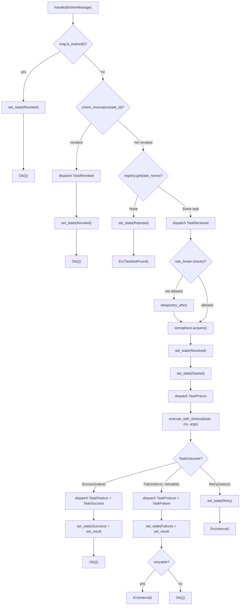
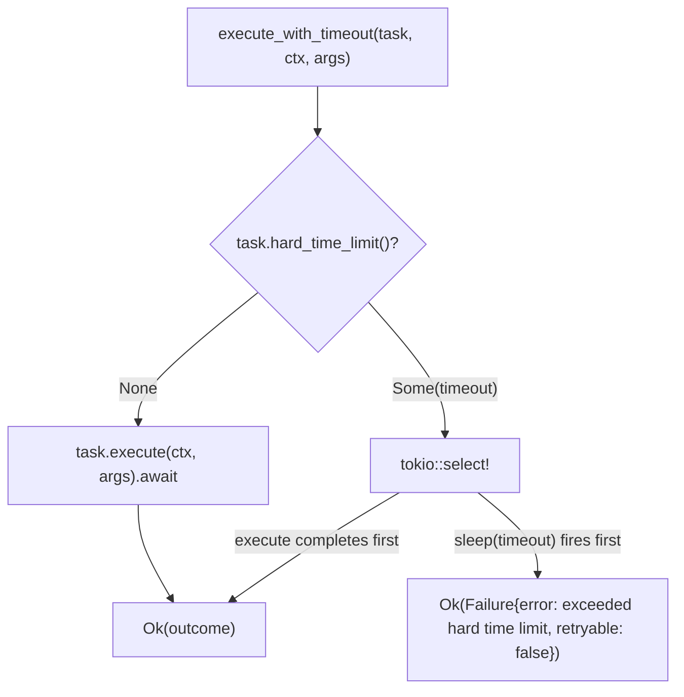

# Worker

## Overview

<!-- type: overview lang: markdown -->

The worker module (`crates/cclab-queue/src/worker/mod.rs`) provides the task execution runtime for cclab-queue. Three primary types:

| Type | Visibility | Role |
|------|-----------|------|
| `WorkerConfig` | pub | Configuration: name (UUID-based), queues, concurrency, prefetch, heartbeat, optional revocation store |
| `TaskExecutor<R: ResultBackend>` | private | `MessageHandler` impl — processes broker messages through a pipeline: expiry → revocation → registry lookup → rate limit → semaphore → state transitions → execution → outcome handling |
| `Worker<B: PullBroker, R: ResultBackend>` | pub | Runtime coordinator: broker subscriptions, backend connections, heartbeat loop, graceful shutdown via `CancellationToken`, optional `RateLimitManager` / `SignalDispatcher` / `RevocationStore` |

### Dependencies

| Dependency | Trait/Type | Used By |
|-----------|-----------|--------|
| `ResultBackend` | async trait | `TaskExecutor` — state transitions + result storage |
| `PullBroker` | async trait | `Worker` — subscribe to queues, connect/disconnect |
| `TaskRegistry` | struct | `TaskExecutor` — task lookup by name |
| `RateLimitManager` | struct | `TaskExecutor` — pre-execution rate check |
| `SignalDispatcher` | struct | `TaskExecutor` — lifecycle signal emission |
| `RevocationStore` | async trait | `TaskExecutor` — pre-execution revocation check |
| `CancellationToken` | tokio_util | `Worker` — graceful shutdown coordination |
| `Semaphore` | tokio | `TaskExecutor` — concurrency limiting |

### Existing Test Coverage

| Category | Count | Tests |
|----------|-------|-------|
| Unit (config) | 2 | `config_defaults`, `config_custom` |
| Unit (infra) | 1 | `semaphore_permit_acquisition` |
| Unit (compile) | 4 | `with_rate_limiter`, `without_rate_limiter`, `with_signal_dispatcher`, `without_signal_dispatcher` |
| Integration (#[ignore]) | 3 | `worker_lifecycle`, `task_execution`, `timeout_handling` |

This spec adds unit tests for `WorkerConfig` Debug impl, `Worker` construction/accessors/shutdown, `TaskExecutor::check_revocation`, `TaskExecutor::execute_with_timeout`, and `TaskExecutor::handle` message processing paths using mock `ResultBackend` and `TaskRegistry`.
## Requirements
<!-- type: requirements lang: markdown -->

<!-- TODO -->

## Scenarios
<!-- type: scenarios lang: markdown -->

<!-- TODO -->

## Diagrams

### Interaction
<!-- type: interaction lang: mermaid -->
<!-- TODO -->

### Logic
<!-- type: logic lang: mermaid -->
<!-- TODO -->

### Dependencies
<!-- type: dependency lang: mermaid -->
<!-- TODO -->

### State Machine
<!-- type: state-machine lang: mermaid -->
<!-- TODO -->

### Data Model
<!-- type: db-model lang: mermaid -->
<!-- TODO -->

## API Spec

### REST API
<!-- type: rest-api lang: yaml -->
<!-- TODO -->

### RPC API
<!-- type: rpc-api lang: json -->
<!-- TODO -->

### Async API
<!-- type: async-api lang: yaml -->
<!-- TODO -->

### CLI
<!-- type: cli lang: yaml -->
<!-- TODO -->

### Schema
<!-- type: schema lang: json -->
<!-- TODO -->

### Config
<!-- type: config lang: json -->
<!-- TODO -->

## Test Plan

<!-- type: test-plan lang: markdown -->

All tests in `crates/cclab-queue/src/worker/mod.rs` as `#[cfg(test)] mod tests`. Unit tests use mock implementations; integration tests are `#[tokio::test] #[ignore]` requiring NATS+Redis.

### Mock Infrastructure

Unit tests for `TaskExecutor::handle` require mock types:

| Mock | Implements | Behavior |
|------|-----------|----------|
| `MockBackend` | `ResultBackend` | In-memory `HashMap<TaskId, (TaskState, Option<TaskResult>)>`. All methods return `Ok`. |
| `MockRevocationStore` | `RevocationStore` | `HashSet<TaskId>` of revoked ids. `is_revoked` checks set membership. |
| `MockTask` | `Task` | Configurable: name, outcome (Success/Failure/Retry), hard_time_limit, queue, retry_policy. |

### WorkerConfig

| ID | Test | Covers | Assertion |
|----|------|--------|-----------|
| W1 | `config_defaults` | `WorkerConfig::default()` | queues==["default"], concurrency==num_cpus, prefetch==4, heartbeat==10s, name starts with "worker-", revocation_store==None | (exists) |
| W2 | `config_custom` | manual construction | all fields match provided values | (exists) |
| W3 | `config_debug_format` | `Debug` impl | `format!("{:?}", config)` contains "WorkerConfig", field names, and revocation_store shows "Some(RevocationStore)" or "None" |
| W4 | `config_debug_with_revocation_store` | `Debug` impl with Some store | revocation_store field shows `Some("Some(RevocationStore)")` |
| W5 | `config_clone` | `Clone` derive | `config.clone()` produces equal name, queues, concurrency, prefetch, heartbeat |

### Worker Construction & Accessors

These tests require concrete types for B and R. Use `MockBroker` (impl `PullBroker` + `Broker`) and `MockBackend` (impl `ResultBackend`).

| ID | Test | Covers | Assertion |
|----|------|--------|-----------|
| W6 | `worker_new_defaults` | `Worker::new()` | `config().name` matches, `is_shutting_down() == false` |
| W7 | `worker_shutdown_sets_flag` | `Worker::shutdown()` | after `shutdown()`, `is_shutting_down() == true` |
| W8 | `worker_config_accessor` | `Worker::config()` | returns reference matching construction config |
| W9 | `worker_with_rate_limiter` | `with_rate_limiter()` builder | constructs without panic, `is_shutting_down() == false` |
| W10 | `worker_with_signal_dispatcher` | `with_signal_dispatcher()` builder | constructs without panic |
| W11 | `worker_with_revocation_store` | `with_revocation_store()` builder | constructs without panic |
| W12 | `worker_builder_chain` | all 3 builders chained | `Worker::new(...).with_rate_limiter(...).with_signal_dispatcher(...).with_revocation_store(...)` compiles and runs |

### Semaphore (existing)

| ID | Test | Covers | Assertion |
|----|------|--------|-----------|
| W13 | `semaphore_permit_acquisition` | concurrency control | 2 permits acquired, 3rd fails, drop 1st, 3rd succeeds | (exists) |

### TaskExecutor — check_revocation

| ID | Test | Covers | Assertion |
|----|------|--------|-----------|
| W14 | `check_revocation_no_store` | `revocation_store == None` | returns `Ok(false)` |
| W15 | `check_revocation_not_revoked` | store returns false | returns `Ok(false)` |
| W16 | `check_revocation_is_revoked` | store returns true | returns `Ok(true)` |

### TaskExecutor — execute_with_timeout

| ID | Test | Covers | Assertion |
|----|------|--------|-----------|
| W17 | `execute_no_timeout` | `hard_time_limit() == None` | task executes normally, returns `Ok(Success(value))` |
| W18 | `execute_within_timeout` | timeout > execution time | task completes, returns `Ok(Success(value))` |
| W19 | `execute_exceeds_timeout` | timeout < execution time | returns `Ok(Failure{error: contains "exceeded hard time limit", retryable: false})` |

### TaskExecutor — handle() Message Processing Paths

| ID | Test | Covers | Assertion |
|----|------|--------|-----------|
| W20 | `handle_expired_message` | expiry check early exit | `msg.expires = Some(past)` → backend state set to Revoked, returns `Ok(())` |
| W21 | `handle_revoked_task` | revocation check early exit | task_id in revocation store → backend state set to Revoked, returns `Ok(())` |
| W22 | `handle_revoked_emits_signal` | signal dispatch on revocation | revoked task with signal_dispatcher → TaskRevoked signal dispatched |
| W23 | `handle_task_not_found` | registry miss | task_name not registered → backend state set to Rejected, returns `Err(TaskNotFound)` |
| W24 | `handle_success_path` | full success flow | registered task returns `Success(json)` → backend state transitions: Received → Started → Success, result stored with correct fields |
| W25 | `handle_success_result_fields` | TaskResult field correctness | result.state==Success, result.result==Some(value), result.error==None, result.worker_id==Some(worker_id), result.started_at is Some, result.completed_at is Some, result.runtime_ms is Some |
| W26 | `handle_failure_non_retryable` | failure with retryable=false | task returns `Failure{retryable: false}` → state set to Failure, result stored, returns `Ok(())` |
| W27 | `handle_failure_retryable` | failure with retryable=true | task returns `Failure{retryable: true}` → state set to Failure, result stored, returns `Err(Internal)` |
| W28 | `handle_retry_outcome` | Retry outcome path | task returns `Retry{reason}` → state set to Retry, returns `Err(Internal("Retry requested: ..."))` |
| W29 | `handle_rate_limited_task` | rate limiter blocks then allows | rate_limiter.check returns not-allowed with retry_after → sleeps then proceeds |
| W30 | `handle_success_emits_signals` | signal dispatch on success | success with dispatcher → TaskReceived, TaskPrerun, TaskPostrun, TaskSuccess signals emitted |
| W31 | `handle_failure_emits_signals` | signal dispatch on failure | failure with dispatcher → TaskReceived, TaskPrerun, TaskPostrun, TaskFailure signals emitted |
| W32 | `handle_no_revocation_store` | revocation check with None store | task_id not revoked (no store) → proceeds to execution |
| W33 | `handle_no_rate_limiter` | execution without rate limiter | rate_limiter==None → proceeds directly to semaphore acquisition |
| W34 | `handle_no_signal_dispatcher` | execution without signals | signal_dispatcher==None → no panics, proceeds normally |
| W35 | `handle_builds_correct_task_context` | TaskContext construction | ctx.task_id, ctx.task_name, ctx.queue, ctx.retry_count, ctx.max_retries, ctx.correlation_id, ctx.parent_id, ctx.root_id all match message fields |

### Integration Tests (existing, #[ignore])

| ID | Test | Covers | Assertion |
|----|------|--------|-----------|
| W36 | `worker_lifecycle` | start/shutdown | worker starts and can be shut down | (exists) |
| W37 | `task_execution` | end-to-end success | publish task → worker processes → result stored with Success state | (exists) |
| W38 | `timeout_handling` | hard_time_limit | timeout task → result stored with Failure state, error contains "exceeded hard time limit" | (exists) |

### Totals

| Category | Existing | New | Total |
|----------|----------|-----|-------|
| Unit (config) | 2 | 3 | 5 |
| Unit (Worker construction) | 4 | 7 | 11 |
| Unit (semaphore) | 1 | 0 | 1 |
| Unit (check_revocation) | 0 | 3 | 3 |
| Unit (execute_with_timeout) | 0 | 3 | 3 |
| Unit (handle paths) | 0 | 16 | 16 |
| Integration (#[ignore]) | 3 | 0 | 3 |
| **Total** | **10** | **32** | **42** |
## Changes

<!-- type: changes lang: yaml -->

```yaml
_sdd:
  id: worker-changes
  refs:
    - $ref: "#worker-async-api"
    - $ref: "#worker-lifecycle-fsm"
    - $ref: "#task-executor-handle-flow"
    - $ref: "error-types#error-types-schema"
    - $ref: "task-state-machine#task-state-schema"
changes:
  - path: crates/cclab-queue/src/worker/mod.rs
    action: modify
    description: >-
      Expand #[cfg(test)] mod tests with 32 new unit tests.
      Add mock infrastructure: MockBackend (in-memory ResultBackend impl with HashMap),
      MockRevocationStore (HashSet-based RevocationStore impl),
      MockTask (configurable Task impl for outcome/timeout/queue/retry).
      New tests cover: WorkerConfig Debug/Clone (3), Worker construction/accessors/shutdown/builders (7),
      TaskExecutor::check_revocation with None/false/true store (3),
      TaskExecutor::execute_with_timeout no-timeout/within/exceeds (3),
      TaskExecutor::handle message processing paths — expired/revoked/not-found/success/failure/retry/
      rate-limited/signal-dispatch/no-optionals/context-construction (16).
```
## Wireframe
<!-- type: wireframe lang: yaml -->

<!-- TODO -->

## Component
<!-- type: component lang: json -->

<!-- TODO -->

## Design Token
<!-- type: design-token lang: json -->

<!-- TODO -->

## Doc
<!-- type: doc lang: markdown -->

<!-- TODO -->


## State Machine

<!-- type: state-machine lang: mermaid -->

### Worker Lifecycle

```mermaid
---
id: worker-lifecycle-fsm
refs:
  - $ref: "#worker-async-api"
---
stateDiagram-v2
    [*] --> Created : Worker::new(config, broker, backend, registry)

    Created --> Initializing : start()
    Created --> Created : with_rate_limiter() / with_signal_dispatcher() / with_revocation_store()

    Initializing --> Connecting : emit WorkerInit signal
    Connecting --> Subscribing : broker.connect() + backend.health_check()
    Subscribing --> Ready : all queues subscribed
    Ready --> Running : emit WorkerReady signal + spawn heartbeat

    Running --> ShuttingDown : shutdown() cancels CancellationToken
    ShuttingDown --> Stopped : emit WorkerShutdown + cancel subscriptions + broker.disconnect()
    Stopped --> [*]
```

### Worker State Classification

| State | Externally Observable | Method |
|-------|----------------------|--------|
| Created | `is_shutting_down() == false` | `Worker::new()` |
| Running | `is_shutting_down() == false` | after `start()` |
| ShuttingDown | `is_shutting_down() == true` | after `shutdown()` |

### TaskExecutor Message Handling Flow

The `MessageHandler::handle()` implementation is a directed acyclic graph (decision tree), not an FSM:



### execute_with_timeout Flow



### Signal Emission Points

| Flow Point | Signal | Emitted By |
|-----------|--------|------------|
| Worker start | `WorkerInit` | `Worker::start()` |
| All queues subscribed | `WorkerReady` | `Worker::start()` |
| Shutdown | `WorkerShutdown(Graceful)` | `Worker::start()` |
| Message revoked | `TaskRevoked` | `TaskExecutor::handle()` |
| Task found in registry | `TaskReceived` | `TaskExecutor::handle()` |
| Before execution | `TaskPrerun` | `TaskExecutor::handle()` |
| After execution | `TaskPostrun` | `TaskExecutor::handle()` |
| Success outcome | `TaskSuccess` | `TaskExecutor::handle()` |
| Failure outcome | `TaskFailure` | `TaskExecutor::handle()` |


## Async API

<!-- type: async-api lang: yaml -->

```yaml
asyncapi: '2.6.0'
info:
  title: Worker Runtime API
  version: 0.1.0
  description: >
    Task worker runtime for cclab-queue. Worker<B: PullBroker, R: ResultBackend>
    coordinates broker subscriptions, task execution, and lifecycle management.
  x-sdd:
    id: worker-async-api
    refs:
      - $ref: "task-state-machine#task-state-schema"
      - $ref: "error-types#error-types-schema"
      - $ref: "result-backend#result-backend-async-api"

defaultContentType: application/json

channels:
  worker-lifecycle:
    description: Worker start/shutdown lifecycle
    publish:
      operationId: start
      summary: >
        Connect broker + backend, subscribe to all queues, spawn heartbeat loop,
        block until CancellationToken cancelled. Feature-gated: #[cfg(feature = "nats")].
      bindings:
        nats:
          feature: nats
      message:
        name: WorkerStartResult
        payload:
          $ref: '#/components/schemas/TaskErrorResult'
    subscribe:
      operationId: shutdown
      summary: Cancel CancellationToken to trigger graceful shutdown (sync, non-blocking)
      message:
        name: ShutdownRequest
        payload:
          type: 'null'

  task-execution:
    description: TaskExecutor message handling pipeline
    publish:
      operationId: handle
      summary: >
        Process a BrokerMessage through pipeline: expiry check → revocation check →
        registry lookup → rate limit → semaphore → state(Received→Started) →
        execute_with_timeout → outcome handling (Success/Failure/Retry)
      message:
        $ref: '#/components/messages/BrokerMessage'

  task-timeout:
    description: Hard time limit enforcement via tokio::select
    publish:
      operationId: executeWithTimeout
      summary: >
        Execute task with optional hard_time_limit(). If timeout fires before
        execution completes, returns Failure{retryable: false}.
      message:
        $ref: '#/components/messages/TaskExecutionRequest'

  revocation-check:
    description: Pre-execution revocation check
    subscribe:
      operationId: checkRevocation
      summary: >
        Delegates to RevocationStore::is_revoked() if store is Some;
        returns Ok(false) if store is None.
      message:
        name: RevocationCheckResult
        payload:
          type: boolean

components:
  messages:
    BrokerMessage:
      name: BrokerMessage
      contentType: application/json
      payload:
        $ref: '#/components/schemas/BrokerMessage'

    TaskExecutionRequest:
      name: TaskExecutionRequest
      contentType: application/json
      payload:
        type: object
        required: [task, ctx, args]
        properties:
          task:
            description: Arc<dyn Task> reference
          ctx:
            $ref: '#/components/schemas/TaskContext'
          args:
            description: serde_json::Value task arguments

  schemas:
    WorkerConfig:
      type: object
      required: [name, queues, concurrency, prefetch, heartbeat]
      properties:
        name:
          type: string
          description: "Worker ID, default: worker-{uuid_v7}"
        queues:
          type: array
          items:
            type: string
          default: ["default"]
        concurrency:
          type: integer
          description: Max parallel tasks (default num_cpus)
        prefetch:
          type: integer
          default: 4
        heartbeat:
          type: string
          format: duration
          default: 10s
        revocation_store:
          description: Optional Arc<dyn RevocationStore>
          nullable: true

    BrokerMessage:
      type: object
      required: [delivery_tag, payload, headers, timestamp, redelivered]
      properties:
        delivery_tag:
          type: string
        payload:
          $ref: '#/components/schemas/TaskMessage'
        headers:
          type: object
          additionalProperties:
            type: string
        timestamp:
          type: string
          format: date-time
        redelivered:
          type: boolean

    TaskMessage:
      type: object
      required: [id, task_name, args, retries]
      properties:
        id:
          type: string
          format: uuid
        task_name:
          type: string
        args:
          description: JSON arguments
        retries:
          type: integer
          format: uint32
        expires:
          type: string
          format: date-time
          nullable: true
        correlation_id:
          type: string
          nullable: true
        parent_id:
          type: string
          format: uuid
          nullable: true
        root_id:
          type: string
          format: uuid
          nullable: true
      x-methods:
        is_expired:
          returns: bool
          description: Checks if expires < Utc::now()

    TaskContext:
      type: object
      required: [task_id, task_name, queue, retry_count, max_retries]
      properties:
        task_id:
          type: string
          format: uuid
        task_name:
          type: string
        queue:
          type: string
        retry_count:
          type: integer
          format: uint32
        max_retries:
          type: integer
          format: uint32
        correlation_id:
          type: string
          nullable: true
        parent_id:
          type: string
          format: uuid
          nullable: true
        root_id:
          type: string
          format: uuid
          nullable: true

    TaskOutcome:
      oneOf:
        - type: object
          title: Success
          required: [value]
          properties:
            value:
              description: serde_json::Value
        - type: object
          title: Failure
          required: [error, retryable]
          properties:
            error:
              type: string
            retryable:
              type: boolean
        - type: object
          title: Retry
          required: [reason]
          properties:
            reason:
              type: string
            countdown:
              type: string
              format: duration
              nullable: true

    TaskErrorResult:
      type: object
      properties:
        error:
          $ref: 'error-types#error-types-schema/definitions/TaskError'
          nullable: true

    WorkerBuilderMethods:
      description: Builder-pattern methods on Worker (all return Self)
      x-methods:
        with_rate_limiter:
          param: RateLimitManager
          description: Sets rate_limiter = Some(Arc::new(rate_limiter))
        with_signal_dispatcher:
          param: SignalDispatcher
          description: Sets signal_dispatcher = Some(Arc::new(dispatcher))
        with_revocation_store:
          param: "S: RevocationStore"
          description: Sets revocation_store = Some(Arc::new(store))

    WorkerAccessors:
      description: Read-only accessors on Worker
      x-methods:
        config:
          returns: "&WorkerConfig"
        is_shutting_down:
          returns: bool
          description: Returns self.shutdown.is_cancelled()
```