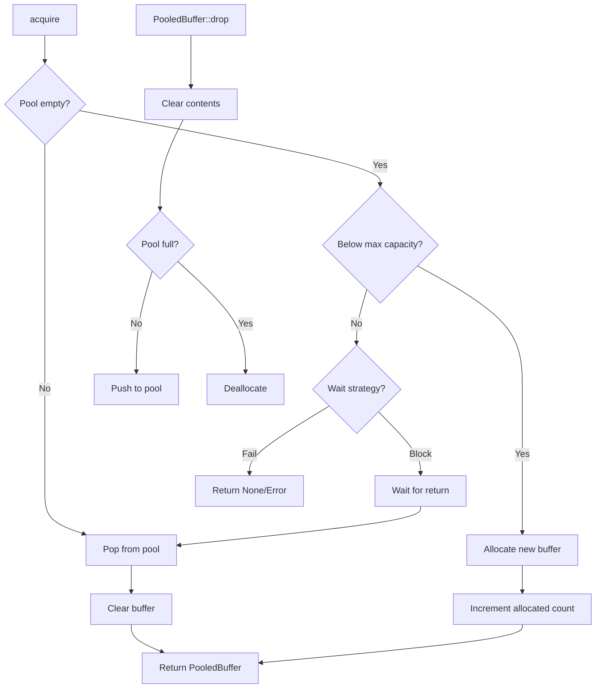

<spec>

# Buffer Pool for Zero-Copy I/O

## Overview

Implement a thread-safe buffer pool for reusable I/O buffers to reduce allocation overhead and enable zero-copy operations. Buffers are pre-allocated and recycled, with configurable sizes and pool capacity. Supports both fixed-size and variable-size buffer strategies.

## Requirements

### R1 - Buffer Pool Creation

```yaml
id: R1
priority: high
status: draft
```

Create buffer pool with configurable initial capacity, max capacity, and buffer size. Pre-allocate buffers on creation for predictable memory usage.

### R2 - Buffer Acquisition

```yaml
id: R2
priority: high
status: draft
```

Provide acquire() method that returns a buffer from the pool or allocates new one if pool is empty (up to max capacity).

### R3 - Buffer Return

```yaml
id: R3
priority: high
status: draft
```

Implement automatic buffer return via Drop trait. Clear buffer contents on return for security.

### R4 - Thread Safety

```yaml
id: R4
priority: high
status: draft
```

Use lock-free data structures (crossbeam ArrayQueue) for concurrent buffer acquisition/return without mutex contention.

### R5 - Statistics

```yaml
id: R5
priority: medium
status: draft
```

Track pool statistics: allocations, reuses, pool misses, current size. Expose via stats() method.

## Acceptance Criteria

### Scenario: Acquire buffer from pool

- **GIVEN** Buffer pool with available buffers
- **WHEN** Call pool.acquire()
- **THEN** Returns buffer from pool without allocation

### Scenario: Pool exhausted allocation

- **GIVEN** Pool is empty but below max capacity
- **WHEN** Call pool.acquire()
- **THEN** New buffer allocated and returned

### Scenario: Buffer recycling

- **GIVEN** Buffer acquired from pool
- **WHEN** Buffer is dropped
- **THEN** Buffer returned to pool for reuse

### Scenario: Concurrent access

- **GIVEN** Multiple threads acquiring buffers
- **WHEN** Concurrent acquire() calls
- **THEN** All threads get valid buffers without data races

## Flow Diagram



</spec>
