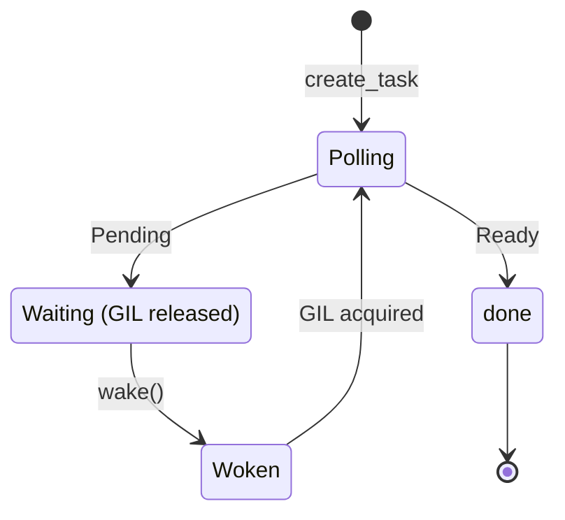

<spec>

# Async-native Coroutine Polling with Waker-driven GIL Release

## Overview

Replace the current 10ms sleep loop in coroutine polling with a waker-driven mechanism that releases the GIL when waiting for I/O. This eliminates GIL contention in multi-threaded applications and reduces latency from 10ms+ to sub-millisecond for short-lived coroutines. The waker integrates with Rust's async ecosystem to enable efficient cooperative scheduling between Python coroutines and Rust futures.

## Requirements

### R1 - Waker-driven polling

```yaml
id: R1
priority: high
status: draft
```

Implement a waker mechanism that allows coroutines to be polled only when they have work to do, eliminating fixed sleep intervals.

### R2 - GIL release on wait

```yaml
id: R2
priority: high
status: draft
```

Release the Python GIL when the waker is waiting for I/O or other async operations, allowing other Python threads to run.

### R3 - Sub-millisecond latency

```yaml
id: R3
priority: high
status: draft
```

Achieve sub-millisecond wake-up latency for coroutines that become ready, down from the current 10ms minimum.

### R4 - Thread-safe waker

```yaml
id: R4
priority: high
status: draft
```

The waker must be thread-safe and support being triggered from any thread (Rust async runtime, Python threads, or OS signals).

### R5 - Backward compatibility

```yaml
id: R5
priority: medium
status: draft
```

Maintain API compatibility with existing create_task and run_until_complete interfaces.

## Acceptance Criteria

### Scenario: Fast coroutine completion

- **GIVEN** A coroutine that completes immediately
- **WHEN** The coroutine is polled
- **THEN** It returns within microseconds, not waiting for any sleep interval

### Scenario: I/O wait releases GIL

- **GIVEN** A coroutine waiting for network I/O
- **WHEN** The coroutine yields pending
- **THEN** The GIL is released allowing other Python threads to execute

### Scenario: Multi-threaded concurrency

- **GIVEN** Multiple Python threads creating tasks
- **WHEN** Tasks are created concurrently
- **THEN** No GIL contention occurs during task polling

### Scenario: Waker triggered from Rust

- **GIVEN** A Rust future completes on the async runtime
- **WHEN** The associated waker is triggered
- **THEN** The Python coroutine is immediately scheduled for polling

### Scenario: Graceful degradation

- **GIVEN** A platform without efficient waker support
- **WHEN** The event loop runs
- **THEN** Falls back to polling with minimal impact on correctness

## Diagrams

### Waker-driven Polling Flow

```mermaid
flowchart TB
    start(poll_coroutine())
    check{Poll result?} 
    ready(Return result)
    pending[Create waker]
    release[Release GIL]
    wait[waker.wait()]
    acquire[Acquire GIL]
    loop(Continue polling)
    start --> check
    check -->|Ready| ready
    check -->|Pending| pending
    pending --> release
    release --> wait
    wait --> acquire
    acquire --> loop
    loop --> check
```

### Coroutine Polling States



</spec>
