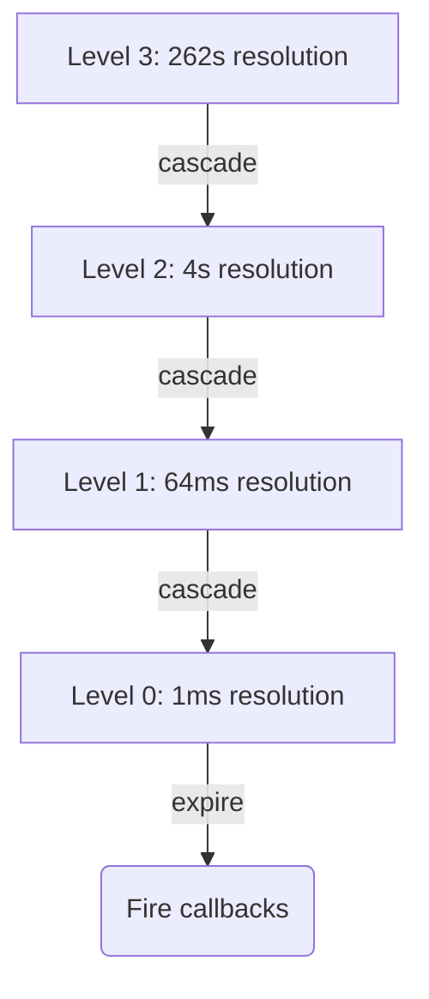

<spec>

# Hashed Hierarchical Timer Wheel Integration

## Overview

Integrate the existing timer_wheel_hashed.rs implementation into the main event loop, replacing the BTreeMap-based timer with O(1) hashed hierarchical wheel. The wheel uses 4 levels with 64 slots each, providing efficient timer scheduling with 1ms resolution at the finest level. This improves timer operations from O(log n) to O(1) and reduces lock contention through better cache locality.

## Requirements

### R1 - O(1) timer operations

```yaml
id: R1
priority: high
status: draft
```

Timer insertion, cancellation, and expiry checks must be O(1) amortized complexity.

### R2 - Hierarchical wheel structure

```yaml
id: R2
priority: high
status: draft
```

Implement 4-level hierarchy: Level 0 (1ms), Level 1 (64ms), Level 2 (4096ms), Level 3 (262144ms) for handling timers from milliseconds to minutes.

### R3 - API compatibility

```yaml
id: R3
priority: high
status: draft
```

Maintain compatibility with existing call_later, call_at, and cancel_handle APIs.

### R4 - Cascade efficiency

```yaml
id: R4
priority: medium
status: draft
```

Timer cascade from higher to lower levels must be efficient and not cause latency spikes.

### R5 - Memory efficiency

```yaml
id: R5
priority: medium
status: draft
```

Use linked lists or similar structures to avoid pre-allocating memory for all possible timer slots.

## Acceptance Criteria

### Scenario: Short timer fast path

- **GIVEN** A timer with 5ms delay
- **WHEN** Timer is scheduled
- **THEN** Inserted into Level 0 in O(1) time

### Scenario: Long timer scheduling

- **GIVEN** A timer with 30 second delay
- **WHEN** Timer is scheduled
- **THEN** Inserted into appropriate higher level wheel

### Scenario: Timer cascade

- **GIVEN** Level 1 slot expires with multiple timers
- **WHEN** Wheel advances to that slot
- **THEN** Timers cascade down to Level 0 efficiently

### Scenario: Timer cancellation

- **GIVEN** A scheduled timer
- **WHEN** Cancel is called before expiry
- **THEN** Timer is removed in O(1) time

### Scenario: High timer volume

- **GIVEN** 10000 timers scheduled within same second
- **WHEN** All timers expire
- **THEN** Callbacks execute without latency spikes

## Diagrams

### Hierarchical Timer Wheel Structure



</spec>
