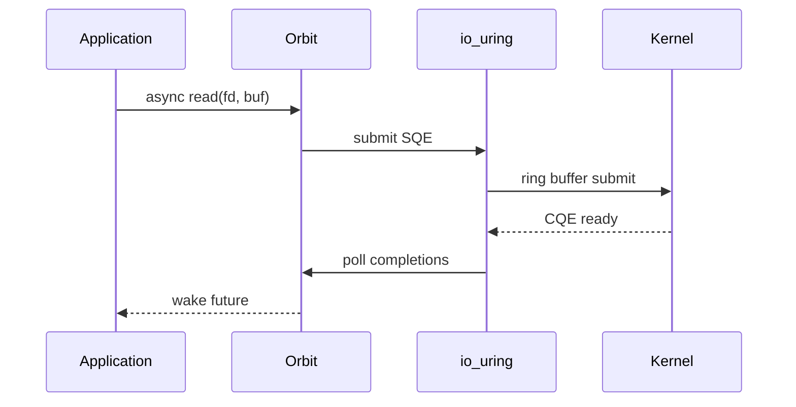

<spec>

# io_uring Backend for Linux

## Overview

Implement an io_uring backend for maximum I/O performance on Linux 5.1+. io_uring provides zero-copy I/O, reduced syscall overhead, and native async file I/O. The backend is feature-gated and falls back to epoll on older kernels or when io_uring is unavailable. This leverages all previous optimizations (waker polling, MPSC queue, timer wheel, GIL batching) to achieve maximum I/O performance.

## Requirements

### R1 - Feature-gated implementation

```yaml
id: R1
priority: high
status: draft
```

Enable io_uring backend via #[cfg(feature = "io-uring")] with automatic fallback to epoll.

### R2 - Core I/O operations

```yaml
id: R2
priority: high
status: draft
```

Support read, write, accept, connect, send, recv, sendfile, and fsync operations via io_uring.

### R3 - Runtime kernel detection

```yaml
id: R3
priority: high
status: draft
```

Detect io_uring availability at runtime and gracefully fall back to epoll if unavailable.

### R4 - Zero-copy support

```yaml
id: R4
priority: medium
status: draft
```

Utilize io_uring's zero-copy capabilities for large data transfers.

### R5 - Completion queue batching

```yaml
id: R5
priority: medium
status: draft
```

Process multiple completion events in batches to reduce syscall overhead.

### R6 - Cross-platform abstraction

```yaml
id: R6
priority: medium
status: draft
```

Provide unified I/O trait that works across io_uring (Linux), kqueue (macOS), and IOCP (Windows).

## Acceptance Criteria

### Scenario: io_uring available

- **GIVEN** Linux 5.1+ kernel with io_uring support
- **WHEN** Event loop initializes
- **THEN** io_uring backend is used automatically

### Scenario: io_uring unavailable

- **GIVEN** Older Linux kernel without io_uring
- **WHEN** Event loop initializes
- **THEN** Falls back to epoll transparently

### Scenario: Zero-copy file send

- **GIVEN** A large file to send over socket
- **WHEN** sendfile is called
- **THEN** Data is transferred without copying to userspace

### Scenario: Batch completion processing

- **GIVEN** Multiple I/O operations complete
- **WHEN** Completion queue is polled
- **THEN** All completions are processed in single syscall

### Scenario: Cross-platform compatibility

- **GIVEN** Same application code
- **WHEN** Run on Linux, macOS, and Windows
- **THEN** Uses optimal backend for each platform

## Diagrams

### io_uring I/O Flow



</spec>
