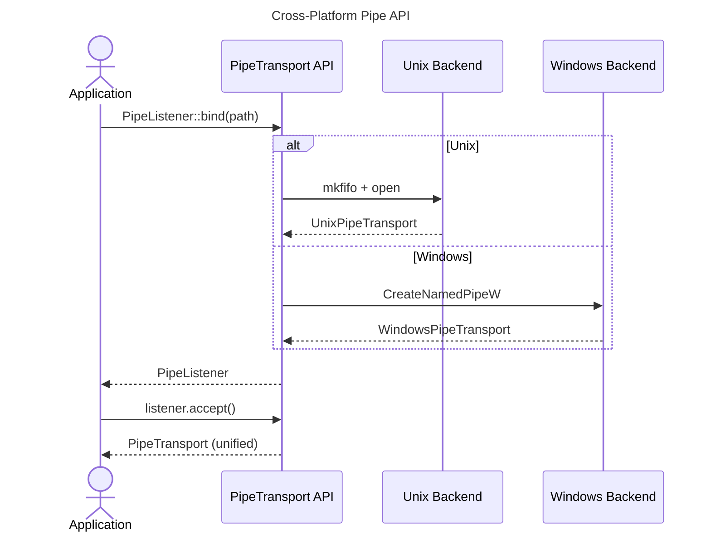

<spec>

# Cross-Platform Pipe Abstraction

## Overview

Provide a unified cross-platform API for named pipes that abstracts over Unix FIFO and Windows named pipes. The PipeTransport trait defines the common interface, with platform-specific implementations handling the differences. Supports both server (listener) and client (connector) patterns.

## Requirements

### R1 - PipeTransport Trait

```yaml
id: R1
priority: high
status: draft
```

Define PipeTransport trait with async read(), write(), flush(), and close() methods that work across platforms.

### R2 - PipeListener

```yaml
id: R2
priority: high
status: draft
```

Create PipeListener that accepts incoming connections (Unix: open for read, Windows: ConnectNamedPipe).

### R3 - PipeConnector

```yaml
id: R3
priority: high
status: draft
```

Create PipeConnector that connects to existing pipes (Unix: open, Windows: CreateFile).

### R4 - PipeConfig

```yaml
id: R4
priority: medium
status: draft
```

Unified configuration struct for buffer sizes, timeouts, and platform-specific options with sensible defaults.

### R5 - Feature Gates

```yaml
id: R5
priority: medium
status: draft
```

Use cfg attributes to compile only platform-relevant code. Provide compile-time errors for unsupported platforms.

## Acceptance Criteria

### Scenario: Create pipe server cross-platform

- **GIVEN** Running on any supported platform
- **WHEN** Call PipeListener::bind(path)
- **THEN** Returns listener ready to accept connections

### Scenario: Connect to pipe cross-platform

- **GIVEN** Pipe server is listening
- **WHEN** Call PipeConnector::connect(path)
- **THEN** Returns connected PipeTransport

### Scenario: Transparent read/write

- **GIVEN** Connected pipe transport
- **WHEN** Call transport.write() and transport.read()
- **THEN** Data flows correctly regardless of platform

### Scenario: Graceful shutdown

- **GIVEN** Active pipe connection
- **WHEN** Call transport.close()
- **THEN** Resources cleaned up on both platforms

## Flow Diagram



</spec>
